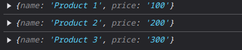
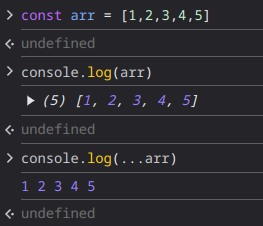
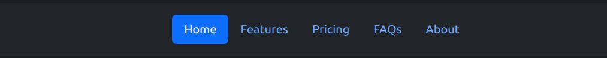
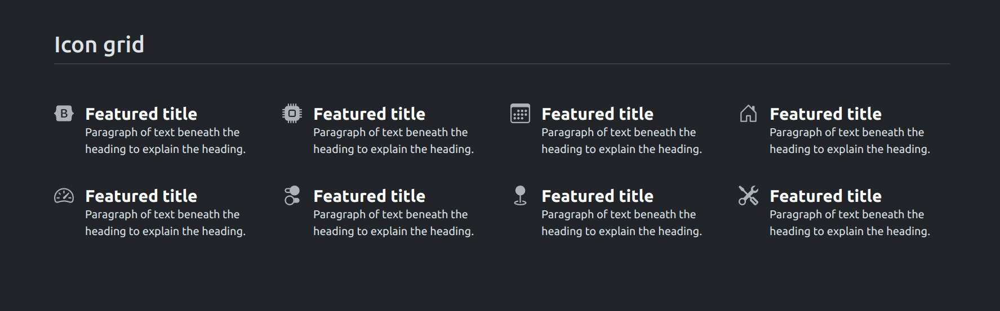
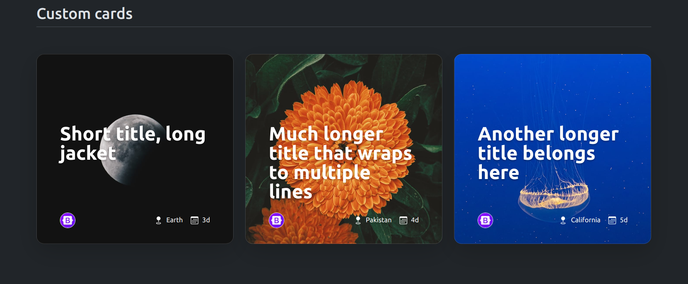
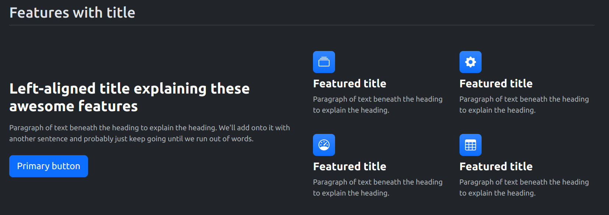

# REACT (PART-1 : Basics, Rules, Syntax, and Some FUN PROJECTS)

- [LinkedIn](https://www.linkedin.com/in/pro-programmer/)
- [YouTube](http://www.youtube.com/@itvaya)
- [gtihub](https://github.com/RishatTalukder/learning_react)
- [Gmail](talukderrishat2@gmail.com)
- [discord](https://discord.gg/ZB495XggcF)


## What is React?

I think you all know what `REACT` is but let's just forget that. `React` is a front-end library developed by `Facebook`. It's a library not a framework. That's it!

## Installation

First you need `Node` js installed in your computer. If you don't have it installed, you can download it from [here](https://nodejs.org/en/).

After installation check the version of `Node` and `NPM` by running the following commands in your terminal.

```bash

node -v

npm -v

```

If a version number is shown then you are good to go. Now, create a new folder with any name you want and navigate to that folder in your terminal.

Now, run the following command to create a new react app.


```bash

npx create-react-app first-app

```

This will create a react app named `my-app`, in your folder with all the necessary files and folders needed for a react app. But before going deep into the `my-app` folder, we need to make some changes. 

As `REACT 19` is out and with it's all new issues and bugs, I'll be using `REACT 18` for this series. So, we need to install `REACT 18` in our app. To do that, navigate to the `my-app` folder in your terminal and run the following command.

```bash

npm install react@18 react-dom@18

```

This will install `REACT 18` in your app. Now, you are ready to go. To start the app, run the following command.

```bash

npm start

```

This will start the app in your default browser. You can also open the app in your browser by going to `http://localhost:3000/`.

# The Process of Learning React

I don't like to `memorize` things. I like to `understand` it, thr work flow, how data is getting changed and loaded onto our screen. So, I think Nothing is better than learning by making projects. So, I'll be making small projects in every part of this series and will try my best to make every project related to the topic of that part. So, As part one is about the basics of react, I'll be making some basic projects in this part. Like these `Two` projects:

- Product List.


- Landing Page.


So, let's get started with the first one.

# Project-1: Product List

## Remove Boilerplate Code

If you have read this article from the beginning, you know how to make a new `React` app. So, Now Do it yourself and you can name the app `product_list`. After creating the app, remove the `src` folder completely. This will effectively break your app.

The idea is to start from scratch. So, now we will create a new `src` folder and inside that folder, we will create a new file named `index.js`. This file will be the entry point of our app. So, let's create the file and write some code in it.

> Don't forget to install `react@18` and `react-dom@18` in your app because we are using `React 18` in this series.

```js

import React from 'react';
import ReactDOM from 'react-dom/client';

const root = ReactDOM.createRoot(document.getElementById('root'));
root.render(<h1>Hello World</h1>);

```

After writting this code, start your app by running `npm start` in your terminal. 

This should open your app in your default browser in `localhost:3000` with a `Hello World` text on the screen.

> If the browser is not opened automatically, you can open it by clicking on the link `http://localhost:3000/` in your terminal.

If you see the `Hello World` text on the screen, then congo! you have successfully removed the boilerplate code and started from scratch. 

Let's learn what just happend in the code above.

- We imported `React` and `ReactDOM` from `react` and `react-dom/client` respectively.
- We created a new `root` using `ReactDOM.createRoot` and passed the `root` element to it.

Now, what does `ReactDOM.createRoot` do?

If you go to the `public` folder in your app, you will see a file named `index.html`. In this file, you will see a `div` with an `id` of `root`. This is the `root` element we passed to the `ReactDOM.createRoot` function. This `div` is the entry point of our app. This is where all the components will be rendered.

- Then we called the `render` method on the `root` and passed a `h1` element with a text of `Hello World` to it.

It's like telling `React` to push a `h1` element with a text of `Hello World` to the `root` element. And that's what happened. The `Hello World` text is now on the screen. 

## Some Tips

I'm using `vs code` for this series and there are some extensions that will make a developer's life easier. So, I'll recommend some extensions that you can use in your `vs code`.

- `ES7 React/Redux/GraphQL/React-Native snippets` by `dsznajder`. This extension will help you to write react code faster. You can write `rfce` and press `tab` to get a functional component template. You can write `rcc` and press `tab` to get a class component template. And many more.

- `Prettier - Code formatter` by `Prettier`. This extension will help you to format your code. You can format your code by pressing `shift+alt+f`.

- `Live Server` by `Ritwick Dey`. This extension will help you to open your `html` files in your default browser. You can open your `html` files by right clicking on the file and selecting `Open with Live Server`.

- `Auto Rename Tag` by `Jun Han`. This extension will help you to rename the opening and closing tags at the same time. You can rename the opening tag and the closing tag will be renamed automatically.

Also, if you are using `chrome` or any `chrome based browser`, you can install the `React Developer Tools` extension. This extension will help you to debug your react app. You can see the `props`, `state`, `context`, `hooks`, `events`, etc. of your components.


## Making the first component

Now, that you have successfully removed the boilerplate code and started from scratch, We can have clean slate to work on. So, let's create our first component.

## What is a Component?

A `Component` is a piece of code that can be reused. It's like a function that returns `JSX`. A `Component` can be a `Functional Component` or a `Class Component`. A `Functional Component` is a simple `JavaScript` function that returns `JSX`. A `Class Component` is a `JavaScript` class that extends `React.Component` and has a `render` method that returns `JSX`.

> `JSX` is a syntax extension for `JavaScript` and it looks just like `HTML`. It's actually a `JavaScript` object that represents `HTML` adn also you completely write `HTML` in `JSX`. It's like the `JS` version of `HTML`.

So, let's create our first `Functional Component` named `ProductList`. So, go to the `src` folder and create a new file named `ProductList.js`. In this file, write the following code.

```js

import React from 'react';

const ProductList = () => {
    return (
        <div>
            <h1>Product List</h1>
        </div>
    );
};

export default ProductList;

```

> Remember to always use `PascalCase` for the name of the component. It's a convention in `React` and sometimes it's can cause errors if you don't follow the convention. So, just `Capitalize` the first letter of the component name.

Let's analyze the code above.

- We imported `React` from `react`.
- We created a simple `arrow function` or `anonymous function` named `ProductList` that returns a `div` with a `h1` element with a text of `Product List`.
- Then we exported the `ProductList` component.

> Also don't forget to export the component at the end of the file.


## Using the Component

Now, that we have created our first component, let's use it in our `index.js` file. So, go to the `index.js` file and write the following code.

```js

import React from 'react';
import ReactDOM from 'react-dom/client';
import ProductList from './ProductList'; // Importing the ProductList component.

const root = ReactDOM.createRoot(document.getElementById('root'));
root.render(<ProductList />); // replacing the h1 element with the ProductList component.

```

Now, if you start your app by running `npm start` in your terminal, you should see a big `Product List` text on the screen. This is the `ProductList` component we created.

But this is not the right way render a component. Because there will be may more `components` in our app and we can't just put them inside `root.render` method. We need a centralized place to render all the components. So, let's make a `component` named `App` that will render all the components we create.

## Making the App Component

So, go to the `index.js` file and create a new `Functional Component` named `App`. This component will render all the components we create later. So, write the following code in the `index.js` file.

```js

import React from 'react';
import ReactDOM from 'react-dom/client';
import ProductList from './ProductList'; // Importing the ProductList component.

const App = () => {
    return (
        <div>
            <ProductList />
        </div>
    );
};

const root = ReactDOM.createRoot(document.getElementById('root'));
root.render(<App />); // replacing the ProductList component with the App component.

```

Now, if you start your app by running `npm start` in your terminal, you should see the same thing But this time the `ProductList` component is rendered inside the `App` component. That is the magic of `React`. You can nest components inside other components and create a tree of components.


Now, if you do this:

```js

import React from 'react';
import ReactDOM from 'react-dom/client';
import ProductList from './ProductList'; // Importing the ProductList component.

const App = () => {
    return (
        <div>
            <ProductList />
            <ProductList />
            <ProductList />
        </div>
    );
};

const root = ReactDOM.createRoot(document.getElementById('root'));
root.render(<App />); // replacing the ProductList component with the App component.

```

You will see three `ProductList` components on the screen. Whith out writing the `ProductList` component three times.

So, now you see how `react` makes a developer's life easier by allowing to nest components inside other components. This is the power of `React`.

## Some debugging tips

Before moving on with this project there is some issues that you may face while working with `React`. The `first issue` I think is the `auto refresh` of the app. 

As we downgraded from `React 19` to `React 18`, the `auto refresh` feature of the app may not work. So, to fix this issue, you can run the following command in your terminal.

```bash

npm install react-scripts@latest

```

If this doesn't work, you can go to the `package.json` file in your app and change the `scripts` to the following.

```json

"scripts": {
    "start": "react-scripts start --watch",
    ........
  },

```

This will start the app in `watch` mode and the app will `auto refresh` when you make changes in your code.

##### An easy task for you to do

Now, that you have successfully created your first component and used it in your app, I have a task for you.

- Create a new component for the `App` component we made to reactify the `Product List` text. Than import the `ProductList` component in the `App` component and finally import the `App` component in the `index.js` file and render it.


## React Fragments

If you have done the task above, you may have noticed that the `Product List` text is wrapped inside a `div`. This is because `React` doesn't allow to return multiple elements from a `Functional Component`. for example:

```js

const App = () => {
    return (
        <h1>Product List</h1>
    );
};

```

This is `OK`. But if you do this:

```js

const App = () => {
    return (
        <h1>Product List</h1>
        <h2>Product List</h2>
    );
};

```

This will cause an error. Because `React` doesn't allow to return multiple elements from a `Functional Component`. So, to fix this issue, you can wrap the elements inside a `div` or a `React Fragment`.

```js

const App = () => {
    return (
        <React.Fragment>
            <h1>Product List</h1>
            <h2>Product List</h2>
        </React.Fragment>
    );
};

```

This will fix the issue. But there is a shorthand for `React.Fragment`. You can use `<>` and `</>` instead of `<React.Fragment>` and `</React.Fragment>`.

```js

const App = () => {
    return (
        <>
            <h1>Product List</h1>
            <h2>Product List</h2>
        </>
    );
};

```

> Remember to always return a single element from a `Functional Component`. You can't return multiple elements from a `Functional Component`. You can wrap the elements inside a `div` or a `React Fragment` to fix this issue.


Before we move on to the next section you should install `React Developer Tools` extension in your browser. This extension will help you to debug your react app. Maybe not now nut when our project gets bigger and bigger, this extension will help you to debug your app.

## What are we making?

The first project will be like a small product list of some products. I was thinking of coping the `Startech` website front page. Let's see how it looks.


Well, you can see that there are some products on the screen, the title of the product, the product image, It's price, and some other things. It's looks fairly simple. So, Let's try make something like this.

## Making the Components

So, let's start by creating the components we need for this project. From the image above, we can see that we need the following things:

- A `Product` component that will render a single product.
- A `Product Name` component that will render the title of the product.
- A `Product image` component that will render the image of the product.
- A `Product price` component that will render the price of the product.

- We also have 10 products in the image above. So, we need to create a `ProductList` component that will render all the products.
- We will also try to make this project responsive for good user experience.

## Product Component

So, let's start by creating a `Folder` named `components` in the `src` folder. In this folder, we will create all the components we need for this project.

So, create a new file named `Product.js` in the `components` folder and write the same code we wrote for the `ProductList` component.

```js

import React from 'react';

const Product = () => {
    return (
        <div>
            <h1>Product</h1>
        </div>
    );
};

export default Product; // Don't forget to export the component.

```

> you can also use the `ES7 React/Redux/GraphQL/React-Native snippets` extension to create a `Functional Component` template by writing `rafce` and pressing `tab`.

Now, Let's make a rough product component. 

```js

import React from "react";

const Product = () => {
  return (
    <div>
      <h1>Image</h1>
      <h2>Product Name</h2>
      <p>Price</p>
    </div>
  );
};

export default Product;


```

This is a rough `Product` component. We will make it better later. We have a Single product with an `Image`, `Product Name`, and `Price`. Now, we follow the steps of importing the `Product` component in the `ProductList` component and the `ProductList` component in the `App` component.

So, go to the `ProductList` component and import the `Product` component.

```js

import React from "react";
import Product from "./components/Product";

const ProductList = () => {
  return (
    <div>
      <h1>Product List</h1>
      <Product />
    </div>
  );
};

export default ProductList;

```

Now, I think you know what to do next. Import the `ProductList` component in the `App` component and render it in the `index.js` file.

```js

// App.js

import React from "react";

import ProductList from "./components/ProductList";

const App = () => {
  return (
    <div>
      <ProductList />
    </div>
  );
};

export default App;

```

Now, all you jave to do is start the server by running `npm start` in your terminal and you should see the `Product List` text on the screen. This is the `Product List` component we created.

Now, with the power of `nesting components`, you can create a multiple products in an instant. Just like this:

```js

// ProductList.js

import React from "react";
import Product from "./components/Product";

const ProductList = () => {
  return (
    <div>
      <h1>Product List</h1>
      <Product />
      <Product />
      <Product />
      <Product />
      <Product />
      <Product />
      <Product />
      <Product />
      <Product />
      <Product />
    </div>
  );
};

export default ProductList;

```

> I will be commenting the File names at the top of the file. This is a good practice to keep track of the files you are working on.

This should render 10 products on the screen. 

But it's not going to be that easy. We need to make the `Product` component better and also dynamic. 

## Props

`Pros` are one of the if not the most important thing in `React`. `Props` are used to pass data from one component to another. 

Let's send some Data to the `Product` component from the `ProductList` component. 

Now before we do that I want youy all to think about what a `Component` is. A `Component` is a `Function` that returns `JSX`. 


### A `Component` is a `FUNCTION`

Like every Function in every know `Programming Language`, a `Function` can take `Arguments`. So, a `Component` can also take `Arguments`. These `Arguments` are called `Props` in `React`.

That's it! we will just pass some `Props` to the `Product` component from the `ProductList` component as `Arguments`.

Let's learn the react way of passing `Props` to a `Component`.

### Passing Props

To pass `Props` to a `Component`, you can pass them as `Attributes` to the `Component` just like you pass `Attributes` to an `HTML` element.

So, let's pass some `Props` to the `Product` component from the `ProductList` component.

```js

// ProductList.js

import React from "react";
import Product from "./components/Product";

const ProductList = () => {
  return (
    <div>
      <h1>
        Product List
      </h1>
      <Product name="Product 1" price="100" />
      <Product name="Product 2" price="200" />
      <Product name="Product 3" price="300" />
    </div>
  );
};

export default ProductList;

```

Here we are passing two `Props` to the `Product` component. The `name` and the `price` of the product. Now, let's receive these `Props` in the `Product` component.

```js

// Product.js

import React from "react";

const Product = (props) => { // Receiving the Props
  return (
    <div>
      <h1>Image</h1>
      <h2>{props.name}</h2> {/* Using the Props */}
      <p>Price: ${props.price}</p> {/* Using the Props */}
    </div>
  );
};

export default Product;
```

Now, whats happening here? 

- We are passing two `Props` to the `Product` component from the `ProductList` component as `Attributes`. 
- We are receiving these `Props` in the `Product` component as `Arguments` in the `Function`.
- We are using the `Props` in the `Product` component by using `props.name` and `props.price`.
  - As you can see in the Above code, we are using the `Props.name` and `Props.price` inside `{}`. This is because we are using `JSX` and we can't write `JavaScript` code inside `JSX`. So, we use `{}` to write `JavaScript` code inside `JSX`. This `{}` is referred to as `Expression` in `vanilla JavaScript`. We will talk more about `Expressions` in the next part.

Now, if you start your app by running `npm start` in your terminal, you should see the `Product 1`, `Product 2`, and `Product 3` on the screen with their prices.

This is the power of `Props` in `React`. You can pass data from one component to another and make your app dynamic.

Now, we need to learn some more `JS` theory before we move on to the next section. So, let's learn about `destructuring` in `JS`.

#### Destructuring

`Destructuring` is a `JavaScript` expression that makes it possible to unpack values from arrays, or properties from objects, into distinct variables.

If you remember, we are passing `Props` to the `Product` component from the `ProductList` component. We are passing two `Props` to the `Product` component. The `name` and the `price` of the products. Now if we just `console.log` the `Props` in the `Product` component and see what we get.


```js

// Product.js

import React from "react";

const Product = (props) => { // Receiving the Props
  console.log(props); // Logging the Props
  return (
    <div>
      <h1>Image</h1>
      <h2>{props.name}</h2> {/* Using the Props */}
      <p>Price: ${props.price}</p> {/* Using the Props */}
    </div>
  );
};

export default Product;
```

Now, go to the browser and open the `inspect element` by right clicking on the screen and selecting `inspect`. Then go to the `console` tab and you should see the `Props` object logged in the console.



All 3 of the `Product` components are logged in the console. Adn they are shown as `Objects`. These `Objects` have two `Properties`. The `name` and the `price` of the product. That's why we can use the `.` operator to access the `name` and the `price` of the product.

> `props.name` and `props.price`.

But there is a issue with getting the `Props` like this. If you have a lot of `Props` to get, you will have to `write` a lot of `props.<prop-name>` to get the `Props`. This is where `Destructuring` comes in.

We can `destructure` the `Props` and turn it's `Properties` into `Variables`. Then we can use these `Variables` to get the `Props`.

```js

// Product.js

import React from "react";

const Product = (props) => { // Receiving the Props
  const { name, price } = props; // Destructuring the Props
  return (
    <div>
      <h1>Image</h1>
      <h2>{name}</h2> {/* Using the Props */}
      <p>Price: ${price}</p> {/* Using the Props */}
    </div>
  );
};

export default Product;
```

Here we are destructuring the `Props` object and turning it's `Properties` into `Variables`. And than we are using those variables to get the `Props`.

There are other ways to `destructure` the `Props` object. You can `destructure` the `Props` object directly in the `Arguments` of the `Function` like this:

```js

// Product.js

import React from "react";

const Product = ({ name, price }) => { // Destructuring the Props
  return (
    <div>
      <h1>Image</h1>
      <h2>{name}</h2> {/* Using the Props */}
      <p>Price: ${price}</p> {/* Using the Props */}
    </div>
  );
};

export default Product;
```

> I personally like this way of `destructuring` the `Props` object. It's clean and easy to read.

Now, if you start your app by running `npm start` in your terminal, every should be working fine.


#### Expressions

As you can see in the above code we are using `{}` to `destructure` the `Props` object and to use the `Props` in the `Product` component. This `{}` is referred to as `Expression` in `vanilla JavaScript`.

`Expressions` are used to compute values. To put this more simply, `Expressions` are used to write `JavaScript` code inside `JSX`.

As a Component returns `JSX`, you can't write `JavaScript` code inside the jsx. So, you use `{}` to write `JavaScript` code inside `JSX`. But you can not write `every JavaScript` code inside `{}` like statements, loops, etc. You can only write
`code that returns a value`.

Here's anopther way to remember the difference between `destructuring` and `expressions`.

> Outside the `jsx` you `destructure` with `{}` and inside the `jsx` you use `{}` to write `code that returns a value` or `expressions`.


## Some What Dynamic Product List

Now, that we have learned about `Props`, `Destructuring`, and `Expressions`, let's make the `Product List` component a little bit dynamic.

Now, If er look at the ProductList component, we are rendering the `Product` component 3 times with the same `Props`. This is not how a `Product List` works. 

A `real life` product list can have `n` number of products each with different `name`, `price`, `image`, etc. So, we need to make the `Product List` component a little bit dynamic.

Now, let's try to make this `Product List` component a little bit dynamic. 

```js

// ProductList.js

import React from "react";
import Product from "./components/Product";

const product1 = {
  name: "Product 1",
  price: 100, 
}; // Product 1

const product2 = {
  name: "Product 2",
  price: 200,
}; // Product 2

const product3 = {
  name: "Product 3",
  price: 300,
}; // Product 3

const ProductList = () => {
  return (
    <div>
      <h1>Product List</h1>
      {/* Product 1 */}
      <Product name={product1.name} price={product1.price} />
      {/* Product 2 */}
      <Product name={product2.name} price={product2.price} />
      {/* Product 3 */}
      <Product name={product3.name} price={product3.price} />
    </div>
  );
}

export default ProductList;

```

### Using the Spread Operator

Spread operator is a new feature in `ES6` that allows an `iterable` to expand in places where `0+ arguments` are expected. It's like `rest parameters` but for `Arrays` and `Objects`.

Mainly what it does is that it takes an `Array` or an `Object` and `spreads` it into individual elements.

This example will make it more clear. Goto the inspect option in any page of your browser and type the following code in the console. Do the following steps:

```js

const arr = [1, 2, 3, 4, 5];
console.log(arr); // [1, 2, 3, 4, 5]
console.log(...arr); // 1 2 3 4 5

```

You should see some thing like this in the console.


So, if we log a iterable like an `Array` or an `Object` it only prints the `Array` or the `Object`. But if we `spread` the `Array` or the `Object` it prints the individual elements of the `Array` or the `Object`.

> The `...` or `spread operator` is mainly used to `copy` an `Array` or an `Object` into another `Array` or `Object`. But in react we can use it to `spread` the `Props` of an `Object` into individual elements.

As we know the attributes we are passing as props are the same as the properties of the object and these are eventually going to be stored in the `props` object of the `Product` component. So, we can make different objects for different products and pass them as props to the `Product` component.

But a better way would be to spread the `product` objects while passing them as props to the `Product` component.

```js

// ProductList.js

import React from "react";
import Product from "./components/Product";

const product1 = {
  name: "Product 1",
  price: 100,
}; // Product 1

const product2 = {
  name: "Product 2",
  price: 200,
}; // Product 2

const product3 = {
  name: "Product 3",
  price: 300,
}; // Product 3

const ProductList = () => {
  return (
    <div>
      {/* Product 1 */}
      <Product {...product1} /> {/* Spreading the product object */}
      {/* Product 2 */}
      <Product {...product2} /> {/* Spreading the product object */}
      {/* Product 3 */}
      <Product {...product3} /> {/* Spreading the product object */}
    </div>
  );
};

export default ProductList;

```

> In a `React` component, while passing `Props` to another component, if the `Props` object has the same `Properties` as the `Attributes` you are passing, you can `spread` the `Props` object while passing it as `Attributes`.

> The `...` or `spread operator` is spreading the `product` object into individual elements. So, the `Product` component will receive the `name` and the `price` of the product as `Props`.

This will work as a charm. Let's break down What just happened.

- We made `three product objects` with the `name` and the `price` of the product.
- We passed these `product objects` as `Props` to the `Product` component.
- We `spread` the `product objects` while passing them as `Props` to the `Product` component.
- As the `product objects` have the same `Properties` `name` and `price` as the `Attributes` we are passing, we can `spread` the `product objects` while passing them as `Props` to the `Product` component. 
- In this way don't need to write `name={product1.name} price={product1.price}` for every product. 


> Moral of the story: If the object we are passing has the same properties as the attributes were passing as props, we can spread the object while passing it as props.

Now, we can change the name and the price of the products in the `product objects` (product1, product2, product3) and the `Product` component will render the products with the new `name` and `price`.

```js

// ProductList.js

import React from "react";
import Product from "./components/Product";

const product1 = {
  name: "AMD Ryzen 5 5600X",
  price: "11,500",
}; // Product 1

const product2 = {
  name: "NVIDIA RTX 3060",
  price: "45,000",
}; // Product 2

const product3 = {
  name: "Corsair Vengeance RGB Pro 16GB",
  price: "6,500",
}; // Product 3

const ProductList = () => {
  return (
    <div>
      <Product {...product1} />
      <Product {...product2} />
      <Product {...product3} />
    </div>
  );
};

export default ProductList;

```

Now everything should be working fine. If you start your app by running `npm start` in your terminal, you should see the `Product List` with the new products on the screen.

### Making the Product Component More dynamic using Array of Objects

The `Product List` component is now a little bit dynamic and we can change a product detail by changing the `product object(product1, product2, product3)` in the `ProductList` component. But we can make it more dynamic by using an `Array of Objects`.

Because when we are using a `web app`, most of the time data is coming from a `database` or an `API`. And the data is in the form of an `Array of Objects`. 

A huge issue in the previous approach is that we have to create a new `product object` for every product. This is not how a `real life` `Product List` works. A `real life` `Product List` has `n` number of products and we can't create a new `product object` for every product.


So, what we need is a way to store the `product objects` in an `Array` and pass them as `Props` to the `Product` component. This is where an `Array of Objects` comes in.

So, let's make the `Product List` component more dynamic by using an `Array of Objects`.

```js

// ProductList.js

import React from "react";
import Product from "./components/Product";

const products = [
  {
    name: "AMD Ryzen 5 5600X",
    price: "11,500",
  },
  {
    name: "NVIDIA RTX 3060",
    price: "45,000",
  },
  {
    name: "Corsair Vengeance RGB Pro 16GB",
    price: "6,500",
  },
]; // Array of Objects

const ProductList = () => {
  return (
    <div>
      <Product {...products[0]} />
      <Product {...products[1]} />
      <Product {...products[2]} />
    </div>
  );
};

export default ProductList;

```


Now, we have an `Array of Objects` named `products` with the same `Properties` as the `Attributes` we were passing as `Props` earlier. But issue is still not resolved. We are still passing the `product objects` 1 by 1 to the `Product` component. And we cannor realisticly make `<Product {...products[0...n]} />` for every product. So, we need some process to do this repeatedly.

### Using the `map` method

The `map` method is used to `iterate` over an `Array` and `return` a new `Array`. The `map` method takes a `callback function` as an `argument` and `calls` the `callback function` for every `element` in the `Array`.

> Callback functions are `Functions` that are passed as `Arguments` to another `Function`

Simpy, the `map method` is a for loop for `Arrays` that can apply a function to every element of the `Array` and return a new `Array` with the results.

So, as we cannot use any `statements` or `loops` inside `JSX`, we can use the `map` method to `iterate` over the `products` `Array` and `return` a new `Array` with the `Product` components.

Try out this code below in a newfile outside the porject folder.

```js

const arr = [1, 2, 3, 4, 5];

const callback = (element) => {
  return element * 2;
};

const newArr = arr.map(callback);

console.log(newArr);

```

> When iterating over an `Array` using the `map` method, the `callback function` takes 3 `arguments`. The `element` or the `value` of the index, the `index` of the element, and the `Array` itself.

Then you can run the file in the terminal as you have `node` installed in your system. open the terminal and run the following command.

```bash

node <filename>.js

```

we can write the callback function inside the `map` method as an `anonymous function`.

```js

const arr = [1, 2, 3, 4, 5];

const newArr = arr.map((element) => {
  return element * 2;
});

console.log(newArr);

```

You should see the `newArr` logged in the console. This is the `new Array` with the `elements` of the `arr` `Array` multiplied by `2`.

We, can use this `map` method to `iterate` over the `products` `Array` and `return` a new `Array` with the `Product` components.

So, let's make a new array of products and use the `map` method to `iterate` over the `products` `Array` and `return` a new `Array` with the `Product` components.

```js

// ProductList.js
import React from "react";
import Product from "./components/Product";

const products = [
  {
    name: "AMD Ryzen 5 5600X",
    price: "11,500",
  },
  {
    name: "NVIDIA RTX 3060",
    price: "45,000",
  },
  {
    name: "Corsair Vengeance RGB Pro 16GB",
    price: "6,500",
  },
]; // Array of Objects

const newProducts = products.map((product) => {
  return <Product {...product} />;
}); // Using the map method to iterate over the products Array

const ProductList = () => {
  return (
    <div>
      {newProducts} {/* Returning the new Array */}
    </div>
  );
};

export default ProductList;

```

> Now Here have a new array of products named `newProducts` that is created by using the `map` method to iterate over the `products` `Array` and `return` a new `Array` with the `Product` components.

Now, we add this new array as a `JSX` expression in the `ProductList` component. This will render the `Product` components for every product in the `products` `Array`.

Now, if you start your app by running `npm start` in your terminal, you should see the `Product List` with the new products on the screen.

There you go, We have a dynamic array of products that can be changed by changing the `products` `Array`. But there is a small detail left. That is the `key` prop.

### The `key` prop

The `key` prop is a special `prop` that you need to include when creating `lists` of `elements`. The `key` prop is used by `React` to identify which items have changed, are added, or are removed. The `key` prop should be a `unique` `String` or a `Number`.

No big issues will arrise if you don't include the `key` prop. But it's a good practice to include the `key` prop when creating `lists` of `elements`.

So, let's add the `key` prop to the `Product` components.

```js

// ProductList.js

import React from "react";
import Product from "./components/Product";

const products = [
  {
    id: 1,
    name: "AMD Ryzen 5 5600X",
    price: "11,500",
  },
  {
    id: 2,
    name: "NVIDIA RTX 3060",
    price: "45,000",
  },
  {
    id: 3,
    name: "Corsair Vengeance RGB Pro 16GB",
    price: "6,500",
  },
]; // Array of Objects

const newProducts = products.map((product) => {
  return <Product key={product.id} {...product} />;
}); // Using the map method to iterate over the products Array

const ProductList = () => {
  return (
    <div>
      {newProducts} {/* Returning the new Array */}
    </div>
  );
};

export default ProductList;

```

We add the `key` prop to the outermost `element` of the callback function in the `map` method. In this case, the outermost `element` is the `Product` component itself. So, we add the `key` prop to the `Product` component.

And we are done. We have finally made the `Product List` component a little bit dynamic by using an `Array of Objects` and the `map` method.

### An easy task for you to do

Now, that you have successfully made the `Product List` component a little bit dynamic, I have a task for you.

- The Product List component kind of messy with the `newProducts` array and calling the `Product` component. So, try to make the `Product List` component more clean by using the `map` method inside the `JSX` expression.

- Make a new folder named `data` in the `src` folder and create a new file named `products.js`. In this file, create an `Array of Objects` named `products` with the `id`, `name`, and `price` of the products. Then import this `Array of Objects` in the `ProductList` component and use it to render the `Product` components.

- Add some more Products to the `products` `Array` and see if the `Product List` component renders the new products on the screen.

Try it yourself before seeing the solutions below.

### Solution

So, let's start by making a new folder named `data` in the `src` folder. In this folder, create a new file named `products.js`. In this file, write the following code.

```js

// src/data/products.js

const products = [
  {
    id: 1,
    name: "AMD Ryzen 5 5600X",
    price: "11,500",
  },
  {
    id: 2,
    name: "NVIDIA RTX 3060",
    price: "45,000",
  },
  {
    id: 3,
    name: "Corsair Vengeance RGB Pro 16GB",
    price: "6,500",
  },
  {
    id: 4,
    name: "Samsung 970 EVO Plus 1TB",
    price: "12,000",
  },
  {
    id: 5,
    name: "Gigabyte B550 AORUS PRO",
    price: "15,000",
  },
  {
    id: 6,
    name: "Cooler Master MasterBox MB511",
    price: "5,000",
  },
  {
    id: 7,
    name: "Corsair RM750x",
    price: "10,000",
  },
]; // Array of Objects

export default products; // don't forget to export the products Array.

```

> Remember to export the `products` `Array` so that you can import it in the `ProductList` component.

Now, go to the `ProductList` component and import the `products` `Array` from the `products.js` file and also use the `map` method to iterate over the `products` `Array` and `return` a new `Array` with the `Product` components.

```js

// ProductList.js

import React from "react";
import Product from "./components/Product";
import products from "./data/products"; // Importing the products Array

const ProductList = () => {
  return (
    <div>
      {products.map((product) => (
        <Product key={product.id} {...product} />
      ))}
    </div>
  );
};

export default ProductList;

```

Now we have cleaned up the `Product List` component by using the `map` method inside the `JSX` expression along with a new `Array of Objects` named `products` in the `data` folder.


We finally have a dynamic `Product List` component that can be changed by changing the `products` `Array` in the `products.js` file. It's looks clean and well organized. 

Time to start `destroying` it... Just kidding. 

If you followed me for this long, You should have noticed that I left a specific attribute in the `Product` component untouched. That is the `Image` attribute. We will be adding the `Image` attribute to the `Product` component in the next part.

## Working with Images in React

Working with images can be very tricky in `React`. But it's not that hard. You just need to know how to do it.

There are three ways we can add images to a `React` app.

- Using a link to the image.
- Storing the image in the `public` folder.
- Importing the image in the `Component` from the `src` folder.

### Using a link to the image

The easiest way to add an image to a `React` app is by using a link to the image. You can copy a link to any image for this example. I will be using the following link to an image.

```html

https://yt3.ggpht.com/hqJ9sbzMZ2myvUbb0HE5PJ71PP9YsW8xoKsXrKFTJ0oHvE4Ryl6bDeIKMj77lX05MfBHGudZOIQ=s176-c-k-c0x00ffffff-no-rj

```

> Please do not use it... It's a link to my youtube profile picture. You can select any picture of youre choosing.

Now, let's add this image to the `Product` component.

```js

// Product.js

import React from "react";

const Product = ({ name, price }) => {
  return (
    <div>
       {/* Using the img tag to add the image */}
      <h2>{name}</h2>
      <p>Price: ${price}</p>
    </div>
  );
};

export default Product;

```

You should see the image rendered on the screen multiple times. But for each product, the same image is rendered. 

In this way we have to copy links of pictures for evey product add that to the `product` object. This is not going to be a optimal solution.

But before going the optimal solution, let's add the new `Image` attribute to the `products` `Array` in the `products.js` file.

```js

// products.js

const products = [
  {
    id: 1,
    name: "AMD Ryzen 5 5600X",
    price: "11,500",
    image: "https://yt3.ggpht.com/hqJ9sbzMZ2myvUbb0HE5PJ71PP9YsW8xoKsXrKFTJ0oHvE4Ryl6bDeIKMj77lX05MfBHGudZOIQ=s176-c-k-c0x00ffffff-no-rj",
  },
  {
    id: 2,
    name: "NVIDIA RTX 3060",
    price: "45,000",
    image: "https://yt3.ggpht.com/hqJ9sbzMZ2myvUbb0HE5PJ71PP9YsW8xoKsXrKFTJ0oHvE4Ryl6bDeIKMj77lX05MfBHGudZOIQ=s176-c-k-c0x00ffffff-no-rj",
  },
  {
    id: 3,
    name: "Corsair Vengeance RGB Pro 16GB",
    price: "6,500",
    image: "https://yt3.ggpht.com/hqJ9sbzMZ2myvUbb0HE5PJ71PP9YsW8xoKsXrKFTJ0oHvE4Ryl6bDeIKMj77lX05MfBHGudZOIQ=s176-c-k-c0x00ffffff-no-rj",
  },
  {
    id: 4,
    name: "Samsung 970 EVO Plus 1TB",
    price: "12,000",
    image: "https://yt3.ggpht.com/hqJ9sbzMZ2myvUbb0HE5PJ71PP9YsW8xoKsXrKFTJ0oHvE4Ryl6bDeIKMj77lX05MfBHGudZOIQ=s176-c-k-c0x00ffffff-no-rj",
  },
  {
    id: 5,
    name: "Gigabyte B550 AORUS PRO",
    price: "15,000",
    image: "https://yt3.ggpht.com/hqJ9sbzMZ2myvUbb0HE5PJ71PP9YsW8xoKsXrKFTJ0oHvE4Ryl6bDeIKMj77lX05MfBHGudZOIQ=s176-c-k-c0x00ffffff-no-rj",
  },
  {
    id: 6,
    name: "Cooler Master MasterBox MB511",
    price: "5,000",
    image: "https://yt3.ggpht.com/hqJ9sbzMZ2my
vUbb0HE5PJ71PP9YsW8xoKsXrKFTJ0oHvE4Ryl6bDeIKMj77lX05MfBHGudZOIQ=s176-c-k-c0x00ffffff-no-rj",
  },
  {
    id: 7,
    name: "Corsair RM750x",
    price: "10,000",
    image: "https://yt3.ggpht.com/hqJ9sbzMZ2myvUbb0HE5PJ71PP9YsW8xoKsXrKFTJ0oHvE4Ryl6bDeIKMj77lX05MfBHGudZOIQ=s176-c-k-c0x00ffffff-no-rj",
  },
]; // Array of Objects

export default products;

```

> I just copied the same link for every product. You can add different links for every product.

And now we make it dynamic by gitting the image property from the product object.

```js

// Product.js

import React from "react";

const Product = ({ name, price, image }) => {
  return (
    <div>
       {/* Using the img tag to add the image */}
      <h2>{name}</h2>
      <p>Price: ${price}</p>
    </div>
  );
};

export default Product;

```

Now we have a dynamic settup for the image. Let's move to the next method.

### Storing the image in the `public` folder

The second way to add an image to a `React` app is by storing the image in the `public` folder. 

In the beginning of this Project, I told you that the `public` folder is the `root` of the `React` app. There is a single `index.html` file in the `public` folder that is the `root` of the `React` app. And that works as the main html where we can add the `link` to the `stylesheet` and the `script` tags to the `React` app, etc.

So, if you store an image in the `public` folder, you can access it by using the `public` folder as the `root`. 

Step 1: Make a folder named `images` in the `public` folder.
Step 2: Download 1 or 2 images and add them to the `images` folder.
Step 3: Add the `image path` to the `image` property of the `products` `Array` in the `products.js` file.

```js

// products.js

const products = [
  {
    id: 1,
    name: "AMD Ryzen 5 5600X",
    price: "11,500",
    image: "/images/img1.jpg",
  },
  {
    id: 2,
    name: "NVIDIA RTX 3060",
    price: "45,000",
    image: "/images/img2.jpg",
  },
  {
    id: 3,
    name: "Corsair Vengeance RGB Pro 16GB",
    price: "6,500",
    image: "/images/img3.jpg",
  },
  ..... // rest of the products
]; // Array of Objects

export default products;

```

Here is a trick question for you. Why are we using '/images/img1.jpg' even thought the image is in a completely different folder outisde the src folder?

> /images/img1.jpg is a relative path. As all the html and js files are compiled into a single file in the public folder, all the paths are relative to the public folder. So, even if we are in the src folder, we can access the images folder by using the /images/img1.jpg path.

The image should have loaded in the browser. 

This is a very good way to add images to a `React` app. But not efficient. Just think about it. We are storing the images in the `public` folder. And the `public` folder is the `root` of the `React` app. So, the images are loaded every time the app is loaded. This can slow down the app.

### Importing the image in the `Component` from the `src` folder

The third way to add an image to a `React` app is by importing the image in the `Component / JS object` from the `src` folder.

This is the most efficient way to add images to a `React` app. Because the images are only loaded when the `Component` is loaded. This can speed up the app.

Step 1: Cut the images from the `images` folder in the `public` folder and paste them in the `src` folder.
Step 2: Import the images in the `products.js` file and add the `imported` images to the `image` property of the `products` `Array`.

```js

// products.js

import img1 from "../images/img1.jpg"; // Importing the image
import img2 from "../images/img2.jpg"; // Importing the image
import img3 from "../images/img3.jpg"; // Importing the image

const products = [
  {
    id: 1,
    name: "AMD Ryzen 5 5600X",
    price: "11,500",
    image: img1, // Using the imported image
  },
  {
    id: 2,
    name: "NVIDIA RTX 3060",
    price: "45,000",
    image: img2, // Using the imported image
  },
  {
    id: 3,
    name: "Corsair Vengeance RGB Pro 16GB",
    price: "6,500",
    image: img3, // Using the imported image
  },
  ..... // rest of the products

]; // Array of Objects

export default products;

```

> I here I used the relative path to the images folder to the data folder where the products.js file is located. Because the two folders are in the same level. I need to go back one level to access the images folder.

> You can name the imported images anything you want. I named them img1, img2, img3, etc. You can name them anything you want. Try it yourself to name them something else.

Now, we have imported the images in the `products.js` file and added the `imported` images to the `image` property of the `products` `Array`. 

We don't really need to change anything in the `Product` component. The image should have loaded in the browser.

And this is the most efficient way to add images to a `React` app. From now on we will be using this method to add images to the `Product` component.

### An easy task for you to do

Now, that you have successfully added images to the `Product` component, I have a task for you.

- Try to add images for all the products in the `products` `Array` in the `products.js` file. And see if the `Product List` component renders the new products with the new images on the screen.

- Try to add a new `Attribute` to the `Product` component named `description`. Then add the `description` to the `products` `Array` in the `products.js` file. And see if the `Product List` component renders the new products with the new `description` on the screen.

> if you want want to use my image folder you can just download this from my github repository. [Download Images](https://github.com/RishatTalukder/learning_react)

Try it yourself before looking at the solutions below.

### Solution

So, let's start by adding images and a new `Attribute` named `description` to the `products` `Array` in the `products.js` file.

```js

import img1 from "../images/img1.jpg";
import img2 from "../images/img2.jpg";
import img3 from "../images/img3.jpg";
import img4 from "../images/img4.png";
import img5 from "../images/img5.png";
import img6 from "../images/img6.png";
import img7 from "../images/img7.png";

const products = [
  {
    id: 1,
    name: "AMD Ryzen 5 5600X",
    price: "11,500",
    image: img1,
    description: "A powerful 6-core processor for gaming and productivity.",
  },
  {
    id: 2,
    name: "NVIDIA RTX 3060",
    price: "45,000",
    image: img2,
    description: "A high-performance graphics card for gaming and rendering.",
  },
  {
    id: 3,
    name: "Corsair Vengeance RGB Pro 16GB",
    price: "6,500",
    image: img3,
    description: "High-speed RGB RAM for enhanced gaming performance.",
  },
  {
    id: 4,
    name: "Samsung 970 EVO Plus 1TB",
    price: "12,000",
    image: img4,
    description: "A fast and reliable NVMe SSD for quick data access.",
  },
  {
    id: 5,
    name: "Gigabyte B550 AORUS PRO",
    price: "15,000",
    image: img5,
    description: "A feature-rich motherboard for AMD Ryzen processors.",
  },
  {
    id: 6,
    name: "Cooler Master MasterBox MB511",
    price: "5,000",
    image: img6,
    description: "A stylish and spacious mid-tower case with excellent airflow.",
  },
  {
    id: 7,
    name: "Corsair RM750x",
    price: "10,000",
    image: img7,
    description: "A reliable and efficient 750W power supply unit.",
  },
]; // Array of Objects

export default products;

```

We have added images and a new `Attribute`. Let's see if the `Product List` component renders the new products with the new images and the new `description` on the screen.

```js

// Product.js

import React from "react";

const Product = ({ name, price, image, description }) => { // Adding the description
  return (
    <div>
      
      <h2>{name}</h2>
      <p>Price: ${price}</p>
      <p>
        <small>{description}</small>
      </p> {/* Adding the description */}
    </div>
  );
};

export default Product;

```

Looks Good. We have a `Product List` component that renders the new products with the new images and the new `description` on the screen, we have a `product` list that has the details and `products` component that renders the details. But there are still two basic things I haven't talked about. That is the `children` `Props` and the `prop drilling`.

I'll talk about `children` `Props` later but let's talk about `prop drilling` now.

## Prop Drilling

We have use props to pass data from a `parent` component to a `child` component. But what if we have a `grandchild` component that needs the data. This is where `prop drilling` comes in.

`Prop drilling` is the process of passing `Props` from a `parent` component to a `grandchild` component by passing the `Props` through the `child` component.

That's a lot of `Props`. But it's the same concept as passing `Props` from a `parent` component to a `child` component. I but I will show you a example by passing a `function` as a `Props` from a `parent` component to a `grandchild` component. Yes, you can pass a `function` as a `Props`, in `React`.🫥

### Passing a function as a `Props`

We made a new attribute named `description` in the `products` `Array` in the `products.js` file. Now, I want to make a button that shows the `description` of the product when clicked. So, let's go to the `Product` component and add a button that shows the `description` of the product when clicked.

```js

// Product.js

import React from "react";

const Product = ({ name, price, image, description }) => {
  const showDescription = () => {
    alert(description); // Showing the description in an alert
  }; // A function that shows the description

  return (
    <div>
      
      <h2>{name}</h2>
      <p>Price: ${price}</p>
      <button onClick={showDescription}>Show Description</button> {/* Adding a button that shows the description */}
    </div>
  );
};

export default Product;

```

This is a simple button that shows the `description` of the product in an `alert` when clicked. But what if we don't have a function in the `Product` component that shows the `description`, what if the function is in the `ProductList` component.

```js

// ProductList.js

import React from "react";
import Product from "./components/Product";
import products from "./data/products";

const ProductList = () => {
  const showDescription = (description) => {
    alert(description); // Showing the description in an alert
  }; // A function that shows the description

  return (
    <div>
      {products.map((product) => (
        <Product key={product.id} {...product} showDescription={showDescription} /> {/* Passing the showDescription function as a Props */}
      ))}
    </div>
  );
};

export default ProductList;

```

> We have a function named `showDescription` in the `ProductList` that takes a `description` as an `argument` and shows the `description` in an `alert`. Be careful with the naming of the function. This is a `function` that shows the `description` of the product so the name should start with a `lowercase` letter.

> Then we pass the `showDescription` function as a `Props` to the `Product` component. We can pass a `function` as a `Props` by adding the `function` as a `property` of the `object` we are passing as `Props`.

Noe we can call the `showDescription` function in the `Product` component by using the `showDescription` `Props`.

```js

// Product.js
import React from "react";

const Product = ({ name, price, image, description, showDescription }) => { // Adding the showDescription function
  

  return (
    <div>
      
      <h2>{name}</h2>
      <p>Price: ${price}</p>
      <button
      onClick={() => showDescription(description)} {/* Calling the showDescription as an arrow function */}
      >show description</button>
    </div>
  );
};

export default Product;

```

> In the `onClick` event handler, we are calling the `showDescription` function as an `arrow function` because the onClick event handler expects a `function`. That function is actiavated when the button is clicked. So, no need to call the function using `()`. But our function take a `description` as an `argument`. So, we need to pass the `description` as an `argument` to the `showDescription` function. 

> The arrow function acts as a `wrapper` for the `showDescription` function. It takes the `description` as an `argument` and passes it to the `showDescription` function. And the button is `clicked`, the `arrow function` is called and the `showDescription` function is called with the `description` as an `argument`.

Now If you want you cna make another Component just for the button and pass the function as a prop to that component and then call the function from that component. This is called `prop drilling`.

I'll leave the drilling part for you to do. 

> NOTE: PROP DRILLING = `BAD`.

### An easy task for you to do

- Undo the prop drilling and make the button in the `Product` component that shows the `description` of the product when clicked.

We finally have everything ready. We can now start To do some Styling to the app.

## Styling in React

I was a little afraid to talk about `Styling` in `React` because i'm a bad designer. It's actually one of my core weaknesses. I know CSS but the design part is not my thing. So, I use a small framework called `Bootstrap` for my projects. So, We will be learning to use a little bit of `css`, but a whole lot of `Bootstrap`.

### CSS in React

Just like `vanilla` `HTML`, you can use `CSS` in `React` in 3 ways.

- Inline CSS
- Internal CSS
- External CSS

### Inline CSS

`Inline CSS` is the process of adding `CSS` to a `React` `Element` using the `style` `attribute`. You can add `CSS` to a `React` `Element` by adding the `style` `attribute` to the `Element` and setting the `value` of the `style` `attribute` to a `JavaScript` `Object`. Let's make the name of the product `red` using `Inline CSS`.

```js

// Product.js

import React from "react";

const Product = ({ name, price, image, description}) => {
  const showDescription = () => {
    alert(description);
  }; // after undoing the prop drilling

  return (
    <div>
      
      <h2 style={{ color: "red" }}>{name}</h2> {/* Adding Inline CSS as a JavaScript Object instead of a String */}
      <p>Price: ${price}</p>
      <button onClick={showDescription}>Show Description</button>
    </div>
  );
};

export default Product;

```

Let's break it down:

- We added the `style` `attribute` to the `h2` `Element`.
- We cannot add `CSS` as a `String` in `JSX`. We have to add `CSS` as a `JavaScript` `Object`.
- And we also cannot write `vanilla` `js` in `JSX`. We have to use `expression` or `{}` to write `JavaScript` `Objects`.
- So, we write `{ color: "red" }` inside the `{}` expression to add `CSS` as a `JavaScript` `Object`.

This should turn the title of the product `red`. 

### Internal CSS

`Internal CSS` is the process of adding `CSS` to a `React` `Component` using the `style` `attribute` of the `Component`. You can add `CSS` to a `React` `Component` by adding the `style` `attribute` to the `Component` and setting the `value` of the `style` `attribute` to a `JavaScript` `Object`. Let's make a new Component named `Heading` and import it in the `ProductList` component.

```js

// scr/components/Heading.js
import React from "react";

const Heading = () => {
  return (
    <div>
      <h1>Product List</h1>
      <p>CHECK OUT THIS AMAZING PRODUCTS THAT I DON'T OWN</p>
    </div>
  );
};

export default Heading;

```

> I just made a simple `Heading` `Component` that has a `h1` `Element` with the text `Product List` and a `p` `Element` with the text `CHECK OUT THIS AMAZING PRODUCTS THAT I DON'T OWN`.

Now, let's add this `Heading` `Component` to the `App` component right above the `ProductList` component.

```js

// App.js

import React from "react";
import ProductList from "./ProductList";
import Heading from "./components/Heading"; // Importing the Heading Component

const App = () => {
  return (
    <div>
      <Heading /> {/* Adding the Heading Component */}
      <ProductList />
    </div>
  );
};

export default App;

```

> I added the `Heading` `Component` to the `App` component.

```js

// Heading.js
import React from "react";

const center = {
  textAlign: "center", // Adding Internal CSS as a JavaScript Object
  margin: "20px 0",
};

const Heading = () => {
  return (
    <div style={center}> {/* Adding the style attribute to the div Element */}
      <h1>Product List</h1>
      <p>CHECK OUT THIS AMAZING PRODUCTS THAT I DON'T OWN</p>
    </div>
  );
};

export default Heading;

```

> This should center the `Heading` `Component` in the `ProductList` component.

As you can see the stylling is done in a `JavaScript` `Object`. The `key` of the `Object` is the `CSS` `Property` and the `value` of the `Object` is the `CSS` `Value`. Then we can add the `Object` to the `style` `attribute` of the `Element` as a `value`. That's it!!! But there is a small issue. 

The naming of the `CSS` `Properties` is a little bit different. The `CSS` `Properties are written in `camelCase` instead of `kebab-case`(the normal css naming). For example, `text-align` is written as `textAlign`, `margin-top` is written as `marginTop`, etc.

This is because you cannot use `-` in a `JavaScript` `Object` key. So, you have to use `camelCase` instead of `kebab-case`.

Here is a list of some `CSS Properties` and their `camelCase` `counterparts` for your reference.

| CSS Property | camelCase |
| ------------ | --------- |
| text-align   | textAlign |
| margin-top   | marginTop |
| margin-right | marginRight |
| margin-bottom| marginBottom |
| margin-left  | marginLeft |
| padding-top  | paddingTop |
| padding-right| paddingRight |
| padding-bottom| paddingBottom |
| padding-left | paddingLeft |
| font-size    | fontSize |
| font-weight  | fontWeight |

> Moral of the story: if the `CSS` `Property` has a `-`, replace the `-` with a capital letter.

Now time for the last type of styling.

### External CSS

`**STEP 1**`: Remove All the `Internal CSS` and `Inline CSS` from the `Product` and `Heading` `Components`.

`**STEP 2**`: Create a new file named `styles.css` in the `src` folder.

`**STEP 3**`: Add the `CSS` to the `styles.css` file.

```css

/* styles.css */

.center {
  text-align: center;
  margin: 20px 0;
}

```

`**STEP 4**`: Import the `styles.css` file in the `App.js` file.

```js

// App.js

import React from "react";
import ProductList from "./ProductList";
import Heading from "./components/Heading";
import "./styles.css"; // Importing the styles.css file

const App = () => {
  return (
    <div>
      <Heading />
      <ProductList />
    </div>
  );
};

export default App;

```

`**STEP 5**`: Add the `center` `class` to the `div` `Element` in the `Heading` `Component`.

```js 

// Heading.js

import React from "react";

const Heading = () => {
  return (
    <div className="center"> {/* Adding the center class to the div Element */}
      <h1>Product List</h1>
      <p>CHECK OUT THIS AMAZING PRODUCTS THAT I DON'T OWN</p>
    </div>
  );
};

export default Heading;

```

> We added the `center` `class` to the `div` `Element` in the `Heading` `Component`.

> In vanilla `HTML`, we use the `class` `attribute` to add a `class` to an `Element`. But in `React`, we use the `className` `attribute` to add a `class` to an `Element`. You can try using the `class` `attribute` in `React`. It should work but it might break in the future on later versions of `React`.

That's it. Now, we can just write css in the `styles.css` file and use the `classNames` in the `React` components to apply the styles.

Here's a list of some `vanilla` `HTML` `Elements` and their `React` `counterparts` for your reference.

| HTML Element | React Element |
| ------------ | ------------- |
| class        | className     |
| for          | htmlFor       |
| tabindex     | tabIndex      |
| onclick      | onClick       |
| onmouseover   | onMouseOver   |
| onmouseout    | onMouseOut    |
| onkeydown     | onKeyDown     |
| onkeyup       | onKeyUp       |
| onfocus       | onFocus       |
| onclick       | onClick       |

> Just make it camel case and you are good to go. But if you cannot find the `React` `counterpart` of an `HTML` `attribute`, just write the `HTML` `attribute`, NO BIG DEAL.

That's it!!! I have reached my limit of designer skills. I hope you can do better than me But we need to style the `Product` component. 

## BOOOOOOOOTSTRAAAAAAAP

As I'm a `lower mid` level front-end developer and I have a `monkey` brain, a `0 iq`, a `peanut`, a `stick` and a `dummy potato` for a brain, when it comes to `design`, I use `Bootstrap` for my day to day bad `UI` designs. I will not say `UX` because when I make a `UI` there no suck thing as `experience`. It's just a `User Interface`.

### What is Bootstrap?

`Bootstrap` is a `CSS` `Framework` that is used to make `responsive` and `fast` `UI/UX` designs. It is a `CSS` `Framework` that has a lot of `pre-built` `CSS` `Classes` that you can use. 


### How to use Bootstrap in React?

#### 1. Using a CDN link

There are many ways you can add `Bootstrap` to a `React` app. But the most common way is by using a `CDN` link. You can add the `CDN` link to the `index.html` file in the `public` folder.

```html
<!doctype html>
<html lang="en">
  <head>
    <meta charset="utf-8">
    <meta name="viewport" content="width=device-width, initial-scale=1">
    <link rel="shortcut icon" href="%PUBLIC_URL%/favicon.ico">
    
    <!-- CDN link -->
    <link href="https://cdn.jsdelivr.net/npm/bootstrap@5.3.3/dist/css/bootstrap.min.css" rel="stylesheet" integrity="sha384-QWTKZyjpPEjISv5WaRU9OFeRpok6YctnYmDr5pNlyT2bRjXh0JMhjY6hW+ALEwIH" crossorigin="anonymous">
  
    
    <title>React App</title>
  </head>
  <body>
    <div id="root"></div>
  </body>
</html>

```

> I added the `CDN` link to the `index.html` file in the `public` folder. This should add `Bootstrap` to the `React` app.

After adding the `CDN` link to the `index.html` file, the app font and some of the styles should have changed. 

#### 2. Downloading the Bootstrap files 

You can also download the `Bootstrap` files and add them to the `src` folder. You can download the `Bootstrap` files from the `Bootstrap` website. [Download Bootstrap](https://getbootstrap.com/)

After downloading the `Bootstrap` files, you will have to import the `CSS` file in the `App` component just like we did with the `styles.css` file.

```js

// App.js

import React from "react";
import ProductList from "./ProductList";
import Heading from "./components/Heading";
import "./bootstrap-5.3.3-dist/css/bootstrap.min.css"; // Importing the Bootstrap CSS file

const App = () => {
  return (
    <div>
      <Heading />
      <ProductList />
    </div>
  );
};

export default App;

```

> This should have the same effect as adding the `CDN` link to the `index.html` file in the `public` folder.

Now, we can use the `Bootstrap` `Classes` in the `React` `Components` to style the `UI`.

#### 3. Using npm

You can also install `Bootstrap` using `npm`. You can install `Bootstrap` using the following command.

```bash

npm install bootstrap

```

After installing `Bootstrap` using `npm`, you can import the `Bootstrap` `CSS` file in the `App` component just like we did with the `styles.css` file.

```js

// App.js

import React from "react";
import ProductList from "./ProductList";
import Heading from "./components/Heading";
import "bootstrap/dist/css/bootstrap.min.css"; // Importing the Bootstrap CSS file

const App = () => {
  return (
    <div>
      <Heading />
      <ProductList />
    </div>
  );
};

export default App;

```

> This should have the same effect as adding the `CDN` link to the `index.html` file in the `public` folder.

> A small info dump: `Bootstrap` is a `CSS` `**Framework**` that means it has a lot of `pre-built` `CSS` `Classes` that you can use to style the `UI`. So, it has to work with `js`  too. 

So, if you look at the `bootstrap` `zip` file you downloaded from the official `Bootstrap` website, you will see a `js` folder after extracting the `zip` file. This folder contains the `Bootstrap` `js` files that you can use to add `Bootstrap` `js` to the `React` app.

So, it's a good practice to import both the `CSS` and the `js` files of `Bootstrap` in the `App` component.

##### Downloaded Bootstrap files

```js

// App.js

import React from "react";
import ProductList from "./ProductList";
import Heading from "./components/Heading";
import "./bootstrap-5.3.3-dist/css/bootstrap.min.css"; // Importing the Bootstrap CSS file
import "./bootstrap-5.3.3-dist/js/bootstrap.bundle.min.js"; // Importing the Bootstrap js file

// rest of the code
.....

```

##### Bootstrap using npm

```js

// App.js

import React from "react";
import ProductList from "./ProductList";
import Heading from "./components/Heading";
import "bootstrap/dist/css/bootstrap.min.css"; // Importing the Bootstrap CSS file
import "bootstrap/dist/js/bootstrap.bundle.min.js"; // Importing the Bootstrap js file

// rest of the code
.....

```

> `Bootstrap.min.css and Bootstrap.bundle.min.js` are the minified versions of the `Bootstrap` `CSS` and `js` files that has all the `Bootstrap` `Classes` and `js` functions.

Now, we can use the `Bootstrap` `Classes` in the `React` `Components` to style the `UI`.

There is still another method to use `Bootstrap` in `React`. But I will use it in the next project.

### Using a Different Font From Font Source

[Font Source](https://fontsources.com/) is a website that has a lot of `free` `fonts` that you can use in your projects. It's easy and simple to use. You can use the `CDN` or download the `font` files or use `npm` to install the `font` files. 

I like the `Open Sans` `font`. So, let's install the `Open Sans` `font` using `npm`.

```bash

npm install @fontsource-variable/open-sans

```

> use `@fontsource-variable/` before the `font` name to install the `font` using `npm`.

Now, we can just add the `font` to the `styles.css` file.

```css

/* styles.css */

body {
  font-family: "Open Sans", sans-serif; 
}

/* remove other styles */

```

Now, we import this in the `index.js` file.

```js

// index.js

import React from "react";
import ReactDOM from "react-dom/client";
import App from "./App";

import './style.css'; // Importing the styles.css file


const root = ReactDOM.createRoot(document.getElementById("root"));
root.render(<App />);
```

> This should change the font of the `App` component to the `Open Sans` `font`.

That's it!!! Now, we have all the things we need for the stylling. Let's start by styling the `Product` component.

### Finally stylling the Component

As I said earlier I'm not a stylist. SO, I won't be explaining the `CSS` `Classes` of `Bootstrap`. I will just show you how to use them.

I hope you removed all the other stylling from the `Product` component and `styles.css` file.

#### Heading

Let's get started. First the header, let's make the `heading` `center` using `Bootstrap`.

```js

// Heading.js

import React from "react";

const Heading = () => {
  return (
    <div className="text-center"> {/* Adding the text-center class to the div Element */}
      <h1>Product List</h1>
      <p>CHECK OUT THIS AMAZING PRODUCTS THAT I DON'T OWN</p>
    </div>
  );
};

export default Heading;

```

> text-center is a Bootstrap class that centers the text.

I want to add some `margin` to the `heading`. Let's add the `mb-4` class to the `div` `Element`.

```js

// Heading.js

import React from "react";

const Heading = () => {
  return (
    <div className="text-center mt-4"> {/* Adding the mb-4 class to the div Element */}
      <h1>Product List</h1>
      <p>CHECK OUT THIS AMAZING PRODUCTS THAT I DON'T OWN</p>
    </div>
  );
};

export default Heading;

```

> `mt-4` is a Bootstrap class that adds `margin-top` to the `Element`. it goes from `1` to `5`. `1` is the smallest and `5` is the largest.

#### Product List

Now, let's style the `Product List` component. I want to add some `padding` to the `Product List` component. Let's add the `p-4` class to the `div` `Element`.

```js

// ProductList.js

import React from "react";
import Product from "./components/Product";
import products from "./data/products";

const ProductList = () => {

  return (
    <div className="p-4"> {/* Adding the p-4 class to the div Element */}
      {products.map((product) => (
        <Product key={product.id} {...product}/>
      ))}
    </div>
  );
};

export default ProductList;

```

> `p-4` is a Bootstrap class that adds `padding` to the `Element`. it goes from `1` to `5`. `1` is the smallest and `5` is the largest.

In the `starTech` `Product` component, we saw there were 5 products in a row. So, let's make 5 products in a row using `Bootstrap`.

```js

// ProductList.js

import React from "react";
import Product from "./components/Product";
import products from "./data/products";

const ProductList = () => {
  return (
    <div className="container"> {/* Adding the container class to the div Element */}
      <div className="p-4 row row-cols-1 row-cols-md-2 row-cols-lg-3 row-cols-xl-5 g-4"> {/* making 5 products in a row */}
        {products.map((products, index) => {
          return (
            <div className="col" key={products.id}> {/* Adding the col class to the div Element */}
              <Product  {...products} />
            </div>
          );
        })}
      </div>
    </div>
  );
};

export default ProductList;


```
> `container` is a Bootstrap class that makes a container. It's css equivalent to `margin: 0 auto; width: 100%;`
> `row` is a Bootstrap class that makes a row
> `row-cols-1` is a Bootstrap class that makes 1 column in a row
> `row-cols-md-2` is a Bootstrap class that makes 2 columns in a row on medium devices
> `row-cols-lg-3` is a Bootstrap class that makes 3 columns in a row on large devices
> `row-cols-xl-5` is a Bootstrap class that makes 5 columns in a row on extra-large devices
> `g-4` is a Bootstrap class that adds `gap` between the columns
> `col` is a Bootstrap class that makes a column.

You can try to change the screen size and see the number of products in a row change.

Before addign styles to the Product Component. If you look closely I removed the `key` prop from the `Product` component and added it to the `div` `Element` that wraps the `Product` component. This is because the `key` prop should be added to the `parent` `Element` of the `Component` that is being rendered in a `loop`. As we are making the Product Components the new 

But the Products in the row doesn't look good at all. Tha't because the Product component is not styled. Now the styling of the `Product` component in called `Card`. Let's make the `Product` component a `Card`.

#### Product

To make the `Product` component a `Card`, we have to add the `card` `class` to the `div` `Element` in the `Product` component and that will give us a `super power` to style the `Product` component as a `Card`

```js

// Product.js

import React from "react";

const Product = ({ name, price, image, description }) => {
  const showDescription = () => {
    alert(description);
  };

  return (
    <div className="card h-100 rounded-1"> {/* Adding the card class to the div Element */}
       {/* Adding the card-img-top class to the img Element */}
      <div className="card-body"> {/* Adding the card-body class to the div Element */}
        <h5 className="card-title">{name}</h5> {/* Adding the card-title class to the h2 Element */}
        <p className="card-text">Price: ${price}</p> {/* Adding the card-text class to the p Element */}
        <button
          className="btn btn-primary"
          onClick={showDescription}
        >
          Show Description
        </button>
      </div>
    </div>
  );
};

export default Product;

```

> `card` is a Bootstrap class that makes the `Element` a `Card`.
> `h-100` is a Bootstrap class that makes the `Element` `100%` `height`.
> `rounded-1` is a Bootstrap class that makes the `Element` `rounded` with a `radius` of `0.25rem`.
> `card-img-top` is a Bootstrap class that makes the `Element` the `top` `image` of the `Card`.
> `card-body` is a Bootstrap class that makes the `Element` the `body` of the `Card`.
> `card-title` is a Bootstrap class that makes the `Element` the `title` of the `Card`.

And we are done... 

We have successfully Finished styling our `Product List` app. I know it's not a 100% copy of the `starTech` website product list. But it's a good start. You can add more `Bootstrap` `Classes` to make it look more like the `starTech` website product list.

### A Final Touch

Go to [bootswatch](https://bootswatch.com/) and download a `Bootstrap` `Theme` that you like. Then add the `Bootstrap` `Theme` to the `App` component.

Bootswatch is a website that has a lot of `Bootstrap` `Themes` that you can use in your projects. You can download the `Bootstrap` `Theme` from the `Bootswatch` website. [Download Bootswatch](https://bootswatch.com/)

Also you can install the `Bootswatch` `Theme` using `npm`.

```bash

npm install bootswatch

```

Now, scroll through the `Bootswatch` `Themes` and download the one you like or import the one you like in the `App` component.

```js

// App.js

import React from "react";
import ProductList from "./ProductList";
import Heading from "./components/Heading";
// we dont need the bootstrap css file anymore because we are using the bootswatch theme
// import "bootstrap/dist/css/bootstrap.min.css";  
import "bootswatch/dist/lux/bootstrap.min.css"; // Importing the Bootswatch Theme
import "bootstrap/dist/js/bootstrap.bundle.min.js"; // Importing the Bootstrap js file

const App = () => {
  return (
    <div>
      <Heading />
      <ProductList />
    </div>
  );
};

export default App;

```

> The bootswatch theme `css` file has all the `Bootstrap` `Classes`, so we can remove the `Bootstrap` `css` file from the `App` component.
> I like the `lux` `theme`. You can import the `theme` you like by `import "bootswatch/dist/<theme-name>/bootstrap.min.css";`.


Not bad, huh?

That's it!!! We, are done with the `Product List` app. We have successfully styled the `Product List` app using `Bootstrap` and `Bootswatch`.

But, is it over? No, it's not over.


## Building the App

Before deploying the app, we have to build the app. We were working on the `development` server. Which is totally not suitable for `production`. So, we have to `compile` the app to `production` `build`. We will turn the `react app` into vanilla `HTML`, `CSS` and `JS` files.

To build the app, you can use the following command.

```bash

npm run build

```

> This command will create a `build` folder in the `root` directory of the `React` app. This folder will contain all the `HTML`, `CSS` and `JS` files of the `React` app.

AAAANNNND We are done. We have successfully built the `Product List` app. We have successfully styled the `Product List` app using `Bootstrap` and `Bootswatch`. 

## Deploying the App

There are many ways you can deploy the app. You can deploy the app to `Netlify`, `Vercel`, `GitHub Pages`, `Heroku`, etc. I Think netlify is the easiest way to deploy a react app. Just follow the steps in the link below. And you are good to go.

- [Deploying a React App to Netlify](https://www.netlify.com/blog/2016/07/22/deploy-react-apps-in-less-than-30-seconds/)


And we are done with the our `PRODUCT LIST` app. Time to move on to the next project.

# Project 2: Landing Page

This Project is like a `Portfolio` website of your own. It's a simple `Landing Page` that has a `Header`, `About`, `Services`, `Portfolio`, `Contact` and a `Footer`.

This project is a little bit more complex than the `Product List` app. But it's a good start to make a `Portfolio` website of your own.

Let's get started.

## Setting Up the Project

Like our first project we need to make a new `React` app. But this time we will not use the `create-react-app` command, instead we will use the `Vite` command.

### What is Vite?

`Vite` is a `build tool` that is used to build `React, Vue, Svelte, etc` apps. It's a `fast` and `lightweight` `build tool` that is used to build `modern` `web` `apps`. It's a `zero-config` `build tool` that is used to build `React` `apps` without any `configuration`.

Don't worry too much... 

It's `99.85%` the same as the `create-react-app` command and the `app structure` is also `99.85%` similar to the `create-react-app` command. So, you won't have any problem using the `Vite` command.

### How to use Vite?

You can use the `Vite` command to create a new `React` app using the following command.

```bash

npm create vite@latest

```

This command will prompt you to enter the name of the `app`, select the `framework` you want to use, select the `variant` you want to use, etc. Just follow the steps and you will have a new `React` app in no time.


### Creating the App

Open the terminal or the command prompt and navigate to the directory where you want to create the new `React` app. I like to create the app in `desktop`, It would be noice if you had a dedicated folder for your projects. Now, run the following command to create a new `React` app.

```bash

npm create vite@latest

```

Fill in the details and you will have a new `React` app in no time.

- `**Name**`: `landing-page`
- `**Framework**`: `React`
- `**Variant**`: `React`

And the app folder should be created in the directory you selected. Now, navigate to the `landing-page` folder and open the app in your favorite code editor.

```bash

cd landing-page

```

Run the following command to start the `development` server.

```bash

npm install

```

> You have to run the `npm install` because vite doesn't install the `node_modules` folder when creating a new `React` app. After running the `npm install` command, you can now start the `development` server. This command is a little bit different from the `create-react-app` command. But it's the same as the `npm start` command.

```bash

npm run dev

```

And we are ready to start building the `Landing Page` app.

> The vite server will be served at `http://localhost:5173`, instead of the normal `http://localhost:3000`.


***Another Information Dump***

Recently, `vite` also updated their `React` `version` to `19.0.0`. Which is kind of annoying because I intended to use the `React` `18` throughout the series. But it's okay. The `React` `19` is not that different from the `React` `18`. So, I'll not be downgrading the `React` `version` to `18`. I'll be using the `React` `19` throughout the series. I love challenges, So, I think this will be a good challenge for me to use the `React` `19` throughout the series. What's the worst that could happen? Breaking the app in the middle of a very important project? I don't think so. I'm a `pro` at breaking things. If the app breaks, it'll be my fault. 

### The App Structure

There are very small differences between the `create-react-app` command and the `vite` command. 

- The `index.html` file is not in the `public` folder anymore. It's in the `root` directory of the app. 
- Almost everything is the same in the `src` folder, except the `index.js` file is called `main.jsx` file.
- Also we will write `React` `components` in the `jsx` `file extension` instead of the `js` `file extension`.

> `.jsx` is the `React` `file extension` that is used to write `React` `components`. It's the same as the `.js` `file extension`. But it's used to write `React` `components`.

Nothing else is changed. The `app structure` is the same as the `create-react-app` command.

## Building the Project

### Analyzing the Project

The `Landing Page` app is a simple `Portfolio` website for a `mid` level `developer`.

So, What do we need in the `Landing Page` app?

- We need a `Header` that has a `Navigation` `Menu`.
- We need an `Introduction` `Section` that has a `Profile` `Image` and a `Description`.
- We need a `Projects` `Section` that has a `List` of `Projects` the `developer` has worked on.
- Skills `Section` that has a `List` of `Skills` the `developer` has.
- A `Contact` `Section` that has a `Form` to `contact` the `developer`.
- A `Footer` that has the `Social` `Media` `Links`.

That's it. We have all the things we need for the `Landing Page` app. Let's start building the app.

## GETTING the APP READY

### Removing the Boilerplate Code

Delete these following files from the `src` folder.
- `assets` folder
- `index.css` file
- `app.css` file

Replace the code in the `App.jsx` file with the following code.

```js

import React from 'react'

function App() {

  return (
    <>
      <h1>
        Hello World
      </h1>
    </>
  )
}

export default App

```

- Don't forget to remove the `import` statement of the `index.css` file from the `main.jsx` file.

The main.jsx file should look like this.

```js

import { StrictMode } from 'react'
import { createRoot } from 'react-dom/client'
import App from './App.jsx'

createRoot(document.getElementById('root')).render(
  <StrictMode>
    <App />
  </StrictMode>,
)

```

Go to the `index.html` file and you can set the `title` of the `app` to `Landing Page` from `Vite + React App`.

```html

<!doctype html>
<html lang="en">
  <head>
    <meta charset="UTF-8" />
    <link rel="icon" type="image/svg+xml" href="/vite.svg" />
    <meta name="viewport" content="width=device-width, initial-scale=1.0" />
    <title>LaNdInG pAgE</title>
  </head>
  <body>
    <div id="root"></div>
    <script type="module" src="/src/main.jsx"></script>
  </body>
</html>

```

- Now, we need to install `Bootstrap` and `Bootswatch` for stylling the `Landing Page` app and also the `font awesome` for the `icons`.

```bash

npm install bootstrap bootswatch

```

For the `font awesome` icons, you can use the following CDN link in the `index.html` file.

```html

<!doctype html>
<html lang="en">
  <head>
    <meta charset="UTF-8" />
    <link rel="icon" type="image/svg+xml" href="/vite.svg" />

    <!-- link for font awesome -->
    <link rel="stylesheet" href="https://cdnjs.cloudflare.com/ajax/libs/font-awesome/6.7.2/css/all.min.css" integrity="sha512-Evv84Mr4kqVGRNSgIGL/F/aIDqQb7xQ2vcrdIwxfjThSH8CSR7PBEakCr51Ck+w+/U6swU2Im1vVX0SVk9ABhg==" crossorigin="anonymous" referrerpolicy="no-referrer" />


    <meta name="viewport" content="width=device-width, initial-scale=1.0" />
    <title>LaNdInG pAgE</title>
  </head>
  <body>
    <div id="root"></div>
    <script type="module" src="/src/main.jsx"></script>
  </body>
</html>

```

> I added the `font awesome` `CDN` link to the `index.html` file. This should add the `font awesome` `icons` to the `Landing Page` app.

Now, can import the `Bootstrap` `CSS` and `js` files in the `App` component.

```js

// App.jsx

import React from 'react'
import 'bootstrap/dist/css/bootstrap.min.css'
import 'bootstrap/dist/js/bootstrap.bundle.min.js'

function App() {

  return (
    <>
      <h1>
        Hello World
      </h1>
    </>
  )
}

export default App

```

> I added the `Bootstrap` `CSS` and `js` files to the `App` component. This should add the `Bootstrap` `styling` to the `Landing Page` app.

And we are done with the `setup`. Now, we can start building the `Landing Page`.

### Making The Components

We need to make the following `Components` for the `Landing Page` app.

- `Header` Component
- `Introduction` Component
- `Projects` Component
- `Skills` Component
- `Contact` Component

Let's start by making the `Header` `Component`.

#### Header Component

Create a new folder named `components` in the `src` folder. Then create a new file named `Header.jsx` in the `components` folder.

> `.jsx` because this is a `React` `Component`.

```js

// Header.jsx

import React from 'react'

const Header = () => {
  return (
    <h1> 
      Header Component
    </h1>
  )
}

export default Header

```

Then we can import the `Header` `Component` in the `App` component.

```js

// App.jsx

import React from 'react'
import 'bootstrap/dist/css/bootstrap.min.css'
import 'bootstrap/dist/js/bootstrap.bundle.min.js'
import Header from './components/Header'

function App() {

  return (
    <>
      <Header />
    </>
  )
}

export default App

```

Now, What should be the Header of the `Landing Page` app?

It's simple. The `Header` should have a `Navigation` `Menu` that has all the links to the other `Sections` of the `Landing Page` app.

- Introduction
- Skills
- Projects
- Contact

So, As a great UI/UX designer, I will copy a navigation template from the `Bootstrap` website and paste it in the `Header` `Component`.

Bootstrap official website has some great [templates](https://getbootstrap.com/docs/5.3/examples/) that you can use in your projects. You can copy the `Navigation` `Menu` template from the `Bootstrap` website and paste it in the `Header` `Component`.



I'm going to use the `navigation` `menu` you can see above. You can directly take the code from the `inspect` tool of the browser or just copy my code.

```js

<div class="container">
    <header class="d-flex justify-content-center py-3">
      <ul class="nav nav-pills">
        <li class="nav-item"><a href="#" class="nav-link active" aria-current="page">Home</a></li>
        <li class="nav-item"><a href="#" class="nav-link">Features</a></li>
        <li class="nav-item"><a href="#" class="nav-link">Pricing</a></li>
        <li class="nav-item"><a href="#" class="nav-link">FAQs</a></li>
        <li class="nav-item"><a href="#" class="nav-link">About</a></li>
      </ul>
    </header>
  </div>

```

Now, we can add the `navigation` `menu` to the `Header` `Component`.

```js

// Header.jsx

import React from 'react'

const Header = () => {
  return (
    <div className="container">
      <header className="d-flex justify-content-center py-3">
        <ul className="nav nav-pills">
          <li className="nav-item"><a href="#" className="nav-link active" aria-current="page">Home</a></li>
          <li className="nav-item"><a href="#" className="nav-link">Features</a></li>
          <li className="nav-item"><a href="#" className="nav-link">Pricing</a></li>
          <li className="nav-item"><a href="#" className="nav-link">FAQs</a></li>
          <li className="nav-item"><a href="#" className="nav-link">About</a></li>
        </ul>
      </header>
    </div>
  )
}

export default Header

```

> Remember to change the `class` to `className` in the `React` `Components`.

Now, we edit this `navigation` `menu` to have the links to the other `Sections` of the `Landing Page` app.

```js
import React from "react";

const Header = () => {
  return (
    <div className="container">
      <header className="d-flex justify-content-center py-3">
        <ul className="nav nav-pills">
          <li className="nav-item">
            <a href="#introduction" className="nav-link">
              Introduction
            </a>
          </li>
          <li className="nav-item">
            <a href="#skills" className="nav-link">
              Skills
            </a>
          </li>
          <li className="nav-item">
            <a href="#projects" className="nav-link">
              Projects
            </a>
          </li>
          <li className="nav-item">
            <a href="#contact" className="nav-link">
              Contact
            </a>
          </li>
        </ul>
      </header>
    </div>
  );
};

export default Header;

```

Now, we should have a nice `navigation` `menu` in the `Header` `Component` that has the links to the other `Sections` of the `Landing Page` app.

Also, added the href to the `Sections` of the `Landing Page` app. 

> `href="#introduction"` is a `link` to the `Introduction` `Section` of the `Landing Page` app. # is used to link to the `id` of the `Element`. So, when we make the `Introduction` `Section`, we have to give the `id` of the `Element` as `introduction`.

That's it. We have successfully made the `Header` `Component` for the `Landing Page` app. Now, we can move on to the `Introduction` `Section`.

#### Introduction Component

Create a new file named `Introduction.jsx` in the `components` folder.

```js 

// Introduction.jsx

import React from 'react'

const Introduction = () => {
  return (
    <h1>
      Introduction Component
    </h1>
  )
}

export default Introduction

```

Now, we can import the `Introduction` `Component` in the `App` `Component`.

```js

// App.jsx

import React from 'react'
import 'bootstrap/dist/css/bootstrap.min.css'
import 'bootstrap/dist/js/bootstrap.bundle.min.js'
import Header from './components/Header'
import Introduction from './components/Introduction'

function App() {

  return (
    <>
      <Header />
      <Introduction />
    </>
  )
}

export default App

```

What should `introducton` `section` have?

I think the `Introduction` `Section` should have a `Profile` `Image` and a `Description` of the `developer`. That's it.

Here is another info dump. The Introduction of any website has a `UI/UX` name. It's called the `Hero` `Section`. The `Hero` `Section` is the first `Section` of the website that has the `Introduction` of the website. Let's go back to the `[official Bootstrap examples](https://getbootstrap.com/docs/5.3/examples/)` and see if we can find a `Hero` `Section` template.

There is a hero section templates in the `Bootstrap` website and I like the `responsive left-aligned hero with image` template. 


I like this `Hero` `Section` template. In the left side there is a description and in the right side there is an image. I think this is a good `Hero` `Section` for a `portfolio` website.

Let's copy the code from the `Bootstrap` website and paste it in the `Introduction` `Component`.

```js

<div class="container col-xxl-8 px-4 py-5">
    <div class="row flex-lg-row-reverse align-items-center g-5 py-5">
      <div class="col-10 col-sm-8 col-lg-6">
        
      </div>
      <div class="col-lg-6">
        <h1 class="display-5 fw-bold text-body-emphasis lh-1 mb-3">Responsive left-aligned hero with image</h1>
        <p class="lead">Quickly design and customize responsive mobile-first sites with Bootstrap, the world’s most popular front-end open source toolkit, featuring Sass variables and mixins, responsive grid system, extensive prebuilt components, and powerful JavaScript plugins.</p>
        <div class="d-grid gap-2 d-md-flex justify-content-md-start">
          <button type="button" class="btn btn-primary btn-lg px-4 me-md-2">Primary</button>
          <button type="button" class="btn btn-outline-secondary btn-lg px-4">Default</button>
        </div>
      </div>
    </div>
  </div>

```

Now, we make it a `React` `Component`.

```js

// Introduction.jsx

import React from 'react'

const Introduction = () => {
  return (
    <div className="container col-xxl-8 px-4 py-5">
      <div className="row flex-lg-row-reverse align-items-center g-5 py-5">
        <div className="col-10 col-sm-8 col-lg-6">
          
        </div>
        <div className="col-lg-6">
          <h1 className="display-5 fw-bold text-body-emphasis lh-1 mb-3">Responsive left-aligned hero with image</h1>
          <p className="lead">Quickly design and customize responsive mobile-first sites with Bootstrap, the world’s most popular front-end open source toolkit, featuring Sass variables and mixins, responsive grid system, extensive prebuilt components, and powerful JavaScript plugins.</p>
          <div className="d-grid gap-2 d-md-flex justify-content-md-start">
            <button type="button" className="btn btn-primary btn-lg px-4 me-md-2">Primary</button>
            <button type="button" className="btn btn-outline-secondary btn-lg px-4">Default</button>
          </div>
        </div>
      </div>
    </div>
  )
}

export default Introduction

```

Doing the same thing as the `Header` `Component`. 

but before making the next `Section`, I want to make it a little dynamic and customizable. So, let's make a `data` `directory` in the `src` folder and create a new file named `navData.js` in the `data` folder. We will store basic navigation data in this file. For now, we can store the `name` and `description` of the `developer` in this file. Also the `image` of the `developer`.

```js

// navData.js

// import av from '../avaters/av.svg'
import image from '../images/image.png'

const navData = {
  brand: "MD. Rishat Talukder",
  //image: av,
  image: image,
  Introduction:
    "I'm a Lower Mid Level Web Developer. But an OG machine learning enthusiast (I know, but I can't do it). I'm an Information Technology graduate with a sub-par GPA. I'm Unemployed, So So Sooooooo Broke. Oww, Btw I'm a youtuber too. I'm a leetcode problem solver with  a rating of 1512. I also have a Discord server where I take porgramming classes. I'm proficient in Django, Tensorflow, React, and Bootstrap. I like to build things, And I 'm going to build the biggest bangladeshi Progremmers community. I'm determined to make a lasting impact in the tech industry.",
};

export default navData;

```

Now, we can import the `navData` in the `Introduction` `Component` and make it dynamic.

```js

// Introduction.jsx

import React from "react";
import navData from "../data/navData";

const Introduction = () => {
  return (
    <div className="container col-xxl-8 px-4 py-4" id="introduction"> {/* Adding the id to the Element */}
      <div className="row flex-lg-row-reverse align-items-center g-5 py-5">
        {/* Image Section */}
        <div className="col-10 col-sm-8 col-lg-6">
          
        </div>

        {/* Text Section */}
        <div className="col-lg-6">
          <h1 className="display-5 fw-bold text-body-emphasis lh-1 mb-3">
            {navData.brand} {/* Name from navData */}
          </h1>
          <p className="lead">{navData.Introduction}</p>

          {/* Contact Button */}
          <div className="d-grid gap-2 d-md-flex justify-content-md-start">
            <button
              type="button"
              className="btn btn-primary btn-lg px-4 me-md-2"
            >
              Contact Me
            </button>
          </div>
        </div>
      </div>
    </div>
  );
};

export default Introduction;

```

> Also an extra change I made is changing the two buttons below the description to a single `Contact Me` button.

There you go, we have a dynamic `Introduction` `Section` that has the `name`, `description` and `image` of the `developer`. 

### Making the Skills Section

You know the drill. 

- Create a new file named `Skills.jsx` in the `components` folder.
- Find a nice `Skills` `Section` template from the `Bootstrap` website.
- Copy the code from the `Bootstrap` website and paste it in the `Skills` `Component`.
- Make it a `React` `Component`.
- Make it `dynamic` and `customizable`.

I want you all to follow these steps and Try to make your own `Skills` `Section`. Take your time and try to make it as good as you can, no rush.

#### Making a Features Skills Section

Most of the time these lists of skill or services are called `Features` but can also be done by `cards`. I'll be using the `icon grid`.



html for this is:

```html

<div class="container px-4 py-5" id="icon-grid">
    <h2 class="pb-2 border-bottom">Icon grid</h2>

    <div class="row row-cols-1 row-cols-sm-2 row-cols-md-3 row-cols-lg-4 g-4 py-5">
      <div class="col d-flex align-items-start">
        <svg class="bi text-body-secondary flex-shrink-0 me-3" width="1.75em" height="1.75em"><use xlink:href="#bootstrap"></use></svg>
        <div>
          <h3 class="fw-bold mb-0 fs-4 text-body-emphasis">Featured title</h3>
          <p>Paragraph of text beneath the heading to explain the heading.</p>
        </div>
      </div>
      <div class="col d-flex align-items-start">
        <svg class="bi text-body-secondary flex-shrink-0 me-3" width="1.75em" height="1.75em"><use xlink:href="#cpu-fill"></use></svg>
        <div>
          <h3 class="fw-bold mb-0 fs-4 text-body-emphasis">Featured title</h3>
          <p>Paragraph of text beneath the heading to explain the heading.</p>
        </div>
      </div>
      <div class="col d-flex align-items-start">
        <svg class="bi text-body-secondary flex-shrink-0 me-3" width="1.75em" height="1.75em"><use xlink:href="#calendar3"></use></svg>
        <div>
          <h3 class="fw-bold mb-0 fs-4 text-body-emphasis">Featured title</h3>
          <p>Paragraph of text beneath the heading to explain the heading.</p>
        </div>
      </div>
      <div class="col d-flex align-items-start">
        <svg class="bi text-body-secondary flex-shrink-0 me-3" width="1.75em" height="1.75em"><use xlink:href="#home"></use></svg>
        <div>
          <h3 class="fw-bold mb-0 fs-4 text-body-emphasis">Featured title</h3>
          <p>Paragraph of text beneath the heading to explain the heading.</p>
        </div>
      </div>
      <div class="col d-flex align-items-start">
        <svg class="bi text-body-secondary flex-shrink-0 me-3" width="1.75em" height="1.75em"><use xlink:href="#speedometer2"></use></svg>
        <div>
          <h3 class="fw-bold mb-0 fs-4 text-body-emphasis">Featured title</h3>
          <p>Paragraph of text beneath the heading to explain the heading.</p>
        </div>
      </div>
      <div class="col d-flex align-items-start">
        <svg class="bi text-body-secondary flex-shrink-0 me-3" width="1.75em" height="1.75em"><use xlink:href="#toggles2"></use></svg>
        <div>
          <h3 class="fw-bold mb-0 fs-4 text-body-emphasis">Featured title</h3>
          <p>Paragraph of text beneath the heading to explain the heading.</p>
        </div>
      </div>
      <div class="col d-flex align-items-start">
        <svg class="bi text-body-secondary flex-shrink-0 me-3" width="1.75em" height="1.75em"><use xlink:href="#geo-fill"></use></svg>
        <div>
          <h3 class="fw-bold mb-0 fs-4 text-body-emphasis">Featured title</h3>
          <p>Paragraph of text beneath the heading to explain the heading.</p>
        </div>
      </div>
      <div class="col d-flex align-items-start">
        <svg class="bi text-body-secondary flex-shrink-0 me-3" width="1.75em" height="1.75em"><use xlink:href="#tools"></use></svg>
        <div>
          <h3 class="fw-bold mb-0 fs-4 text-body-emphasis">Featured title</h3>
          <p>Paragraph of text beneath the heading to explain the heading.</p>
        </div>
      </div>
    </div>
  </div>

```

Now, we can make it a `React` `Component`.

```js

// Skills.jsx

import React from 'react'

const Skills = () => {
  return (
    <div className="container px-4 py-5" id="skills">
      <h2 className="pb-2 border-bottom">Skills</h2> {/* Title as Skills */}

      <div className="row row-cols-1 row-cols-sm-2 row-cols-md-3 row-cols-lg-4 g-4 py-5">
        <div className="col d-flex align-items-start">
          <svg className="bi text-body-secondary flex-shrink-0 me-3" width="1.75em" height="1.75em">
            <use xlinkHref="#bootstrap"></use>
          </svg>
          <div>
            <h3 className="fw-bold mb-0 fs-4 text-body-emphasis">Featured title</h3>
            <p>Paragraph of text beneath the heading to explain the heading.</p>
          </div>
        </div>
        <div className="col d-flex align-items-start">
          <svg className="bi text-body-secondary flex-shrink-0 me-3" width="1.75em" height="1.75em">
            <use xlinkHref="#cpu-fill"></use>
          </svg>
          <div>
            <h3 className="fw-bold mb-0 fs-4 text-body-emphasis">Featured title</h3>
            <p>Paragraph of text beneath the heading to explain the heading.</p>
          </div>
        </div>
        <div className="col d-flex align-items-start">
          <svg className="bi text-body-secondary flex-shrink-0 me-3" width="1.75em" height="1.75em">
            <use xlinkHref="#calendar3"></use>
          </svg>
          <div>
            <h3 className="fw-bold mb-0 fs-4 text-body-emphasis">Featured title</h3>
            <p>Paragraph of text beneath the heading to explain the heading.</p>
          </div>
        </div>
        <div className="col d-flex align-items-start">
          <svg className="bi text-body-secondary flex-shrink-0 me-3" width="1.75em" height="1.75em">
            <use xlinkHref="#home"></use>
          </svg>
          <div>
            <h3 className="fw-bold mb-0 fs-4 text-body-emphasis">Featured title</h3>
            <p>Paragraph of text beneath the heading to explain the heading.</p>
          </div>
        </div>
        <div className="col d-flex align-items-start">
          <svg className="bi text-body-secondary flex-shrink-0 me-3" width="1.75em" height="1.75em">
            <use xlinkHref="#speedometer2"></use>
          </svg>
          <div>
            <h3 className="fw-bold mb-0 fs-4 text-body-emphasis">Featured title</h3>
            <p>Paragraph of text beneath the heading to explain the heading.</p>
          </div>
        </div>
        <div className="col d-flex align-items-start">
          <svg className="bi text-body-secondary flex-shrink-0 me-3" width="1.75em" height="1.75em">
            <use xlinkHref="#toggles2"></use>
          </svg>
          <div>
            <h3 className="fw-bold mb-0 fs-4 text-body-emphasis">Featured title</h3>
            <p>Paragraph of text beneath the heading to explain the heading.</p>
          </div>
        </div>
      </div>
    </div>
  );
};

export default Skills;

```

We have a placeholder for the `Skills` `Section`, time to make it `dynamic`. Before making it `dynamic`, we need to find the similarities between the `Skills`. 

- Every `Skill` has an `icon`.
- Every `Skill` has a `title`.
- Every `Skill` has a `description`.

So, we can now make a new `data` file named `skillsData.js` in the `data` folder. We can store the `icon`, `title` and `description` of the `Skills` in this file.

```js

// skillsData.js

const skillsData = [
    {
      icon: "fa-brands fa-bootstrap",
      title: "Bootstrap",
      description: "3+ years of experience in building responsive UIs.",
    },
    {
      icon: "fa-brands fa-react",
      title: "React",
      description: "2+ years of experience in developing dynamic web apps.",
    },
    {
      icon: "fa-brands fa-python",
      title: "Django",
      description: "2+ years of experience in backend development with Django.",
    },
    {
      icon: "fa-solid fa-brain",
      title: "TensorFlow",
      description: "1 year of hands-on experience in deep learning models.",
    },
    {
      icon: "fa-solid fa-code",
      title: "LeetCode",
      description: "Solved 500+ problems, currently rated 1512.",
    },
    {
      icon: "fa-brands fa-js",
      title: "JavaScript",
      description: "3+ years of experience in writing clean, efficient JS code.",
    },
    {
      icon: "fa-brands fa-git-alt",
      title: "Git & GitHub",
      description: "3+ years of version control experience with Git.",
    },
    {
      icon: "fa-brands fa-node-js",
      title: "Node.js",
      description:
        "1.5+ years of experience in backend development with Node.js.",
    },
  ];

export default skillsData;

```

So, time to make the `Skills` `Section` `dynamic`. We will use the `map` method to loop through the `skillsData` and display the `Skills`. In the process we need to make some changes too.

> The bootstrap icons don't work in the `React` `Components`. That's why I'm using the `font awesome` `icons` instead of the `bootstrap` `icons`.

```js

// Skills.jsx

import React from "react";
import skillsData from "../data/skillsData";

const Skills = () => {
  return (
    <div id="skills">
      <div class="container px-4 py-5" id="icon-grid">
        <h2 class="pb-2 border-bottom">Skills</h2> {/* Title as Skills */}
        <div class="row row-cols-1 row-cols-sm-2 row-cols-md-3 row-cols-lg-4 g-4 py-5"> {/* Grid */}
          {/** Looping through the skillsData */}
          {skillsData.map((skill, index) => (
            <div key={index} className="col d-flex align-items-start"> {/* Single Skill */}
              <i className={`${skill.icon} text-primary fs-3 me-3`}></i> {/* loading the icon from the skillsData */}
              <div>
                <h3 className="fw-bold mb-0 fs-4 text-body-emphasis">
                  {skill.title} {/* loading the title from the skillsData */}
                </h3>
                <p>{skill.description}</p> {/* loading the description from the skillsData */}
              </div>
            </div>
          ))}
        </div>
      </div>
    </div>
  );
};

export default Skills;

```

AAAAAANNNNDDDDD, Done. 

### Making the Projects Section

Time for the final touch.

The most important part of a portfolio website is the `Projects showcase`. The `Projects` `Section` should have a `List` of `Projects` and the `technologies` used in the `Projects` along with the `descriptions and links`.

There are two common ways to showcase the `Projects` in a `portfolio` website.

- Use Over the top `responsive` `animated` `cards` to showcase the `Projects`.

- Use a `simple` `list` of `features` to showcase the `Projects`.

In bootstrap templates there are both of these in the [features examples](https://getbootstrap.com/docs/5.3/examples/features/)

- Custom `cards` for each `Project`.



- Features with List of `Projects`.



You can use both, but I'll not be using the `cards` for the `Projects` `Section`. I'll be using the `list` of `features` to showcase the `Projects`.

I think up until now you know what to and how to do it. And you can Find my implementation in the `github` repo. So, i wont be explaining and I would leave it to you understand what I did on your own. 

SOOOOOOOOOOOOOOO... 

- Build the `projectsData.js` file in the `data` folder. Write your own projects according to the template. ORRRRR, you can just use this....


```js

const projectData = [
  {
    title: "Tic-Tac-Toe Game",
    description:
      "A simple Tic-Tac-Toe game built using HTML, CSS, and JavaScript. It features a two-player mode and basic AI opponent.",
    link: "https://github.com/your-profile/tic-tac-toe",
    features: [
      {
        icon: "fas fa-gamepad",
        title: "Fun Gameplay",
        description: "Engaging two-player mode with an AI option.",
      },
      {
        icon: "fas fa-code",
        title: "Simple Codebase",
        description: "Beginner-friendly JavaScript logic for easy learning.",
      },
      {
        icon: "fas fa-mobile-alt",
        title: "Responsive Design",
        description: "Works on both desktop and mobile devices.",
      },
      {
        icon: "fas fa-trophy",
        title: "Win/Loss Detection",
        description:
          "Automatically detects game results and highlights the winner.",
      },
    ],
  },
  {
    title: "Portfolio Website",
    description:
      "A beginner-friendly personal portfolio website built using React and Bootstrap. Showcases projects, skills, and contact info.",
    link: "https://your-portfolio-site.com",
    features: [
      {
        icon: "fas fa-laptop-code",
        title: "Modern UI",
        description: "Clean and minimal design for a professional look.",
      },
      {
        icon: "fas fa-server",
        title: "Deployed Online",
        description: "Live on GitHub Pages or Netlify for easy access.",
      },
      {
        icon: "fas fa-user",
        title: "Contact Form",
        description: "Simple form for visitors to reach out via email.",
      },
      {
        icon: "fas fa-project-diagram",
        title: "Project Showcase",
        description:
          "Displays projects with live links and GitHub repositories.",
      },
    ],
  },
  {
    title: "House Price Predictor",
    description:
      "A simple machine learning project using Python and Scikit-Learn to predict house prices based on various features.",
    link: "https://github.com/your-profile/house-price-predictor",
    features: [
      {
        icon: "fas fa-chart-line",
        title: "Predictive Model",
        description: "Uses linear regression to estimate house prices.",
      },
      {
        icon: "fas fa-database",
        title: "Real-World Data",
        description: "Trained on real housing market datasets.",
      },
      {
        icon: "fas fa-tools",
        title: "Scikit-Learn",
        description: "Built using Python, Pandas, and Scikit-Learn libraries.",
      },
      {
        icon: "fas fa-robot",
        title: "Future Scope",
        description:
          "Can be extended to use deep learning models for better accuracy.",
      },
    ],
  },
];

export default projectData;

```

This is for the `Projects` with the `features` list template...

I would heavily recommend you to try the `cards` template for the `Projects` `Section`. 

Time to make the `Projects` `component`.

```js

import React from "react";
import projectData from "../data/projectData";

const Projects = () => {
  return (
    <div className="container px-4 py-5">
      <h2 className="pb-2 border-bottom">Projects</h2>

      {projectData.map((project, index) => (
        <div
          key={index}
          className="row row-cols-1 row-cols-md-2 align-items-md-center g-5 py-5"
        >
          {/* Left Side: Project Info */}
          <div className="col d-flex flex-column align-items-start gap-2">
            <h2 className="fw-bold text-body-emphasis">{project.title}</h2>
            <p className="text-body-secondary">{project.description}</p>
            <a
              href={project.link}
              className="btn btn-primary btn-lg"
              target="_blank"
              rel="noopener noreferrer"
            >
              View Project
            </a>
          </div>

          {/* Right Side: Features */}
          <div className="col">
            <div className="row row-cols-1 row-cols-sm-2 g-4">
              {project.features.map((feature, idx) => (
                <div
                  key={idx}
                  className="col d-flex flex-column gap-2 align-items-start"
                >
                  <div className="feature-icon-small d-inline-flex align-items-center justify-content-center text-bg-primary bg-gradient fs-4 rounded-3">
                    <i
                      className={`${feature.icon} p-3`}
                      width="1em"
                      height="1em"
                    ></i>
                  </div>
                  <h4 className="fw-semibold mb-0 text-body-emphasis">
                    {feature.title}
                  </h4>
                  <p className="text-body-secondary">{feature.description}</p>
                </div>
              ))}
            </div>
          </div>
        </div>
      ))}
    </div>
  );
};

export default Projects;

```

> Spoiler Alert: it's the hardest part of the `Landing Page` app. 😁😁😁😁😁😁😁😁

> You have to use all the Knowledge you have gained from the previous `Sections` to make the `Projects` `Section`.

> I have faith in you. You can do it. 🫰🫰🫰🫰

### Making the Contact Section

## MAKE IT YOURSELF

> it's called a footer.

# Bye Bye

Well that was a rough one. We learned all the fundamentals of `React` and `Bootstrap` and made **TWO PROJECTS**.

I hope you learned a lot from this. Here is little extra explanation on why I left the `features` `Section` for you to understand and also the `footer` section for you to make on your own.

This is because in all of my time as a developer, I have learned that there is no better way to learn than to `experiment` and `try` things `on your own`. You can learn a lot by just copying and pasting code, but you when it comes to using that knowledge to build something later on, you get the `imposter syndrome`. 

> The `imposter syndrome` is a psychological pattern in which an individual doubts their skills, talents, or accomplishments and has a persistent internalized fear of being exposed as a "fraud".

So, I want you to `experiment` and I believe, if you read the whole thing until the end of project 1, you can somewhat get the picture of what to do.

I know most of you won't and can't do it. But the picture is there. Which patterns you need to follow, which components you need to make, how do you need to make the data files, how to make the components dynamic. 

If you have those things in your mind, you will eventually be able to make the the whole `Landing Page` app on your own one day. 

All you need is a little `patience`, a little `consistency` and a lot of `practice`.

I hope I was able to help you in your journey to become a `React` `Developer` and this whole article was helpful to you. If it was and you want more of these articles in the future because I'll be starting the `article` on `advanced` `React` `topics` soon, you can join me on my [Discord Server](https://discord.gg/7Qb3bJ6) and follow me on my socials.

# Thank you For Reading and Happy Coding 😊