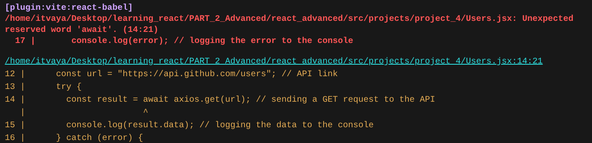
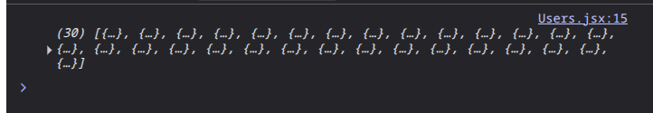
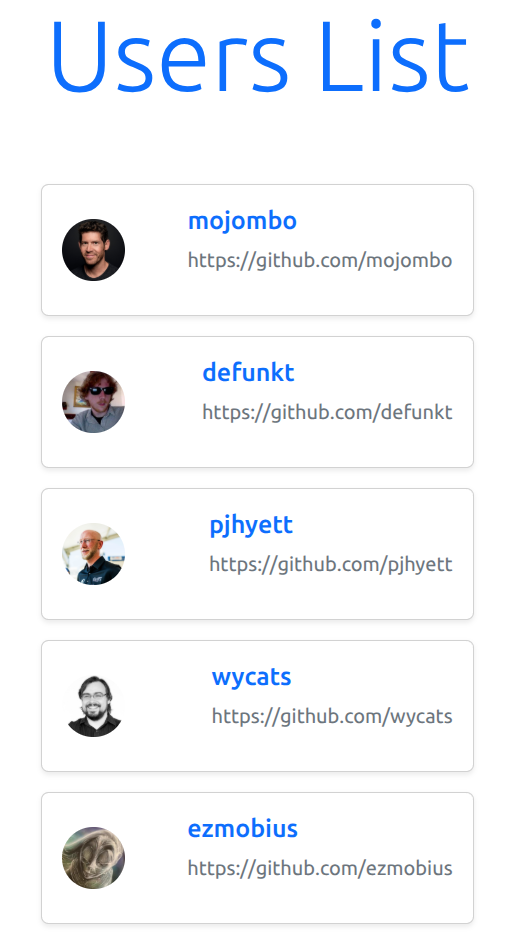

# REACT (PART-2 : Advanced & Hooks)

- [LinkedIn](https://www.linkedin.com/in/pro-programmer/)
- [YouTube](http://www.youtube.com/@itvaya)
- [gtihub](https://github.com/RishatTalukder/learning_react)
- [Gmail](talukderrishat2@gmail.com)
- [discord](https://discord.gg/ZB495XggcF)

# A Small Recap of Part 1

- Made a `React` app using `create-react-app`.
- Installed `React 18` and `React dom 18` because at that time I didn't know about `React 19`.
- couldn't solve some `dependency` issues. Epic fail.
- Installed some `vs code` extensions.

  - `ES7+ React/Redux/React-Native snippets`
  - `Prettier`

- Made a `product list` app using `React`.
- Learned the rules of `React`.
- Learned about `JSX`.
- Learned about `Components`, `Props`, `Image`, `CSS`.
- Than dumped all the `css` knowledge and used `bootstrap` instead.
- Finally Did another project using `React` and `bootstrap`.
- And realized that `Create-react-app` is completely deprecated and the support is gone so that's one of the reasons why there was sooooo many `dependency` issues.
- So, we learned to create a `React` app using `Vite`.
- Adn we gave up on `React 18` and `React dom 18` and we made the second project (landing page) using the latest version of `React` and `React dom` which is `React 19` and `React dom 19`.

And we are all caught up now. So, we can start the second part of the course. Time to learn some `advanced` stuff. We will do a lot of `projects` in this part. And try to learn as much as we can.

# Structure

As I said, we will do a lot of projects in this parts and those projects won't be very big. So, I think making a new `react` app for each project is a bit of a waste of time and resources. So, I will make a single folder for all the projects and make `component` folder for the projects and we can then import those components in the `App.js` file interchangeably like plugins.

This way we can use the same react app and we won't have to make new `package` installations for each project.

The Folder structure should look like this:

```bash
├── Part-2
│   ├── docs
│   ├── react-advanced
│   │   ├── public
│   │   ├── src
│   │   │   ├── projects
│   │   │   │   ├── 1_project_name
│   │   │   │   ├── 2_project_name
│   │   │   │   ├── 3_project_name
│   │   │   │   ├── 4_project_name
│   │   │   │   ├── 5_project_name
│   │   │   ├── App.jsx
│   │   │   ├── main.jsx
│   │   ├── index.html
│   │   ├── package.json
│   │   ├── vite.config.js
....................
```

Oouuuuukaaay, now with that out of the way, We can set things up.

# Setting up the project

- Satrt a new `vite` project using the command below:

```bash

npm create vite@latest react-advanced --template react
```

> npm create vite@latest is the default command to create a new vite project. which will guide you through the process of creating a new vite project. But skipping the guide we can write the name of the project right after the command and also we can use the `--template` flag to specify the template we want to use. In this case, we are using the `react` template. So, we are creating a new vite project with the name `react-advanced` and using the `react` template.

- Now, we can go to the project folder and install the dependencies along with `bootstrap`:

```bash

cd react-advanced
npm install bootstrap

```

- Now, we can open the project in `vs code` and then set up the `srs` folder for the projects.

- Make two new directories inside the `src` folder named `projects` and `data`. We can remove the `assets` folder, the `App.css` and also `index.css` file because we will use `bootstrap` for styling. Also don't forget to comment out the `import` statement for the `index.css` file in the `main.jsx` file. And also remove the `import` statement for the `App.css` file in the `App.jsx` file. And we can import the `bootstrap` css and `js` files in the `App.jsx` file. The `App.jsx` file should be like this after the changes:

```js {.line-numbers}
//app.jsx

import "bootstrap/dist/css/bootstrap.min.css";
import "bootstrap/dist/js/bootstrap.bundle.min.js";

function App() {
  return <>Hello World</>;
}

export default App;
```

```js {.line-numbers}
//main.jsx

import { StrictMode } from "react";
import { createRoot } from "react-dom/client";
import App from "./App.jsx";

createRoot(document.getElementById("root")).render(
  <StrictMode>
    <App />
  </StrictMode>
);
```

- Now, we can start the development server using the command below:

```bash
npm run dev

```

this will start the development server and you should see a `Hello World` message in the browser.

We are ready to start the projects now.

#### **Some more `useful extensions` for `vs code`**

**PREVIOUSLY INSTALLED:**

- `ES7+ React/Redux/React-Native snippets` - For using `React` snippets.
- `Prettier` - For formatting the code.

**NEWLY INSTALLED:**

- `Advanced New File` - For creating new files and folders easily.
- `Auto Close Tag` - For auto closing tags in `HTML` and `JSX`.
- `Auto Rename Tag` - For auto renaming tags in `HTML` and `JSX`.

Now with all the setup done, we can start with `React` `advanced` `projects`.

# Let's make a `Counter`

Make a component named `Counter.jsx` in `projects/project_1/Counter.jsx` and add the code below in `Counter.jsx` file and also import it in the `App.jsx` file.

```js {.line-numbers}
// projects/project_1/Counter.jsx

import React from "react";

const Counter = () => {
  return <div>Counter</div>;
};

export default Counter;
```

```js {.line-numbers}
// App.jsx
import "bootstrap/dist/css/bootstrap.min.css";
import "bootstrap/dist/js/bootstrap.bundle.min.js";
import Counter from "./projects/1_counter.jsx";

function App() {
  return (
    <>
      <Counter />
    </>
  );
}
export default App;
```

Now let's go to the `Counter.jsx` file and `start coding`.

## Approach

- I'l make a simple `counter` app Where the Counter will start from `0`.
- We can Increase and decrease the counter by `1` using two buttons.
- And also we can reset the counter to `0` using a `reset` button.

So, what we need is a `variable` to store the `counter` value, `2 functions` to increase and decrease the counter, and a `reset` function to reset the counter.

SOOOOOO, let's make it.

### The Variable

We can take a simple variable named `count` and set it to `0` and render it in the `Counter` component.

```js {.line-numbers}
// projects/project_1/Counter.jsx
import React from "react";

const Counter = () => {
  const count = 0; // counter variable
  return (
    <div className="d-flex justify-content-center align-items-center vh-100">
      {" "}
      {/* Centering the counter */}
      {count} {/* Rendering the counter */}
    </div>
  );
};

export default Counter;
```

> The should be a 0 in the middle of the screen.

### Increase, Decrease and Reset

We need three buttons to increase, decrease and reset the counter. So, let's make three buttons and add some `bootstrap` classes to style them.

```js {.line-numbers}
// projects/project_1/Counter.jsx
import React from "react";

const Counter = () => {
  const count = 0; // counter variable
  return (
    <div className="d-flex flex-column justify-content-center align-items-center vh-100">
      <h1
        className="text-center text-primary
      display-1
      "
      >
        {count}
      </h1>
      <div className="mt-1">
        <button className="btn btn-danger mx-2">decrease</button>
        <button className="btn btn-primary mx-2">increase</button>
      </div>
      <button className="btn btn-secondary mt-2">Reset</button>
    </div>
  );
};
export default Counter;
```

> Now, we should see three buttons and a counter in the middle of the screen. The counter should be `0` and the buttons should be styled with `bootstrap` classes.

Now what we need to do is to make a `logic` to increase, decrease and reset the counter when we click the buttons.

There is an `attribute` for the `button` element called `onClick` which takes a function as an argument and runs that function when we click the button. So, if we make a `function` to `increase`, `decrease` and `reset` that will `increment`, `decrement` and `reset` the counter, we can pass that function to the `onClick` attribute of the button. And when we click the button, it will run the function and the counter will be updated.

So, let's make the functions and pass them to the buttons.

```js {.line-numbers}
// projects/project_1/Counter.jsx
import React from "react";

const Counter = () => {
  const count = 0; // counter variable
  const increase = () => {
    console.log("increase"); // function to increase the counter
  };
  const decrease = () => {
    console.log("decrease"); // function to decrease the counter
  };
  const reset = () => {
    console.log("reset"); // function to reset the counter
  };
  return (
    <div className="d-flex flex-column justify-content-center align-items-center vh-100">
      <h1
        className="text-center text-primary
      display-1
      "
      >
        {count}
      </h1>
      <div className="mt-1">
        <button onClick={decrease} className="btn btn-danger mx-2">
          decrease
        </button>
        <button onClick={increase} className="btn btn-primary mx-2">
          increase
        </button>
      </div>
      <button onClick={reset} className="btn btn-secondary mt-2">
        Reset
      </button>
    </div>
  );
};
export default Counter;
```

> here we are checking if the functions are working or not. So, when we click the buttons, we should see the `console` logs in the `console` of the browser. If we see the logs, that means the functions are working and we can move on to the next step.

As we can see the `console` logs are working, We can now increment, decrement and reset the count variable.

```js {.line-numbers}
// projects/project_1/Counter.jsx
import React from "react";

const Counter = () => {
  const count = 0; // counter variable
  const increase = () => {
    count++; // function to increase the counter
    console.log(count);
  };
  const decrease = () => {
    count--; // function to decrease the counter
    console.log(count);
  };
  const reset = () => {
    count = 0; // function to reset the counter
    console.log(count);
  };
  return (
    <div className="d-flex flex-column justify-content-center align-items-center vh-100">
      <h1
        className="text-center text-primary
      display-1
      "
      >
        {count}
      </h1>
      <div className="mt-1">
        <button onClick={decrease} className="btn btn-danger mx-2">
          decrease
        </button>
        <button onClick={increase} className="btn btn-primary mx-2">
          increase
        </button>
      </div>
      <button onClick={reset} className="btn btn-secondary mt-2">
        Reset
      </button>
    </div>
  );
};
export default Counter;
```

> ANNNNDDDD, we broke the code. The counter is not updating or there is nothing in the screen.

This is because we are using const to declare the `count` variable. So, as const is the `immutable` variable, we can't change the value of the `count` variable. So, we need to use `let` instead of `const` to declare the `count` variable.

> Try it yourself. Change the `const` to `let` and see if it works or not.

> I'm `100%` sure it will not work. You should see the `count` variable in the `console` but the counter in the screen will not update.

Why You Asked?

Because, `React` is a `UI` library and it uses a `virtual DOM` to update the UI.

#### The Virtual DOM

`DOM` stands for `Document Object Model`. It is a `tree` structure that represents the `HTML` of the page. When we update the `DOM`, it takes a lot of time to update the `DOM` because it has to go through the whole tree and update the elements.

`React` uses a `virtual DOM` to update the `UI`. The `virtual DOM` is a lightweight copy of the `DOM`. When we update the `UI`, `React` updates the `virtual DOM` first and then updates the `DOM` with the changes. This makes the updates faster and more efficient.

The `virtual DOM` is a `JavaScript` object that represents the `DOM` of the page. When we update the `DOM`, `React` creates a new `virtual DOM` and compares it with the old `virtual DOM`. If there is a difference, it updates the `DOM` with the new `virtual DOM`. This is called `reconciliation`.

Now, how the `virtual DOM` works is that it keeps track of the `state` of the component, When we update the `state`.

> state is a `JavaScript` object that represents the `data` of the component. It is used to store the `data` that changes over time. For example, in our case, the `count` variable is the `state` of the component.

But there is no way that `react` can know that the `count` variable has changed because we are using a simple `JavaScript` variable. So, we need to tell `react` that the `count` variable is a `state` variable and it should keep track of it.

### The useState Hook

`React` provides a `hook` called `useState` to manage the `state` of the component.

> Hooks are functions that let you use `React` features in functional components. They are a way to use `state` and other `React` features without writing a class.

> Every `React` `Hook` starts with the word `use`. For example, `useState`, `useEffect`, `useContext`, etc.

The `useState` hook takes an `initial value` as an argument and returns an array with two elements. The first element is the `state` variable and the second element is a `function` to update the `state` variable.

> This hook will tell `react` that the `count` variable is a `state` variable and it should keep track of it. So, when we update the `count` variable, `react` will know that the `count` variable has changed and it will update the `UI` accordingly.

So, let's use the `useState` hook to manage the `count` variable.

```js {.line-numbers}
// projects/project_1/Counter.jsx
import React, { useState } from "react";

const Counter = () => {
  // let count = 0;
  const [count, setCount] = useState(0); // counter variable

  const increase = () => {
    count++; // function to increase the counter
    console.log(count);
  };
  const decrease = () => {
    count--; // function to decrease the counter
    console.log(count);
  };
  const reset = () => {
    count = 0; // function to reset the counter
    console.log(count);
  };

  return (
    <div className="d-flex flex-column justify-content-center align-items-center vh-100">
      <h1
        className="text-center text-primary
      display-1
      "
      >
        {count}
      </h1>

      <div className="mt-1">
        <button className="btn btn-danger mx-2" onClick={decrease}>
          decrease
        </button>

        <button className="btn btn-primary mx-2" onClick={increase}>
          increase
        </button>
      </div>

      <button className="btn btn-secondary mt-2" onClick={reset}>
        Reset
      </button>
    </div>
  );
};

export default Counter;
```

> We made removed the previous `count` variable and used replaced it with the `const [count, setCount] = useState(0)` line.

> Don't forget to import the `useState` hook from `react`.

`useState(0)` will create a `state` variable named `count` and set the initial value to `0`, as we want the counter to start from `0` and also it will create a function named `setCount`.

> You can name the returned function anything you want. But it is a good/common practice to name it `set` + the name of the state variable. So, in this case, we named our variable `count`, so we named the function `setCount`. This is not a rule but a good practice.

As, the useState hook returns an array of two elements, we can use array destructuring to get the values. So, we can use `const [count, setCount] = useState(0)` to get the values.

But even though we are using the `useState` hook, we are still using the `count` variable as a simple `JavaScript` variable. So, what we need to do is to use the `setCount` function to update the `count` variable instead of using the `count` variable directly. So, we need to change the `increase`, `decrease` and `reset` functions to use the `setCount` function to update the `count` variable.

Let's do just that.

> I know this is a bit confusing but this is how `React` works.

> The `setCount` function takes a new value as an argument and updates the `count` variable.

Let's just try to increment the counter using the `setCount` function.

```js {.line-numbers}
// projects/project_1/Counter.jsx
import React, { useState } from "react";

const Counter = () => {
  const [count, setCount] = useState(0); // counter variable

  const increase = () => {
    setCount(count + 1); // function to increase the counter
    console.log(count);
  };
  const decrease = () => {
    count--; // function to decrease the counter
    console.log(count);
  };
  const reset = () => {
    count = 0; // function to reset the counter
    console.log(count);
  };
  return (
    <div className="d-flex flex-column justify-content-center align-items-center vh-100">
      <h1
        className="text-center text-primary
      display-1
      "
      >
        {count}
      </h1>

      <div className="mt-1">
        <button className="btn btn-danger mx-2" onClick={decrease}>
          decrease
        </button>

        <button className="btn btn-primary mx-2" onClick={increase}>
          increase
        </button>
      </div>

      <button className="btn btn-secondary mt-2" onClick={reset}>
        Reset
      </button>
    </div>
  );
};
export default Counter;
```

Try clicking the `increase` button and see if the counter is increasing or not.

> The counter should be increasing by `1` when we click the `increase` button.

Alright let's recap:

- We use the `useState` hook to create a `state` variable named `count` and set the initial value to `0`.
- The `useState` hook returns an array of two elements. The first element is the `state` variable and the second element is a function to update the `state` variable.
- The state variable is a simple `vanilla` `JavaScript` variable but `react` keeps track of it.
- We use the `setCount` function to update the `count` variable instead of using the `count` variable directly.
- The `setCount` function takes a new value as an argument and updates the `count` variable.

I hope you guys understand how the `useState` hook works. We can now use the `setCount` function to update the `count` variable in the `decrease` and `reset` functions.
So, let's do that.

```js {.line-numbers}
// projects/project_1/Counter.jsx
import React, { useState } from "react";

const Counter = () => {
  const [count, setCount] = useState(0); // counter variable

  const increase = () => {
    setCount(count + 1); // function to increase the counter
    console.log(count);
  };
  const decrease = () => {
    setCount(count - 1); // function to decrease the counter
    console.log(count);
  };
  const reset = () => {
    setCount(0); // function to reset the counter
    console.log(count);
  };
  return (
    <div className="d-flex flex-column justify-content-center align-items-center vh-100">
      <h1
        className="text-center text-primary
      display-1
      "
      >
        {count}
      </h1>

      <div className="mt-1">
        <button className="btn btn-danger mx-2" onClick={decrease}>
          decrease
        </button>

        <button className="btn btn-primary mx-2" onClick={increase}>
          increase
        </button>
      </div>

      <button className="btn btn-secondary mt-2" onClick={reset}>
        Reset
      </button>
    </div>
  );
};
export default Counter;
```

Now, we have a decent `counter` app that can increase, decrease and reset the counter.

### Another way to update the state

As, we have seen, we can pass a single value to the `setCount` function to update the state. But we can also pass a `callback` function to the `setCount` function that takes the previous state as an argument and returns the new state. This might be even more confusing but this is a better and more efficient way to update the state.

The code format should look like this:

```js {.line-numbers}
setCount((prevState) => {
  return newState;
});
```

> The `prevState` is the previous state of the component and the `newState` is the new state of the component.

As you can see, we are passing a `arrow` function to the `setCount` function that has a single argument `prevState`.

This is the exact same `count` variable that we are using in the `Counter` component. So, we can now use the `prevState` variable to update the state using the callback function. Let's implement this in our code.

```js {.line-numbers}
// projects/project_1/Counter.jsx
import React, { useState } from "react";

const Counter = () => {
  const [count, setCount] = useState(0); // counter variable

  const increase = () => {
    setCount((prevState) => prevState + 1); // function to increase the counter
    console.log(count);
  };
  const decrease = () => {
    setCount((prevState) => prevState - 1); // function to decrease the counter
    console.log(count);
  };
  const reset = () => {
    setCount(0); // function to reset the counter
    console.log(count);
  };
  return (
    <div className="d-flex flex-column justify-content-center align-items-center vh-100">
      <h1
        className="text-center text-primary
      display-1
      "
      >
        {count}
      </h1>

      <div className="mt-1">
        <button className="btn btn-danger mx-2" onClick={decrease}>
          decrease
        </button>

        <button className="btn btn-primary mx-2" onClick={increase}>
          increase
        </button>
      </div>

      <button className="btn btn-secondary mt-2" onClick={reset}>
        Reset
      </button>
    </div>
  );
};
export default Counter;
```

Instead of using `count + 1` to increment and `count - 1` to decrement, we are using `prevState + 1` and `prevState - 1` to increment and decrement the counter.

This method of updating the state opens up a lot of possibilities.

### A task for you to do

Our counter goes from `-infinity` to `+infinity`. I want to set a limit to the counter. I want the counter to go from `0` to `infinity` and not go below `0`.

Use your brain and the knowledge you have learned so far to implement this.

### Solution

```js {.line-numbers}
// projects/project_1/Counter.jsx
import React, { useState } from "react";

const Counter = () => {
  const [count, setCount] = useState(0); // counter variable

  const increase = () => {
    setCount((prevState) => prevState + 1); // function to increase the counter
    console.log(count);
  };

  const decrease = () => {
    setCount((prevState) => {
      if (prevState > 0) {
        return prevState - 1; // function to decrease the counter
      } else {
        return prevState;
      }
    });
    console.log(count);
  };

  const reset = () => {
    setCount(0); // function to reset the counter
    console.log(count);
  };

  return (
    <div className="d-flex flex-column justify-content-center align-items-center vh-100">
      <h1
        className="text-center text-primary
      display-1
      "
      >
        {count}
      </h1>

      <div className="mt-1">
        <button className="btn btn-danger mx-2" onClick={decrease}>
          decrease
        </button>

        <button className="btn btn-primary mx-2" onClick={increase}>
          increase
        </button>
      </div>

      <button className="btn btn-secondary mt-2" onClick={reset}>
        Reset
      </button>
    </div>
  );
};
export default Counter;
```

### General Rules of `React hooks / useState`

- Start with the word `use`.
- Must be called inside a `React` component or a custom `hook`.(will talk about custom hooks later)
- Should be called at the `top` level of the component. (`not inside loops, conditions or nested functions`)
- `State` updates are `asynchronous`.(This means that the state updates are `not immediate`. So, if you try to `log the state variable` right after updating it, you will not see the updated value. You will see the old value.)

## Some extra

### useState Functional update

We know from the previous section that we can pass a function to the `setCount` function to update the state. In that function we can use the previous state of that `state variable` to update the state.

But we have to follow cirtain rules for it.

- The function should `always return a value`.

For your practice I won't write the code for it but I will give you the instructions.

- Make a `button` below the `reset` button and name it `double`.
- When we click the `double` button, the counter should be doubled.
- So, make a function named `double` and pass it to the `onClick` attribute of the button.
- In the `double` function, use the `setCount` function to update the state.
- In the `setCount` function, `pass a function` that takes the previous state as an argument and in that function, console log the `prevState` and look at the console to see what happens.
- Now, return the `prevState * 2` from the function and see what happens.

### Asynchronous state updates

The `setCount` function is `asynchronous`. So, if you try to log the `count` variable right after updating it, you will not see the updated value. You will see the old value.

- Console log the `count` variable right after updating it in the `double` function from the previous section and see what happens.
- You will see the old value of the `count` variable in the console even though you will see the updated value in the `UI`.

### Set time out issue

This is abother wierd thing that can happen in `React`. Let's modify the `increase` function a bit. But this time we will use the `setTimeout` function to add a `2 second delay` to the `increase` function. Everything else will be the same. So, the `increase` function should look like this:

> we also don't need the `double` button for this. So, you can remove it or keep it. It's up to you.

```js {.line-numbers}

import React, { useState } from "react";

const Counter = () => {
  // let count = 0;
  const [count, setCount] = useState(0);

  const increase = () => {
    setTimeout(()=>{
      setCount(count + 1);
    },3000)
    console.log(count);
  };

  const decrease = () => {
    ... // everything else is the same
  };
  const reset = () => {
    ... // everything else is the same
  };

  return (
    ... // everything else is the same
  );
};

export default Counter;

```

Now, if we click the increase button, it will wait for `3 seconds` before updating the counter and the counter will be `increased by 1`.

But if you click the `increase` multiple times in `the 3 seconds`, the counter will be increased by only `1` no matter how many times you click the button. This is because the `setCount` function is `asynchronous` and it will only update the state once. And when we are using `useState` hook and `directly updating the state`, it will only update the state once becuase the when we are updating the state, it will take the previous state and update it. So, when we are passing `count + 1` to the `setCount` function, the count variable will be the same no matter how many times we click the button. So, the counter will only be increased by `1` no matter how many times we click the button.

This is one quirk of `React` that you should know. But if you want to update the state multiple times, you can use the `setCount` functional update method. So, instead of passing `count + 1` to the `setCount` function, we can pass a function that takes the previous state as an argument and returns the new state. So, we can use the `prevState` variable to update the state. So, the `increase` function should look like this:

```js {.line-numbers}

import React, { useState } from "react";
const Counter = () => {
  // let count = 0;
  const [count, setCount] = useState(0);

  const increase = () => {
    setTimeout(() => {
      setCount((prevState) => prevState + 1);
    }, 3000);
    console.log(count);
  };

  const decrease = () => {
    ... // everything else is the same
  };
  const reset = () => {
    ... // everything else is the same
  };

  return (
    ... // everything else is the same
  );
};
export default Counter;
```

This way, we are getting the previous state of the `count` variable and updating it with the `prevState` variable. Not like passing the `count` variable directly. This ensures that the state is updated correctly and everytime we click the button, `prevState` will always be updated and the counter will be increased by `1` every time we click the button. So, if we click the button `5` times in `3 seconds`, the counter will be increased by `5` and not `1` after `3 seconds`.

> This is a very important quirk of `React` that you should know. So, make sure you understand this and practice it.

## End of the project

Now, we have a decent `counter` app that can increase, decrease and reset the counter. We also learned about the `useState` hook and how to use it to manage the state of the component. We also learned about the `virtual DOM` and how it works. And we also learned about some `quirks` of `React` that you should know. But there are some other things that you should know about `useState` hook. But we cannot cover `everything` in this `project`. So, I let's move on to the `next project` and we will learn some more things about `React` in the next project.

# Project 2: Todo List

## Steps

- Make a new folder named `project_2` in the `projects` folder.
- Add a new file named `todoData.js` for the data. You can add some dummy data in the file. The data should look like this:

```js {.line-numbers}
// projects/project_2/todoData.js

const todoData = [
  {
    id: 1,
    task: "Buy groceries",
  },
  {
    id: 2,
    task: "Clean the house",
  },
  {
    id: 3,
    task: "Finish project report",
  },
  {
    id: 4,
    task: "Call mom",
  },
  {
    id: 5,
    task: "Walk the dog",
  },
];

export default todoData;
```

- Now, make a new component file named `TodoList.jsx` in the `projects/project_2` folder and import the `todoData.js` file in the `TodoList.jsx` file.

```js {.line-numbers}
// projects/project_2/TodoList.jsx

import React from "react";
import todoData from "./todoData";

const Todo = () => {
  return <div>Todo List</div>;
};
export default Todo;
```

- Now, import the `TodoList` component in the `App.jsx` file and render it in the `App` component.

```js {.line-numbers}
// App.jsx

import "bootstrap/dist/css/bootstrap.min.css";
import "bootstrap/dist/js/bootstrap.bundle.min.js";
import Counter from "./projects/project_1/Counter";
import Todo from "./projects/project_2/Todo"; // importing the Todo component

function App() {
  return (
    <div className="container">
      {/* <Counter></Counter> */}
      <Todo /> {/* rendering the Todo component */}
    </div>
  );
}

export default App;
```

We are ready start coding.

## Rendering the data

We are making a simple `todo list` app where we can `add` and `delete` todos. So, we need to `render` a `list` of `todos` and also we need to `implement` the `add` and `delete` functionality.

> have the data in the `todoData.js` file.
> let's start by rendering the data in the `TodoList` component.

```js {.line-numbers}
// projects/project_2/TodoList.jsx
import React from "react";
import todoData from "./todoData";

const Todo = () => {
  return (
    <div className="p-5">
      <h1 className="text-center mb-5">Todo List</h1>
      <div className="d-flex flex-column align-items-center">
        {todoData.map((todo) => (
          <div key={todo.id}>
            <h3 className="text-center text-primary">{todo.task}</h3>
          </div>
        ))}
      </div>
    </div>
  );
};

export default Todo;
```

> We are using the `map` function to iterate over the `todoData` array and render the `task` in a `h3` tag. We are also using the `key` prop to give each element a unique key. This is important for `React` to keep track of the elements and update them correctly.

This should render the `todo` list in the `TodoList` component. You should see a list of todos in the browser.

But this looks cluttered. So, let's add some `bootstrap` classes to style the list.

```js {.line-numbers}
// projects/project_2/TodoList.jsx
import React from "react";
import todoData from "./todoData";

const Todo = () => {
  return (
    <div className="p-5">
      <h1 className="text-center mb-5">Todo List</h1>
      <div className="d-flex flex-column align-items-center gap-3">
        {data.map((item) => (
          <div
            key={item.id}
            className="card shadow-sm w-100"
            style={{ maxWidth: "500px" }}
          >
            <div className="card-body d-flex justify-content-between align-items-center">
              <h5 className="mb-0">{item.task}</h5>
            </div>
          </div>
        ))}
      </div>
    </div>
  );
};

export default Todo;
```

> Looks clean to me.

Now that we have the data rendered, we can move on to the next step.

## Removing a todo

To `remove` a todo, we need to add a `delete` button to each todo item. So, let's add a `button` to the `TodoList` component and style it with `bootstrap` classes.

```js {.line-numbers}
// projects/project_2/TodoList.jsx
import React from "react";
import todoData from "./todoData";

const Todo = () => {
  return (
    <div className="p-5">
      <h1 className="text-center mb-5">Todo List</h1>
      <div className="d-flex flex-column align-items-center gap-3">
        {todoData.map((item) => (
          <div
            key={item.id}
            className="card shadow-sm w-100"
            style={{ maxWidth: "500px" }}
          >
            <div className="card-body d-flex justify-content-between align-items-center">
              <h5 className="mb-0">{item.task}</h5>
              <button className="btn btn-danger">Delete</button>
            </div>
          </div>
        ))}
      </div>
    </div>
  );
};
export default Todo;
```

> Now, we should see a `delete` button next to each todo item. But this button is not doing anything right now. So, let's add a function to delete the todo item when we click the button.

Now, what we need to do is to create a `function` to delete the todo item and pass it to the `onClick` attribute of the button. But from the previous project, we know that we cannot directly update the `todoData` array because it is a `constant` variable. So, we need a `state` variable to store the `todoData` array and update it when we delete a todo item. So, let's create a `state` variable to store the `todoData` array and update it when we delete a todo item.

We can use the `useState` hook to create a `state` variable to store the `todoData` array. So, let's do that.

```js {.line-numbers}
// projects/project_2/TodoList.jsx
import React, { useState } from "react";
import todoData from "./todoData";

const Todo = () => {
  const [data, setData] = useState(todoData); // state variable to store the todoData array

  const deleteTodo = (id) => {
    setData((prevState) => prevState.filter((item) => item.id !== id)); // function to delete the todo item
  };

  return (
    <div className="p-5">
      <h1 className="text-center mb-5">Todo List</h1>
      <div className="d-flex flex-column align-items-center gap-3">
        {data.map((item) => (
          <div
            key={item.id}
            className="card shadow-sm w-100"
            style={{ maxWidth: "500px" }}
          >
            <div className="card-body d-flex justify-content-between align-items-center">
              <h5 className="mb-0">{item.task}</h5>
              <button
                onClick={() => deleteTodo(item.id)} // passing the id of the todo item to the deleteTodo function
                className="btn btn-danger"
              >
                Delete
              </button>
            </div>
          </div>
        ))}
      </div>
    </div>
  );
};

export default Todo;
```

> Now, when we click the `delete` button, the todo item should be removed from the list.

We are using the `filter` method to filter out the todo item with the `id` that we passed to the `deleteTodo` function.

I think this example will help you understand how the `filter` method works.

### Understanding the Filter method

The `filter` method is a `built-in` method in `JavaScript` that is used to `filter out` elements from an `array` based on a condition. It takes a `callback`.

Make a new file named `filter_example.js` in the `projects/project_2` folder and add the following code to it:

```js {.line-numbers}
// projects/project_2/filter_example.js

const arr = [1, 2, 3, 4, 5, 6, 7, 8, 9, 10];

const newArr = arr.filter((item) => {
  return item > 5;
}); // filtering out the elements that are greater than 5

console.log(newArr); // [6, 7, 8, 9, 10]
```

> Now, run the file using `node filter_example.js` and see the output in the console. You should see an array of numbers that are greater than `5`.

The `filter` methods `callback` function takes three arguments:

- The first argument is the `current` element of the array.
- The second argument is the `index` of the current element.
- The third argument is the `array` itself.

Exactly like the `map` method. The only difference is that the `filter` method returns a new array with the elements that pass the condition in the callback function.

So, when we are using the `filter` method to filter out the todo item with the `id` that we passed to the `deleteTodo` function, we are `checking` if the `id` of the `current` todo item is not equal to the `id` that we passed to the `deleteTodo` function because we want to remove the todo item with that `id`. So, we are using the `!==` operator to check if the `id` is not equal to the `id` that we passed.

And this way the `filter` method return me an `array` without the `id` we want to remove and after we get the new array we can just `set` the `data` state variable to the new array and the `UI` will be updated automatically.

This is how the `filter` method works.

## The Clear All

Like the `delete` button, we can also add a `clear all` button to clear all the todo items. So, let's add a `button` below the todo list and style it with `bootstrap` classes.

```jsx {.line-numbers}
// projects/project_2/TodoList.jsx
import React, { useState } from "react";
import todoData from "./todoData";

const Todo = () => {
  const [data, setData] = useState(todoData); // state variable to store the todoData array

  const deleteTodo = (id) => {
    setData((prevState) => prevState.filter((item) => item.id !== id)); // function to delete the todo item
  };

  const clearAll = () => {
    setData([]); // function to clear all the todo items
  };

  return (
    <div className="p-5">
      <h1 className="text-center mb-5">Todo List</h1>
      <div className="d-flex flex-column align-items-center gap-3">
        ... {/* everything else is the same */}
      </div>
      <button onClick={clearAll} className="btn btn-danger mt-3">
        Clear All
      </button>
      {/* button to clear all the todo items */}
    </div>
  );
};
export default Todo;
```

> We will just `set` the `data` state variable to an empty array to clear all the todo items.

> Now, when we click the `clear all` button, all the todo items should be removed from the list.

Well that was easy. Let's move on to the hard one.

## Adding a todo

Adding to a todo list can be a bit tricky for beginners. Let's try to figure it out.

### What we need?

- We need an `input` field to enter the todo item.
- We need to get the `value` of the input field.
- We need a `button` to add the todo item.
- Also we need to add the todo item to the `todoData` array.
- We need to `update` the `UI` with the new todo item.
- We need to `clear` the input field after adding the todo item.
- We need to give the new todo item a unique `id`.
- We need to make sure that the `id` is `unique` and not already in use.

I think that's about it. So, let's do step by step.

### Adding the input field

Let's just add a simple `input` field and a `button` to the `TodoList` component. We will use `bootstrap` classes to style the input field and the button.

```js {.line-numbers}
// projects/project_2/TodoList.jsx
import React, { useState } from "react";
import todoData from "./todoData";

const Todo = () => {
  const [data, setData] = useState(todoData); // state variable to store the todoData array

  const deleteTodo = (id) => {
    ... // everything else is the same
  };

  const clearAll = () => {
    ... // everything else is the same
  };

  return (
    <div className="p-5">
      <h1 className="text-center mb-5">Todo List</h1>
      {/* input field and button to add a todo item */}
      <div className="d-flex flex-column align-items-center gap-3 mb-4">
        <input
          type="text"
          className="form-control w-50"
          placeholder="Enter a todo item"
          style={{ maxWidth: "500px" }} // to limit the width of the input field
        />
        <button className="btn btn-primary">Add Todo</button>
      </div>

      <div className="d-flex flex-column align-items-center gap-3">

        ...{/* everything else is the same */}

      </div>

      <button onClick={clearAll} className="btn btn-danger mt-3">
        Clear All
      </button>
    </div>
  );
};

export default Todo;
```

> i just added a simple `input` field that takes a `text` input and a button to add the todo item and I added some `bootstrap` classes to style the input field and the button.

We have the input field ready. Now, time for step 2.

### Getting the value of the input field

Getting the value from a input field can be a little tricky. But we just need to know the underlying concept logic behind it.

Let's first figure out how can we get the value of the input field.

We can use the `onChange` event to get the value of the input field.

> `onChange` event is a built-in event in `JavaScript` that is triggered when the value of an input field changes. And like a `onClick` event, we can pass a function to the `onChange` event to get the value of the input field.

```js {.line-numbers}
// projects/project_2/TodoList.jsx
import React, { useState } from "react";
import todoData from "./todoData";

const Todo = () => {
  const [data, setData] = useState(todoData); // state variable to store the todoData array
  const [inputValue, setInputValue] = useState(""); // state variable to store the input value

  const deleteTodo = (id) => {
    ... // everything else is the same
  };

  const clearAll = () => {
    ... // everything else is the same
  };


  return (
    <div className="p-5">
      <h1 className="text-center mb-5">Todo List</h1>
      {/* input field and button to add a todo item */}
      <div className="d-flex flex-column align-items-center gap-3 mb-4">
        <input
          type="text"
          className="form-control w-50"
          placeholder="Enter a todo item"
          style={{ maxWidth: "500px" }} // to limit the width of the input field
          onChange={(e) => setInputValue(e.target.value)} // getting the value of the input field
        />
        <button className="btn btn-primary">Add Todo</button>
      </div>

      <div className="d-flex flex-column align-items-center gap-3">
        ...{/* everything else is the same */}
      </div>

      <button onClick={clearAll} className="btn btn-danger mt-3">
        Clear All
      </button>
    </div>
  );
};

export default Todo;
```

As you can see I used the `onChange` event where I passed an `arrow` function that takes the event as an argument and in that function I used the `setInputValue` function that I created to update the `inputValue` state variable at the top of the component. So, when we type something in the input field, the `inputValue` state variable will be updated with the value of the input field.

> `e` is the event object that is passed to the `onChange` event and `e.target.value` is the value of the input field.

> We will always get a `event` object when we use the `onChange` event. So, we can use the `e.target.value` to get the value of the input field.

> The `target` property of the event object is the element that triggered the event. So, in this case, the `target` property is the input field and the `value` property is the value of the input field.

> Value of a input field will always be a string.

Now, we have a state variable that stores the value of the input field. Now, we can use this value to add a todo item to the list.

### Adding the todo item

So, that we can get a `value` from the `input field`, we can now use this value to add a todo item to the list. So, we can make a function named `handleAdd` that will add the todo item to the list. We can just pass this function to the `onClick` attribute of the button. And then,

- We need to make sure that the `inputValue` is not empty. If it is empty, we can just return from the function.

- We can use the `setData` function to update the `data` state variable.
- Than we can merge the two arrays using the `spread` operator.

> Spread operator can be used as a `syntax` to merge two arrays as the `spread` operator copies the elements of the array and adds them to the new array.

- We can make a `new array` with the `inputValue` and a copy of the `data` array using the spread operator.

- Before that we need to make sure that the `inputValue` should also have a unique `id` and the `id` should be the last `id` of the `data` array + 1. We can manage that by getting the `length` of the `data` array and adding `1` to it. So, the `id` will be `data.length + 1`.

- We can also clear the input field after adding the todo item by setting the `inputValue` state variable to an empty string.

```js {.line-numbers}
// projects/project_2/TodoList.jsx
import React, { useState } from "react";
import todoData from "./todoData";

const Todo = () => {
  const [data, setData] = useState(todoData); // state variable to store the todoData array
  const [inputValue, setInputValue] = useState(""); // state variable to store the input value

  const deleteTodo = (id) => {
    ... // everything else is the same
  };

  const clearAll = () => {
    ... // everything else is the same
  };

  const handleAdd = () => {
    if (inputValue === "") return; // if input value is empty, return from the function

    newData = {
      id: data.length + 1, // unique id for the new todo item
      task: inputValue, // value of the input field
    }
    setData((prevState) => [
      newData, // adding the new todo item to the list
      ...prevState, // merging the two arrays
    ]); // adding the new todo item to the list
    setInputValue(""); // clearing the input field
  };

  return (
    <div className="p-5">
      <h1 className="text-center mb-5">Todo List</h1>
      {/* input field and button to add a todo item */}
      <div className="d-flex flex-column align-items-center gap-3 mb-4">
        <input
          type="text"
          className="form-control w-50"
          placeholder="Enter a todo item"
          style={{ maxWidth: "500px" }} // to limit the width of the input field
          onChange={(e) => setInputValue(e.target.value)} // getting the value of the input field
          value={inputValue} // setting the value of the input field
        />
        <button onClick={handleAdd} className="btn btn-primary">
          Add Todo
        </button>
      </div>

      <div className="d-flex flex-column align-items-center gap-3">
        ...{/* everything else is the same */}
      </div>

      <button onClick={clearAll} className="btn btn-danger mt-3">
        Clear All
      </button>
    </div>
  );
};

export default Todo;
```

> Now, when we click the `add todo` button, the todo item should be added to the list and the input field should be cleared.

But there is a question for you.

Why Am I passing `inputValue` to the `value` attribute of the input field?

I would encourge you to try to figure it out yourself. But if you are not able to do it, I will explain it to you.

Normally the value types in the input field is `controlled` by the `state` variable. So, when we type something in the input field, the value of the input field will be updated with the value of the `inputValue` state variable by default by. But this is controlled by the `value` attribute of the input field. The `value` attribute gets what's wriiten in the input field and shows it in the input field. But when we are adding the `value` attribute to the input field, we are controlling the value of the input field with the `inputValue` state variable.

So, when we are adding the `new Task` in the `todo` list we are updating the `inputValue` state variable to an empty string. But the value of the input field is set to the `previous` value because it is not a `state` variable. So, we need to set the `value` attribute of the input field to the `inputValue` state variable. This way, when we update the `inputValue` state variable, the value of the input field will also be updated with the value of the `inputValue` state variable.

Pheew! That was a lot of information. But I hope you understand how the `value` attribute works in the input field.

Now we have a working `todo` app that can add, delete and clear all the todo items.

## Recap

By doing these two projects, we learned a lot about `React` and how to use the `useState` hook to manage the state of the component. We also learned about the `virtual DOM` and how it works. And we also learned about some `quirks` of `React` that you should know. But there are some other things that you should know about `useState` hook. But we cannot cover `everything` in this `project`. So, I let's move on to the `next project` and we will learn some more things about `React` in the next project.

# Project 3: UseEffect Example(Counter Again)

## UseEffect

The `useEffect` hook is another `built-in` hook in `React` that is used to perform `side effects` in a functional component. Now, you might be wondering what is a `side effect`?

A `side effect` is anything that is not a `pure` function. A `pure` function is a function that does not have any side effects. For example, a function that `returns a value` is a `pure` function. But a function that `updates the state` or `makes an API call` is not a `pure` function. So, we can say that a `side effect` is anything that is not a `pure` function.

Sooooo, the `useEffect` hook is used to perform `side effects` in a functional component. It takes two arguments:

- The first argument is a `callback` function that is executed after the component is rendered.

- The second argument is an `array` of dependencies that tells `React` when to run the `callback` function.

Enough of the theory. Let's see an example of how to use the `useEffect` hook in a functional component.

```js {.line-numbers}
import React, { useState, useEffect } from "react";

const App = () => {
  useEffect(() => {
    console.log("Component mounted");
  }, []); // empty array means that the effect will only run once when the component is mounted

  return (
    <div>
      <h1>Hello World</h1>
    </div>
  );
};
export default App;
```

Now, start the app and see the console. You should see `Component mounted` in the console. This means that the `useEffect` hook is working and the `callback` function is executed after the component is rendered. But have you noticed something?

The `useEffect` `callback` function is executed twice in the console. Because `component mounted` is printed twice in the console. This is because `React` runs the `useEffect` hook twice in `development mode` to help you find bugs in your code. But in `production mode`, it will only run once. So, don't worry about it.

Let's do a small experiement. Remove the `[]` from the `useEffect` hook and see what happens.

You should see `Component mounted` in the console every time the component is re-rendered. This is because the `useEffect` hook is executed every time the component is re-rendered. The `[]` is an empty array that tells `React` to only run the `callback` function once when the component is mounted.

We can also pass a `state` variable to the `useEffect` hook and every time the state variable is updated, the `callback` function will be executed. So, let's make a simple counter app again but this time we will only have the increase button.

## Remaking the counter app

YOu know the process. Make a new folder named `project_3` in the `projects` folder and add a new file named `Counter.jsx` in the `project_3` folder. And then, add the following code to the `Counter.jsx` file:

```js {.line-numbers}
// projects/project_3/Counter.jsx
import React, { useState, useEffect } from "react";
const Counter = () => {
  const [count, setCount] = useState(0); // counter variable

  const increase = () => {
    setCount((prevState) => prevState + 1); // function to increase the counter
  };

  useEffect(() => {
    console.log("Counter updated"); // this will run every time the component is re-rendered
  });

  return (
    <div className="d-flex flex-column justify-content-center align-items-center vh-100">
      <h1
        className="text-center text-primary
      display-1
      "
      >
        {count}
      </h1>

      <div className="mt-1">
        <button className="btn btn-primary mx-2" onClick={increase}>
          increase
        </button>
      </div>
    </div>
  );
};

export default Counter;
```

> Now, import the `Counter` component in the `App.jsx` file and render it in the `App` component.

```js {.line-numbers}
// App.jsx
import "bootstrap/dist/css/bootstrap.min.css";
import "bootstrap/dist/js/bootstrap.bundle.min.js";
import Counter from "./projects/project_3/Counter"; // importing the Counter component

function App() {
  return (
    <div className="container">
      <Counter /> {/* rendering the Counter component */}
      {/* <Todo /> */}
    </div>
  );
}
export default App;
```

Now start the development server with `npm run dev` and see the output in the browser. You should see a counter that increases when you click the `increase` button. And you should also see `Counter updated` in the console every time you click the button.

Time to do another experiment.

### Infinite loop

Call the `increase` function inside the `useEffect` hook and see what happens.

```js {.line-numbers}
// projects/project_3/Counter.jsx
import React, { useState, useEffect } from "react";

const Counter = () => {
  const [count, setCount] = useState(0); // counter variable

  const increase = () => {
    setCount((prevState) => prevState + 1); // function to increase the counter
  };

  useEffect(() => {
    console.log("Counter updated"); // this will run every time the component is re-rendered
    increase(); // calling the increase function inside the useEffect hook
  });

  return (
    ... // everything else is the same
  );
};

export default Counter;
```

This should blank the screen and you should see an `error` in the console saying `Maximum update depth exceeded` or something like that.

This is because the `useEffect` hook is executed every time the component is re-rendered and when we call the `increase` function inside the `useEffect` hook, it updates the state and causes the component to re-render again and again and again and again. This causes an infinite loop and the component keeps re-rendering until the maximum update depth is exceeded.

Not gonna lie, this scenario is waay too common in `React` and you will face this issue a lot. So, that's why we can add a `dependency` array to the `useEffect` hook to tell `React` when to run the `callback` function. And if we keep the dependency array empty, the `callback` function will only run once when the component is mounted. So, let's just add an empty array to the `useEffect` hook and see what happens.

```js {.line-numbers}
// projects/project_3/Counter.jsx
import React, { useState, useEffect } from "react";

const Counter = () => {
  const [count, setCount] = useState(0); // counter variable

  const increase = () => {
    setCount((prevState) => prevState + 1); // function to increase the counter
  };

  useEffect(() => {
    console.log("Counter updated"); // this will run every time the component is re-rendered
    increase(); // calling the increase function inside the useEffect hook
  }, []); // empty array means that the effect will only run once when the component is mounted

  return (
    ... // everything else is the same
  );
};

export default Counter;
```

> Now, when you start the development server and see the output in the browser, you should see `Counter updated` in the console twice and the counter should be increased by `2` and not `1`. Like I said before, the `useEffect` hook is executed twice in `development mode` to help you find bugs in your code. But in `production mode`, it will only run once. So, don't worry about it.

This `empty array` is the `dependency array` that tells `React` when to run the `callback` function. And when it's empty, the `callback` function which has the `side effect` will only run once when the component is mounted or render for the first time.

Inside the `dependency` array, we can also add `state` variables and when the state variable is updated, the `callback` function will be executed.

So, `empty == only run once when the component is mounted` and `with state variable == run every time the state variable is updated`.

Now, I hope you guys understand one of the use cases of the `useEffect` hook. As this was a example of accidentally creating an infinite loop I will go back to the `Counter` app and remove the `increase` function from the `useEffect` hook. And I will also add a `console.log` statement to the `increase` function to see when it is called.

```js {.line-numbers}
// projects/project_3/Counter.jsx
import React, { useState, useEffect } from "react";

const Counter = () => {
  const [count, setCount] = useState(0); // counter variable

  const increase = () => {
    console.log("Increase function called"); // this will run every time the increase function is called
    setCount((prevState) => prevState + 1); // function to increase the counter
  };

  useEffect(() => {
    console.log("Counter updated"); // this will run every time the component is re-rendered
  }, []); // empty array means that the effect will only run once when the component is mounted

  return (
    <div className="d-flex flex-column justify-content-center align-items-center vh-100">
      <h1
        className="text-center text-primary
      display-1
      "
      >
        {count}
      </h1>

      <div className="mt-1">
        <button className="btn btn-primary mx-2" onClick={increase}>
          increase
        </button>
      </div>
    </div>
  );
};

export default Counter;
```

## Multiple Side Effects

Like I said before, the `useEffect` hook takes two arguments. The first argument is a `callback` function that is executed after the component is rendered. And the second argument is an `array` of dependencies that tells `React` when to run the `callback` function.

So, by theory we can say that if we now put the `count` variable in the `dependency` array, the `callback` function will be executed every time the `count` variable is updated. So, let's do that.

```js {.line-numbers}
// projects/project_3/Counter.jsx
import React, { useState, useEffect } from "react";

const Counter = () => {
  const [count, setCount] = useState(0); // counter variable

  const increase = () => {
    console.log("Increase function called"); // this will run every time the increase function is called
    setCount((prevState) => prevState + 1); // function to increase the counter
  };

  useEffect(() => {
    console.log("Counter updated"); // this will run every time the component is re-rendered
  }, [count]); // empty array means that the effect will only run once when the component is mounted

  return (
    ... // everything else is the same
  );
};

export default Counter;
```

> I hace added the `count` variable to the `dependency` array.

Now, go to the server and open the console. Let's test it out. You should see `Counter updated` in the console every time you click the `increase` button or the `count` variable is updated. And now you can see that the `useEffect` hook is executed every time the `count` variable is updated. This is because we added the `count` variable to the `dependency` array. So, when the `increase` function is called, the `count` variable is updated and the `useEffect` hook `detects` that the `count` variable is updated and executes the `callback` function.

But now the question is, what if we had 2 `counters` each with their own `side effects`? How can we do that?

### Setting up the second counter

So, let's set up the second counter inside the `Counter` component. We can just copy the `Counter` component and change the name of the `state` variable to `count2` and the `increase` function to `increase2`. And we can also change the `id` of the second counter to `2`. So, let's do that.

```js {.line-numbers}
// projects/project_3/Counter.jsx
import React, { useState, useEffect } from "react";

const Counter = () => {
  const [count, setCount] = useState(0); // counter variable
  const [count2, setCount2] = useState(0); // second counter variable

  const increase = () => {
    console.log("Increase function called"); // this will run every time the increase function is called
    setCount((prevState) => prevState + 1); // function to increase the counter
  };

  const increase2 = () => {
    console.log("Increase2 function called"); // this will run every time the increase2 function is called
    setCount2((prevState) => prevState + 1); // function to increase the second counter
  };

  useEffect(() => {
    console.log("Counter updated"); // this will run every time the component is re-rendered
  }, [count]); // empty array means that the effect will only run once when the component is mounted

  useEffect(() => {
    console.log("Counter2 updated"); // this will run every time the component is re-rendered
  }, [count2]); // empty array means that the effect will only run once when the component is mounted

  return (
    <div className="d-flex flex-column justify-content-center align-items-center vh-100">
      <h1
        className="text-center text-primary
      display-1
      "
      >
        {count}
      </h1>

      <div className="mt-1">
        <button className="btn btn-primary mx-2" onClick={increase}>
          increase
        </button>
      </div>

      <h1
        className="text-center text-primary
      display-1
      "
      >
        {count2}
      </h1>

      <div className="mt-1">
        <button className="btn btn-primary mx-2" onClick={increase2}>
          increase2
        </button>
      </div>
    </div>
  );
};

export default Counter;
```

> Now, we have two counters with their own `side effects`. The first counter is `count` and the second counter is `count2`. And we have two `increase` functions to increase the counters.

Now, start the development server and see the output in the browser.

You should see two counters with their own `increase` buttons. And when you click the `increase` button, you should see `Counter updated` in the console and when you click the `increase2` button, you should see `Counter2 updated` in the console and even though `re-renders` are happening for both the counters, the `useEffect` hook is executed only for the counter that is updated.

This is the power of the `useEffect` hook. We can define `isolated` side effects for each `state` variable and we can also define multiple `side effects` for the same `state` variable. And they will not interfere with each other. We can do a lot of cool things with this `useState` and `useEffect` combination.

# Fetching data with useEffect Project

WEll well well, you've made it this far. No way I'm going to let you go without doing a little bit of data fetching. This is the part that will stay with you forever and this is the main basis of `React` and `web development in general`. So, let's learn how to fetch data in react using the `useEffect` hook by doing this simple `user's list project`.

## Setting up the project

We will start as usual. Create a new folder named `project_4` in the `projects` folder and add a new file named `Users.jsx` in the `project_4` folder and let's start by creating a simple `Users` component that will only show a `h1` tag with the text `Users List`.

```js {.line-numbers}
// projects/project_4/Users.jsx
import React from "react";

const Users = () => {
  return (
    <div className="d-flex flex-column justify-content-center align-items-center vh-100">
      <h1 className="text-center text-primary display-1">Users List</h1>
    </div>
  );
};
export default Users;
```

Now, we can `import` the `Users` component in the `App.jsx` file and render it in the `App` component. So, let's do that.

```js {.line-numbers}
// App.jsx
import "bootstrap/dist/css/bootstrap.min.css";
import "bootstrap/dist/js/bootstrap.bundle.min.js";
import Users from "./projects/project_4/Users"; // importing the Users component

function App() {
  return (
    <div className="container">
      <Users /> {/* rendering the Users component */}
      {/* <Counter /> */}
      {/* <Todo /> */}
    </div>
  );
}

export default App;
```

Now, start the development server and see the output in the browser. You should see a huge `Users List` in the center of the screen. Now, we can start making the structure of the `Users` component.

### Using dummy data

Before fetching we will make the app with dummy data and see if every-thing works fine. So, let's create some dummy data.

Now let's think about what info about the user do we want in this users list. I want 3 attributes for each of the users,

- `Name`
- `Email`
- `Porfile image`

I can set random names for the users and random email addresses. And I can set the `profile image` as the `svg` avater we made in `Landing Page` project we did for the `part 1(react fundamentals)` of this course.

So, I copied the `svg` avatar from the `Landing Page` project and pasted it in the `project_4` folder. And I named it `av.svg`. And now I will create a new file named `dummyData.js` in the `project_4` folder and add the following code to it:

```js {.line-numbers}
// projects/project_4/dummyData.js
import av from "./av.svg"; // importing the svg avatar
const dummyData = [
  {
    id: 1,
    name: "John Doe",
    email: "john@doe.com",
    image: av,
  },
  {
    id: 2,
    name: "Jane Doe",
    email: "jane@doe.com",
    image: av,
  },
  {
    id: 3,
    name: "Jack Ripper",
    email: "jack666@reaper.com",
    image: av,
  },
];

export default dummyData; // exporting the dummy data
```

> I have created an array of objects with the `id`, `name`, `email` and `image` attributes. And I have set the `image` attribute to the `svg` avatar we made in the `Landing Page` project.

Now, let's go to the `Users` component and import the `dummyData` array and render it in the `Users` component.

```js {.line-numbers}
// projects/project_4/Users.jsx
import React from "react";
import dummyData from "./dummyData"; // importing the dummy data
import av from "./av.svg"; // importing the svg avatar

const Users = () => {
  return (
    <div className="d-flex flex-column justify-content-center align-items-center vh-100">
      <h1 className="text-center text-primary display-1">Users List</h1>
      <div className="d-flex flex-column align-items-center gap-3 mt-5">
        {dummyData.map((user) => {
          return (
            <div
              key={user.id}
              className="card d-flex flex-row justify-content-between align-items-center gap-3 p-3 shadow-sm w-100"
            >
              
              <div className="d-flex flex-column">
                <h5 className="text-primary">{user.name}</h5>
                <p className="text-secondary">{user.email}</p>
              </div>
            </div>
          );
        })}
      </div>
    </div>
  );
};

export default Users;
```

Now, we have a small `Users` component that renders the `dummyData` array. We are using the `map` method to iterate over the `dummyData` array and render each user in a card. And we are using the `key` prop to give each user a unique key.

But this looks a little bit boring. I want to add a button to create a illusion of loading.

The idea is there will be button called `load users` and when we click on it, the `dummyData` will be rendered in the `Users` component. Let's see how we can do that.

### Adding the load users button

So, let's add a button below the `Users List` heading and style it with `bootstrap` classes. And we will also add a `loading` state variable to show the loading state of the users list.

```js {.line-numbers}
// projects/project_4/Users.jsx
import React, { useState } from "react";
import dummyData from "./dummyData"; // importing the dummy data
import av from "./av.svg"; // importing the svg avatar

const Users = () => {
  const [loading, setLoading] = useState(false); // loading state variable
  const [users, setUsers] = useState([...dummyData]); // users state variable

  const loadUsers = () => {
    setLoading(true);
  }; // function to load the users

  return (
    <div className="d-flex flex-column justify-content-center align-items-center vh-100">
      <h1 className="text-center text-primary display-1">Users List</h1>
      <button onClick={loadUsers} className="btn btn-primary mt-3">
        Load Users
      </button>
      <div className="d-flex flex-column align-items-center gap-3 mt-5">
        {users.map((user) => {
          return (
            <div
              key={user.id}
              className="card d-flex flex-row justify-content-between align-items-center gap-3 p-3 shadow-sm w-100"
            >
              
              <div className="d-flex flex-column">
                <h5 className="text-primary">{user.name}</h5>
                <p className="text-secondary">{user.email}</p>
              </div>
            </div>
          );
        })}
      </div>
    </div>
  );
};

export default Users;
```

We made two new state variables. One is `loading` and the other is `users`. The `loading` state variable is used to show the loading state of the users list and the `users` state variable is used to store the users list.

Now you should see a button right below the `Users List` heading. And also the `users` list should be rendered below the button. But we need to add a little bit of logic to show the loading state of the users list. So, let's do that.

So, what can be the logic to show the loading state of the users list?

- We can just use a simple `if` statement to check if the `loading` state variable is `true`. If it is `true`, we can just render the `users` list. If it is `false`, we can just render the `load Users` button.

```js {.line-numbers}
// projects/project_4/Users.jsx
import React, { useState } from "react";
import dummyData from "./dummyData"; // importing the dummy data
import av from "./av.svg"; // importing the svg avatar

const Users = () => {
  const [loading, setLoading] = useState(false); // loading state variable
  const [users, setUsers] = useState([...dummyData]); // users state variable

  const loadUsers = () => {
    setLoading(true);
  }; // function to load the users

  if (loading) {
    return (
      <div className="d-flex flex-column justify-content-center align-items-center vh-100">
        <h1 className="text-center text-primary display-1">Users List</h1>
        <div className="d-flex flex-column align-items-center gap-3 mt-5">
          {users.map((user) => {
            return (
              <div
                key={user.id}
                className="card d-flex flex-row justify-content-between align-items-center gap-3 p-3 shadow-sm w-100"
              >
                
                <div className="d-flex flex-column">
                  <h5 className="text-primary">{user.name}</h5>
                  <p className="text-secondary">{user.email}</p>
                </div>
              </div>
            );
          })}
        </div>
      </div>
    );
  } else {
    return (
      <div className="d-flex flex-column justify-content-center align-items-center vh-100">
        <h1 className="text-center text-primary display-1">Users List</h1>
        <button onClick={loadUsers} className="btn btn-primary mt-3">
          Load Users
        </button>
      </div>
    );
  }
};

export default Users;
```

> As the component will re-render when the `loading` state variable is updated, the check will be done again and the `users` list will be rendered.

Now let's see if our logic is working.

IT WORKSSSS!!??? YEEEEEE BABYYYYY!!!

I got little too excited there, didn't I? All's good now...

Let's get going.

We have a functioning `load users` button that loads the users list when we click on it. Now, time to start fetching the data from the API.

## Fetching data from the API

First we need to know what is an `API`. Simplely, it's a `javaScript object` that has a `link` to the data we want to fetch. Now going to go any deeper now, you'll have a better understanding of it when we start fetching the data.

Time for the main event. We will fetch the data and load it in the `Users` component.

But where will we find the `API`?

That is a good question. There are many `free APIs` specially from `github` that you can use to fetch data. Visit [github API](https://docs.github.com/en/rest/quickstart?apiVersion=2022-11-28) to see the list of APIs you can use.

There is a `users API` that we can use to fetch the users list. The API is `api.github.com/users`. This API will return a list of users with a lot of information about the users. You can find all the info about the users in the [API documentation](https://docs.github.com/en/rest/reference/users#list-users).

Now, go to the `api.github.com/users` and you should see a list of users objects. Nothing too fancy.

The data should look like this:

```json
[
  {
    "login": "mojombo",
    "id": 1,
    "node_id": "MDQ6VXNlcjE=",
    "avatar_url": "https://avatars.githubusercontent.com/u/1?v=4",
    "gravatar_id": "",
    "url": "https://api.github.com/users/mojombo",
    "html_url": "https://github.com/mojombo",
    "followers_url": "https://api.github.com/users/mojombo/followers",
    "following_url": "https://api.github.com/users/mojombo/following{/other_user}",
    "gists_url": "https://api.github.com/users/mojombo/gists{/gist_id}",
    "starred_url": "https://api.github.com/users/mojombo/starred{/owner}{/repo}",
    "subscriptions_url": "https://api.github.com/users/mojombo/subscriptions",
    "organizations_url": "https://api.github.com/users/mojombo/orgs",
    "repos_url": "https://api.github.com/users/mojombo/repos",
    "events_url": "https://api.github.com/users/mojombo/events{/privacy}",
    "received_events_url": "https://api.github.com/users/mojombo/received_events",
    "type": "User",
    "user_view_type": "public",
    "site_admin": false
  },
  ...
]
```

Each object has a lot of information about the user. But we need only some of the information(`login`, `id`, `avatar_url`, `html_url`) to render the users list.

So, let's get this list of users and render it in the `Users` and load it in the `console`.

### Fetching the data

To fetch the data we need to send a `GET` request to the API link and there is a built-in `fetch` method in `JavaScript` that we can use to fetch the data. But the syntax of the `fetch` method can be a little bit tricky and hard to understand. So, I'll use another library called `axios` to fetch the data.

> Axios is a promise based HTTP client for the browser and node.js. It is a simple and easy to use library to fetch data from the API. You can find the documentation of `axios` [here](https://axios-http.com/docs/intro).

Stop the development server and install `axios` using the following command:

```bash
npm install axios
```

Now, start the server again and let's import `axios` in the `Users` component and use it to fetch the data from the API.

```js {.line-numbers}
// projects/project_4/Users.jsx
import React, { useState } from "react";
import axios from "axios"; // importing axios
import dummyData from "./dummyData"; // importing the dummy data
import av from "./av.svg"; // importing the svg avatar

... // everything else is the same
```

### Fetching the data with axios

axios has a `get` method that we can use to send a `GET` request to the API. The `get` method takes the API link as an argument and returns a promise. What is a promise, you ask? I have no idea. I just know that is a way to handle asynchronous operations in JavaScript.

#### Promise

A `promise` is an `object` that `represents the eventual completion (or failure) of an asynchronous operation and its resulting value`.

Let's say you ordered a pizza. The pizza is the `promise` and the `pizza delivery guy` is the `asynchronous operation`. Now, the pizza delivery guy will take some time to deliver the pizza. So, when you order the pizza, you get a `promise` that the pizza will be delivered to you. But it may take some time. So, when the pizza is delivered to you, the `promise` is `resolved` and you get the pizza. But if the pizza delivery guy gets into an accident or something happens and he doesn't deliver the pizza, the `promise` is `rejected` and you don't get the pizza.

It's a `placeholder` for the `value` that will be `returned` in the future. So, when the `promise` is `resolved`, you get the `value` and when the `promise` is `rejected`, you get an `error`.

There are three states of a `promise`:

- `Pending`: The initial state of the promise. The promise is still being processed and the value is not yet available.
- `Fulfilled`: The promise is resolved and the value is available. The pizza is delivered to you.
- `Rejected`: The promise is rejected and the value is not available. The pizza is not delivered to you.

Assssss, we are all beginners here(including myself) and we don't know what the hell is going on. So, let's do some practice coding and see how the `promise` works in real life.

Try out these examples in the `src/test.js` file.

```js {.line-numbers}
// test.js
// pending and fulfilled example
import axios from "axios";

const promise = new Promise((resolve, reject) => {
  setTimeout(() => {
    resolve("Pizza delivered");
  }, 2000);
});

try {
  const result = await promise;
  console.log(result);
} catch (error) {
  console.log(error);
}
```

> Here i used the `promise` constructor to create a new `promise` and I used the `setTimeout` method to simulate the `asynchronous operation`.

> The `setTimeout` method takes a callback function and a time in milliseconds as arguments. The callback function will be executed after the time is up.

> Resolve is a method of the `promise` object that is used to resolve the promise and return the value.

Here the `promise` is `pending` and after 2 seconds the `promise` is `resolved` and the value inside the `resolve` method is returned.

When the `promise` is `resolved`, the `result` variable will have the value of the `promise` and this way the `promise` is `fulfilled`.

```js {.line-numbers}
// test.js
// rejected example
import axios from "axios";

const url = "https://api.github.com/user";

try {
  const result = await axios.get(url);
  console.log(result);
} catch (error) {
  console.log(error);
}
```

> Note: Dont forget the `htpp://` or `https://` in the url.

> Here I used the `axios` library to send a `GET` request to the API. The `get` method takes the API link as an argument and returns a promise.

The `url` is the API link which is `https://api.github.com/user`(it has a syntax error). So, when we send a `GET` request to the API, the `promise` is `pending` and when the API returns a response, the `promise` is `fulfilled` and the value is returned. But if there is an error in the API or the API is not found, the `promise` is `rejected` and the error is returned.

> The `catch` block is used to handle the error and log it to the console.

> try it with `https://api.github.com/users` and see the difference.

#### fetching the data with axios

Now, let's go back to the `Users` component and use the `axios` library to fetch the data from the API. I'll just make a new function called `fetchUsers` where I'll log the data to the console and I'll call this function inside the `loadUsers` function. So, let's do that.

```js {.line-numbers}
// projects/project_4/Users.jsx
import React, { useState } from "react";
import axios from "axios"; // importing axios
import dummyData from "./dummyData"; // importing the dummy data
import av from "./av.svg"; // importing the svg avatar

const Users = () => {
  const [loading, setLoading] = useState(false); // loading state variable
  const [users, setUsers] = useState([...dummyData]); // users state variable

  const fetchUsers = ()=> {
    const url = "https://api.github.com/users"; // API link
    try {
      const result = await axios.get(url); // sending a GET request to the API
      console.log(result.data); // logging the data to the console
    } catch (error) {
      console.log(error); // logging the error to the console
    }
  } // function to fetch the users

  const loadUsers = () => {
    setLoading(true);
    fetchUsers(); // calling the fetchUsers function
  } // function to load the users

  ... // everything else is the same

```

Now, try the above code and see the output in the console. You should see an error straight away.



> REACT linter prevented the `await` keyword from being used outside of an `async` function.

Time for some theory.

### Async and Await

`async` and `await` are used to handle asynchronous operations in JavaScript.

#### Why fetching from an API is asynchronous?

When we send a `GET` request to the API, the API takes some time to respond. So, we need to wait for the API to respond before we can use the data. This is where `async` and `await` come in.

This process will stop other code from executing until the API responds. So, for the `promise` to be `fulfilled`, we must make it a `asynchronous` function.

That's why to prevent this from happening again and to make the code cleaner, `react` will force you to use the `async` keyword before a function that uses the `await` keyword.

### Fixing the bug

So, let's add the `async` keyword to the `fetchUsers` function and see if it works.

```js {.line-numbers}
// projects/project_4/Users.jsx
import React, { useState } from "react";
import axios from "axios"; // importing axios
import dummyData from "./dummyData"; // importing the dummy data
import av from "./av.svg"; // importing the svg avatar

const Users = () => {
  const [loading, setLoading] = useState(false); // loading state variable
  const [users, setUsers] = useState([...dummyData]); // users state variable

  const fetchUsers = async () => { // adding the async keyword
    const url = "https://api.github.com/users"; // API link
    try {
      const result = await axios.get(url); // sending a GET request to the API
      console.log(result.data); // logging the data to the console
    } catch (error) {
      console.log(error); // logging the error to the console
    }
  } // function to fetch the users

  const loadUsers = () => {
    setLoading(true);
    fetchUsers(); // calling the fetchUsers function
  } // function to load the users

  ... // everything else is the same
```

Now, start the development server and the error should be gone. And you should see the data in the console.



And we successfully fetched the data from the API.

### Preparing the fetched data

We can see the data in the console. `axios.get` returns an object with a lot of information about the response and in the `result` object, we can see the `data` property which contains the data we want. So, we can just use the `result.data` to get the data we want.

In the console we can see that the data is an array of objects and each object has a lot of information about the user. But we need only some of the information for our users list app.

So, we need to map the data and get only the information we need. We can create a new array of objects with the `id`, `name`, `email` and `image` attributes. And we can use the `map` method to iterate over the data and create a new array of objects with the information we need.

```js {.line-numbers}
// projects/project_4/Users.jsx
import React, { useState } from "react";
import axios from "axios"; // importing axios
import dummyData from "./dummyData"; // importing the dummy data
import av from "./av.svg"; // importing the svg avatar

const Users = () => {
  const [loading, setLoading] = useState(false); // loading state variable
  const [users, setUsers] = useState([]); // users state variable

  const fetchUsers = async () => { // adding the async keyword
    const url = "https://api.github.com/users"; // API link
    try {
      const result = await axios.get(url); // sending a GET request to the API
      const data = result.data.map((user) => { // mapping the data to get only the information we need
        return {
          id: user.id,
          name: user.login,
          email: user.html_url,
          image: user.avatar_url,
        };
      });
      console.log(data); // logging the data to the console
    } catch (error) {
      console.log(error); // logging the error to the console
    }
  } // function to fetch the users

  const loadUsers = () => {
    setLoading(true);
    fetchUsers(); // calling the fetchUsers function
  } // function to load the users

  ... // everything else is the same
```

> We mapped over the `result.data` array and created a new array of objects with the `id`, `name`, `email` and `image` attributes that has the values we need.
> The `name` attribute is set to the `login` property of the user object, the `email` attribute is set to the `html_url` property of the user object and the `image` attribute is set to the `avatar_url` property of the user object.

Now, we can set the `users` state variable to the new array of objects we created. So, let's do that.

```js {.line-numbers}

// projects/project_4/Users.jsx
... // everything else is the same

  const fetchUsers = async () => { // adding the async keyword
    const url = "https://api.github.com/users"; // API link
    try {
      const result = await axios.get(url); // sending a GET request to the API
      const data = result.data.map((user) => { // mapping the data to get only the information we need
        return {
          id: user.id,
          name: user.login,
          email: user.html_url,
          image: user.avatar_url,
        };
      });
      setUsers(data); // setting the users state variable to the new array of objects
      console.log(data); // logging the data to the console
    } catch (error) {
      console.log(error); // logging the error to the console
    }
  } // function to fetch the users

  ... // everything else is the same
```

And that's it, we don't need the `dummyData` array anymore. So, let's remove it from the code and we will have a clean project where we are fetching the data from the API and rendering it in the `Users` component.

```js {.line-numbers}
// projects/project_4/Users.jsx
import React, { useEffect, useState } from "react";
import axios from "axios";
// import dummyData from "./dummyData"; // importing the dummy data
import av from "./av.svg"; // importing the svg avatar

const Users = () => {
  const [loading, setLoading] = useState(false);
  const [users, setUsers] = useState([]); // users state variable is an empty array

  const fetchUsers = async () => {
    // adding the async keyword
    const url = "https://api.github.com/users"; // API link
    try {
      const result = await axios.get(url); // sending a GET request to the API
      const data = result.data.map((user) => {
        // mapping the data to get only the information we need
        return {
          id: user.id,
          name: user.login,
          email: user.html_url,
          image: user.avatar_url,
        };
      });
      setUsers(data); // setting the users state variable to the new array of objects
      console.log(data); // logging the data to the console
    } catch (error) {
      console.log(error); // logging the error to the console
    }
  }; // function to fetch the users

  const loadUsers = () => {
    setLoading(true);
    fetchUsers(); // calling the fetchUsers function
  }; // function to load the users

  if (loading) {
    return (
      <div className="d-flex flex-column justify-content-center align-items-center h-100">
        <h1 className="text-center text-primary display-1">Users List</h1>
        <div className="d-flex flex-column align-items-center gap-3 mt-5">
          {users.map((user) => (
            <div
              key={user.id}
              className="card d-flex flex-row justify-content-between align-items-center gap-3 p-3 shadow-sm w-100"
            >
              
              <div className="d-flex flex-column">
                <h5 className="text-primary">{user.name}</h5>
                <p className="text-secondary">{user.email}</p>
              </div>
            </div>
          ))}
        </div>
      </div>
    );
  }

  return (
    <div className="d-flex flex-column justify-content-center align-items-center h-100">
      <h1 className="text-center text-primary display-1">Users List</h1>
      <button onClick={loadUsers} className="btn btn-primary mt-3">
        Load Users
      </button>
    </div>
  );
};

export default Users;
```

Now, let's start the development server and see the output in the browser. You should see the `Load Users` button and when you click on it, the users list should be rendered in the `Users` component like this:


And we are successfully fetching the data from the API and rendering it in the `Users` component. And we also have a `loading` state variable that shows the loading state of the users list.

That should be the end of this project, right? Well, not quite. We are not using the `useEffect` hook yet. We can say this is a `fully functional` project but we could have done it in `vanilla js` too. So, time to reactify this project. But before that, let's make the `component code cleaner`.

## Ternary operator

In this project we are using a lot of `if` statements to check the loading state of the users list, which can make the code a little bit messy and hard to read. We can do the checking using the `ternary operator` which is a shorthand way of writing an `if` statement. Try out this example in the `src/test.js` file.

```js {.line-numbers}
// test.js
const age = 18;

// normal if statement
if (age >= 18) {
  console.log("You are an adult");
} else {
  console.log("You are a minor");
}

// ternary operator
const result = age >= 18 ? "You are an adult" : "You are a minor";

console.log(result);
```

> `?` is the `ternary operator`.

`?` operates takes a condition and two values. If the condition is true, it returns the first value, otherwise it returns the second value.

The syntax of the `ternary operator` is:

```js
condition ? ifTrue : ifFalse;
```

> If the condition is true, it returns the value of `ifTrue`, otherwise it returns the value of `ifFalse`.

> `:` is used to separate the two values. Left side of the `:` is the value that will be returned if the `condition` is `true` and the right side of the `:` is the value that will be returned if the `condition` is `false`.

This might be a little bit confusing at first but we can use this to make our code cleaner and more readable. So, let's use the `ternary operator` to check the loading state of the users list.

```js {.line-numbers}
// projects/project_4/Users.jsx
... // everything else is the same
  return (
    <div className="d-flex flex-column justify-content-center align-items-center h-100">
      <h1 className="text-center text-primary display-1">Users List</h1>

      {loading ? ( // using the ternary operator to check the loading state
        <div className="d-flex flex-column align-items-center gap-3 mt-5">
          {users.map((user) => (
            <div
              key={user.id}
              className="card d-flex flex-row justify-content-between align-items-center gap-3 p-3 shadow-sm w-100"
            >
              
              <div className="d-flex flex-column">
                <h5 className="text-primary">{user.name}</h5>
                <p className="text-secondary">{user.email}</p>
              </div>
            </div>
          ))}
        </div>
      ) : (
        <button onClick={loadUsers} className="btn btn-primary mt-3">
          Load Users
        </button>
      )}

    </div>
  );
};

export default Users;

```

Her istead of using the `if` statement to check the loading state of the users list and then returning the `users` list or the `load users` button using 2 separate `return` statements, we can now use the `ternary operator` to check the loading state of inside the `return` statement and return the `users` list or the `load users` button based on the loading state of the users list. This makes the code cleaner and more understandable.

But too much tarnary operator can make the code even more messy so here are some rules to follow:

- Use the `ternary operator` only when you have a simple condition to check.
- If the conditional statement is too long or complex, use the `if` statement instead.
- If the return value is too big and can be re-used, create a `new component` and return that component instead of using the `ternary operator`.

Use this operator wisely and it will make your code cleaner and more readable. But if you overuse it, it can make the code even more messy and turn it into a `spaghetti code`. So, use it wisely.

## Reactify the project

Now, let's use the `useEffect` hook to fetch the data from the API when the component mounts. The `useEffect` hook is used to perform side effects in a functional component. It takes a function as an argument and runs that function after the component renders. We can use this hook to fetch the data from the API when the component mounts.

```js {.line-numbers}
// projects/project_4/Users.jsx

... // everything else is the same
const Users = () => {
  const [loading, setLoading] = useState(false);
  const [users, setUsers] = useState([]); // users state variable is an empty array

  const fetchUsers = async () => {
    // adding the async keyword
    const url = "https://api.github.com/users"; // API link
    try {
      const result = await axios.get(url); // sending a GET request to the API
      const data = result.data.map((user) => {
        // mapping the data to get only the information we need
        return {
          id: user.id,
          name: user.login,
          email: user.html_url,
          image: user.avatar_url,
        };
      });
      setUsers(data); // setting the users state variable to the new array of objects
      console.log(data); // logging the data to the console
    } catch (error) {
      console.log(error); // logging the error to the console
    }
  }; // function to fetch the users

  const loadUsers = () => {
    setLoading(true); // calling the fetchUsers function
    // fetchUsers(); // removing the fetchUsers function
  }; // function to load the users

  useEffect(() => {
    fetchUsers(); // calling the fetchUsers function
  }, [loading]); // passing the setLoading function as a dependency to the useEffect hook

  return (
    ... // everything else is the same
  )
};

export default Users;
```

> AS we have learned earlier in this project, the `useEffect` hook takes a function as an argument and runs that function after the component renders. So, we can use this hook to fetch the data from the API when the component mounts.

> We removed the `fetchUsers` function from the `loadUsers` function and called it inside the `useEffect` hook and added the `loading` state variable as a dependency to the `useEffect` hook.

We know by adding the `loading` state variable as a dependency to the `useEffect` hook, the `useEffect` hook will run every time the `loading` state variable changes. So, in the `loadUsers` function, we change the `loading` state variable to `true` and the `useEffect` hook will run and fetch the data from the API.

BUT (there's always a but) Do you remember the definition of the `useEffect` hook?

The `useEffect` is used to perform side effects in a functional component. So, when the component mounts, the `useEffect` hook will run and fetch the data from the API. But when the `loading` state variable changes, the `useEffect` hook will run again and fetch the data from the API again. So, how can we prevent this from happening?

We can setup a condition to check if the `loading` state variable is `true` or `false`. If it is `true`, we can fetch call the `fetchUsers` function and if it is `false`, we can just return `null`. So, let's do that.

```js {.line-numbers}
// projects/project_4/Users.jsx
... // everything else is the same

const Users = () => {
  const [loading, setLoading] = useState(false);
  const [users, setUsers] = useState([]); // users state variable is an empty array

  const fetchUsers = async () => {
    ... // everything else is the same
  }; // function to fetch the users

  const loadUsers = () => {
    setLoading(true); // calling the fetchUsers function
    // fetchUsers(); // removing the fetchUsers function
  }; // function to load the users

  useEffect(() => {
    if (loading) {
      fetchUsers(); // calling the fetchUsers function
    }
  }, [loading]); // passing the setLoading function as a dependency to the useEffect hook

  ... // everything else is the same
}
export default Users;
```

And that's it. Now, when the `loading` state variable is `true`, the `useEffect` hook will run and fetch the data from the API. But when the `loading` state variable is `false`, the `useEffect` hook will not run the `fetchUsers` function and the data will not be fetched from the API.

Even though we are using the `useEffect` hook which will trigger when the component mounts, we are preventing the `fetchUsers` function from running at the first render.

AAAANNNNNDDDD we have successfully reactified the project.

And our project is now fully functional and we are fetching the data from the API and rendering it in the `Users` component. That bring's us to the end of this heavily loaded project.

## Bonus (Setting a Error state variable)

You can add this bonus feature to the project if you want to. But I think a API fetching project is not complete without an error management. I won't explain that much here because it's farely simple and you can understand the logic easily.

We will just take a `error` state variable and set it to `true` when there is an error in the API. And we will use the `error` state variable to show the error message in the UI. So, let's do that.

```js {.line-numbers}
// projects/project_4/Users.jsx
import React, { useEffect, useState } from "react";
import axios from "axios"; // importing axios
import av from "./av.svg"; // importing the svg avatar

const Users = () => {
  const [loading, setLoading] = useState(false);
  const [users, setUsers] = useState([]); // users state variable is an empty array
  const [error, setError] = useState(false); // error state variable

  const fetchUsers = async () => {
    // adding the async keyword
    const url = "https://api.github.com/users"; // API link
    try {
      const result = await axios.get(url); // sending a GET request to the API
      const data = result.data.map((user) => {
        // mapping the data to get only the information we need
        return {
          id: user.id,
          name: user.login,
          email: user.html_url,
          image: user.avatar_url,
        };
      });
      setUsers(data); // setting the users state variable to the new array of objects
      console.log(data); // logging the data to the console
    } catch (error) {
      setError(true); // setting the error state variable to true
      console.log(error); // logging the error to the console
    }
  }; // function to fetch the users

  const loadUsers = () => {
    setLoading(true); // calling the fetchUsers function
    // fetchUsers(); // removing the fetchUsers function
  }; // function to load the users

  useEffect(() => {
    if (loading) {
      fetchUsers(); // calling the fetchUsers function
    }
  }, [loading]); // passing the setLoading function as a dependency to the useEffect hook

  if (error) {
    return (
      <div className="d-flex flex-column justify-content-center align-items-center h-100">
        <h1 className="text-center text-primary display-1">Users List</h1>
        <p className="text-danger">Error fetching data from the API</p>
      </div>
    );
  }

  return (
    <div className="d-flex flex-column justify-content-center align-items-center h-100">
      <h1 className="text-center text-primary display-1">Users List</h1>

      {loading ? ( // using the ternary operator to check the loading state
        <div className="d-flex flex-column align-items-center gap-3 mt-5">
          {users.map((user) => (
            <div
              key={user.id}
              className="card d-flex flex-row justify-content-between align-items-center gap-3 p-3 shadow-sm w-100"
            >
              
              <div className="d-flex flex-column">
                <h5 className="text-primary">{user.name}</h5>
                <p className="text-secondary">{user.email}</p>
              </div>
            </div>
          ))}
        </div>
      ) : (
        <button onClick={loadUsers} className="btn btn-primary mt-3">
          Load Users
        </button>
      )}
    </div>
  );
};
export default Users;
```

> We declaired a new state variable called `error` and set it to `false` by default. When we catch an error in the API, we set the `error` state variable to `true`. And we check the `error` state variable if it's `true`, we return an error message in the UI.

Because we are returning the error message in the UI the other code will not be executed. So, we are preventing the `users` list from being rendered in the UI when there is an error in the API.

And we are done, I hope you enjoyed this project and learned a LOT from it. It took waaaay longer than I expected to finish this project. But I hope I didn't bore you to death with all the theory and explanations. I tried to keep it as simple as possible and I hope you learned a lot from this project.

# Project 5: Destination

Now, that we have learned 2 of the most important concepts of `react` and we have a fully functional project, it's crucial to practice what we have learned so far. That's why we are going to build project that will help you practice and recap what we have learned so far.

This project is a simple `destination` app that will show you fun destinations for traveling. It's will be another list like app but this time we can click on a destination it will expand and show more information about the destination. We will also use the `useEffect` hook to fetch the data from a `dummy API` that we will create using `json-server`. So, let's get started.

## Setting up the project

First as we will be setting a `json-server` to create a dummy API, let's set up a `json-server` in the project.

First make a file named `db.json` in the `root` of the project. This file will be used to create a dummy API using `json-server`.

Than we need the dummy data to be used in the `db.json` file. So, Go to the `db.json` file and add the following data:

```json
{
  "destinations": [
    {
      "id": 1,
      "name": "Kaptai Lake",
      "image": "https://encrypted-tbn2.gstatic.com/licensed-image?q=tbn:ANd9GcRrxZpFY6bAJb4Hi3p6h89jIWfbIlA57zm5DPKF_HQP-aN1G9EfRy4mwzD7-5xtK6NJwhTaifV_ttXh2yaV9Lp7ZKmwWuhCoPnm_CJd2g",
      "description": "Kaptai Lake is a natural lake located in the Rangamati district of Bangladesh. With amazing views and a serene atmosphere, it is a popular destination for tourists and locals alike. The lake is surrounded by lush green hills and is home to various species of fish and birds. Visitors can enjoy boating, fishing, and exploring the nearby hills.",
      "location": "Rangamati, Bangladesh"
    },
    {
      "id": 2,
      "name": "Sundarbans",
      "image": "https://encrypted-tbn3.gstatic.com/licensed-image?q=tbn:ANd9GcTlnqro3eX6Ak-C2QJzU4DGaMnXz-NgY4J1XsEDJHNnpOsYpHG-yHM-YB0TXZsBP_-kYi5L89nwHzRS1DufiOx4NESb8OoTInde00T4hQ",
      "description": "The Sundarbans is the largest mangrove forest in the world, located in the delta region of the Padma, Meghna and Brahmaputra river basins. It is home to the Royal Bengal Tiger and various other species of flora and fauna. The forest is a UNESCO World Heritage Site and is a popular destination for eco-tourism.",
      "location": "Khulna, Bangladesh"
    },
    {
      "id": 3,
      "name": "Cox's Bazar",
      "image": "https://encrypted-tbn1.gstatic.com/licensed-image?q=tbn:ANd9GcRdt88zHYhx576FxvfcU3jP0qw2jJDcrv6e6cKhPBS0EcPzdz9S4H_hMpIwwwUIylZlJGuI8ov7RrWK--wIVXF_4IbJaQshh7EO9ALNjQ",
      "description": "Cox's Bazar is the longest natural sea beach in the world, stretching over 120 kilometers along the southeastern coast of Bangladesh. It is a popular tourist destination known for its stunning views, golden sands, and vibrant culture. Visitors can enjoy swimming, sunbathing, and exploring the nearby hills and forests.",
      "location": "Cox's Bazar, Bangladesh"
    }
  ]
}
```

> This is a simple data that we will use to create a dummy API using `json-server`. This is just an JS objest with one property called `destinations` which will be the `endpoint` of the API.

We hare have a list of destinations with their `id`, `name`, `image`, `description` and `location`. I think you are familiar with this data as we have used it in the previous projects.

Time to make a server using `json-server`.

### Setting up json-server

Now, we need to install `json-server` in the project. So, stop the development server and run the following command in the terminal:

```bash
npm install -g json-server
```

> The `-g` flag is used to install the package globally. This will allow us to use the `json-server` command in any project.

Now, we can just run the following command to start the server:

```bash
json-server --watch db.json
```

> The `--watch` flag is used to watch the `db.json` file for changes and restart the server automatically. This will allow us to make changes to the `db.json` file and see the changes in the API without restarting the server manually.

After running the above command, you should see the following output in the terminal:

```bash
--watch/-w can be omitted, JSON Server 1+ watches for file changes by default
JSON Server started on PORT :3000
Press CTRL-C to stop
Watching db.json...

♡( ◡‿◡ )

Index:
http://localhost:3000/

Static files:
Serving ./public directory if it exists

Endpoints:
http://localhost:3000/destinations

```

> The server is running on `http://localhost:3000/` and the API endpoint is `http://localhost:3000/destinations`.

So, here we can see in the `db.json` file whatever property we have, it will be the endpoint of the API. So, in our case the `destinations` property is the endpoint of the API. And we can access the data by going to `http://localhost:3000/destinations`.

And we have a simple API running on our local machine. Now, we can use this API to fetch the data in our project.

### Setting up the project

You already know what to do here.

- Create a new folder called `project_5` in the `src` folder and create a new file called `Destination.jsx` inside the `project_5` folder.
- Import the `Destination` component in the `App.jsx` file and render it in the `App` component.

And that's it. Now, we can start building the `Destination` component.

## Building the Destination component

### Fetching The Data from the API

Now, we can use the `axios` library to fetch the data from the API. So, let's do that.

```js {.line-numbers}
// projects/project_5/Destination.jsx
import React, { useEffect, useState } from "react";
import axios from "axios"; // importing axios

const Destination = () => {
  const [loading, setLoading] = useState(false); // loading state variable
  const [destinations, setDestinations] = useState([]); // destinations state variable

  const fetchDestinations = async () => {
    // function to fetch the destinations
    const url = "http://localhost:3000/destinations"; // API link
    try {
      const result = await axios.get(url); // sending a GET request to the API
      console.log(result.data); // logging the data to the console
    } catch (error) {
      console.log(error); // logging the error to the console
    }
  }; // function to fetch the destinations

  useEffect(() => {
    fetchDestinations(); // calling the fetchDestinations function
  }, []); // passing an empty array as a dependency to the useEffect hook

  return (
    <div>
      <h1>Destination</h1>
    </div>
  );
};

export default Destination;
```

Here, I passed an empty array as a dependency to the `useEffect` hook. This will make the `useEffect` hook run only once when the component mounts. So, we are fetching the data from the API when the component mounts only.

If you have no errors in the console and see the data in the console, then we are good to go. Now, we can set the `destinations` state variable to the data we fetched from the API ans render the destination names in the UI.

```js {.line-numbers}
// projects/project_5/Destination.jsx
import React, { useEffect, useState } from "react";
import axios from "axios"; // importing axios

const Destination = () => {
  const [loading, setLoading] = useState(false); // loading state variable
  const [destinations, setDestinations] = useState([]); // destinations state variable

  const fetchDestinations = async () => {
    // function to fetch the destinations
    const url = "http://localhost:3000/destinations"; // API link
    try {
      const result = await axios.get(url); // sending a GET request to the API
      setDestinations(result.data); // setting the destinations state variable to the data we fetched from the API
      console.log(result.data); // logging the data to the console
    } catch (error) {
      console.log(error); // logging the error to the console
    }
  }; // function to fetch the destinations

  useEffect(() => {
    fetchDestinations(); // calling the fetchDestinations function
  }, []); // passing an empty array as a dependency to the useEffect hook

  return (
    <div>
      <h1>Destination</h1>
      {destinations.map((destination) => (
        <div key={destination.id} className="card">
          <h2>{destination.name}</h2>
        </div>
      ))}
    </div>
  );
};

export default Destination;
```

You should see the destination names rendered in the UI.

If that's the case, then we are good to go. And now we can start building the UI of the `Destination` component.

### Loading screen

It's like a side quest. But I just want to see aloading screen before the data actually loads. So, what we can do is set the `loading` state variable to `true` when we start fetching the data and set it to `false` when the data is fetched. And when according to that we can show a loading screen in the UI. So, let's do that.

```js {.line-numbers}
// projects/project_5/Destination.jsx
import React, { useEffect, useState } from "react";
import axios from "axios"; // importing axios

const Destination = () => {
  const [loading, setLoading] = useState(false); // loading state variable
  const [destinations, setDestinations] = useState([]); // destinations state variable

  const fetchDestinations = async () => {
    // function to fetch the destinations
    const url = "http://localhost:3000/destinations"; // API link
    try {
      setLoading(true); // setting the loading state variable to true
      const result = await axios.get(url); // sending a GET request to the API
      setDestinations(result.data); // setting the destinations state variable to the data we fetched from the API
      console.log(result.data); // logging the data to the console
    } catch (error) {
      console.log(error); // logging the error to the console
    } finally {
      setLoading(false); // setting the loading state variable to false
    }
  }; // function to fetch the destinations

  useEffect(() => {
    fetchDestinations(); // calling the fetchDestinations function
  }, []); // passing an empty array as a dependency to the useEffect hook

  if (loading) {
    return (
      <div className="d-flex flex-column justify-content-center align-items-center h-100">
        <h1 className="text-center text-primary display-1">Loading...</h1>
      </div>
    );
  }

  return (
    <div>
      <h1>Destination</h1>
      {destinations.map((destination) => (
        <div key={destination.id} className="card">
          <h2>{destination.name}</h2>
        </div>
      ))}
    </div>
  );
};
export default Destination;
```

You might not see the loading screen because the data is fetched very quickly. But if you add a `setTimeout` in the `fetchDestinations` function, you will see the loading screen.

```js {.line-numbers}
// projects/project_5/Destination.jsx
import React, { useEffect, useState } from "react";
import axios from "axios"; // importing axios

const Destination = () => {
  const [loading, setLoading] = useState(false); // loading state variable
  const [destinations, setDestinations] = useState([]); // destinations state variable

  const fetchDestinations = async () => { // function to fetch the destinations
    const url = "http://localhost:3000/destinations"; // API link
    try {
      setLoading(true); // setting the loading state variable to true
      const result = await axios.get(url); // sending a GET request to the API
      setDestinations(result.data); // setting the destinations state variable to the data we fetched from the API
      console.log(result.data); // logging the data to the console
    } catch (error) {
      console.log(error); // logging the error to the console
    } finally {
      setTimeout(() => {
        setLoading(false); // setting the loading state variable to false
      }, 2000);
    }
  } // function to fetch the destinations

  ... // everything else is the same

```

And you should see the loading screen for 2 seconds before the data is rendered in the screen. You can remove the `setTimeout` after that. I just wanted to show you how to implement a loading screen in the UI.

### Rendering everthing

We will first render all the data and implement hte features one by one. So, let's render all the data in the UI and then we will implement the features one by one.

```js {.line-numbers}
// projects/project_5/Destination.jsx
import React, { useEffect, useState } from "react";
import axios from "axios"; // importing axios

const Destination = () => {
  const [loading, setLoading] = useState(false); // loading state variable
  const [destinations, setDestinations] = useState([]); // destinations state variable

  const fetchDestinations = async () => {
    ... // everything else is the same
  } // function to fetch the destinations

  useEffect(() => {
    fetchDestinations(); // calling the fetchDestinations function
  }, []); // passing an empty array as a dependency to the useEffect hook

  if (loading) {
    return (
      ... // everything else is the same
    );
  }

  return (
    <div className="my-5">
      <h1 className="text-center mb-4">Destinations</h1>
      <div className="d-flex flex-column align-items-center gap-4">
        {destinations.map((destination) => {
          return (
            <div
              key={destination.id}
              className="card shadow-sm"
              style={{ width: '100%', maxWidth: '500px' }}
            >
              
              <div className="card-body d-flex flex-column">
                <h5 className="card-title text-center">{destination.name}</h5>
                <p className="card-text text-center">
                  {destination.description}
                </p>
                {destination.location}
                <button
                  className="btn btn-primary mx-auto mt-auto"
                  onClick={}
                >
                  Show More
                </button>
              </div>
            </div>
          );
        })}
      </div>
    </div>
  );
};

export default Destination;
```

> I added a `Show More` button in the card for toggling the card. and also added some styles to the card to make it look good.

And now you should be able to see all the data rendered in the UI. You can also add some styles of your own to make it look even better. But I think this is good enough for now.

This hsould show the whole data in the UI. But we don't need to show all the data at once. We need to show only the name and image of the destination and some part of the description. And

### Toggling the card

Now We can implement the toggling feature. As we will update the state of the card when we click on the `Show More` button, we need to create a new state variable to keep track of the toggled cards. But first let's implement a logic where when a show more button is clicked, the card id will be shown on the console. This will help us to know which card is toggled. So, let's do that.

```js {.line-numbers}
// projects/project_5/Destination.jsx
import React, { useEffect, useState } from "react";
import axios from "axios"; // importing axios

const Destination = () => {
  const [loading, setLoading] = useState(false); // loading state variable
  const [destinations, setDestinations] = useState([]); // destinations state variable

  const fetchDestinations = async () => {
    ... // everything else is the same
  } // function to fetch the destinations

  useEffect(() => {
    fetchDestinations(); // calling the fetchDestinations function
  }, []); // passing an empty array as a dependency to the useEffect hook

  if (loading) {
    return (
      ... // everything else is the same
    );
  }

  return (
    <div className="my-5">
      <h1 className="text-center mb-4">Destinations</h1>
      <div className="d-flex flex-column align-items-center gap-4">
        {destinations.map((destination) => {
          return (
            <div
              key={destination.id}
              className="card shadow-sm"
              style={{ width: '100%', maxWidth: '500px' }}
            >
              
              <div className="card-body d-flex flex-column">
                <h5 className="card-title text-center">{destination.name}</h5>
                <p className="card-text text-center">
                  {destination.description}
                </p>
                {destination.location}
                <button
                  className="btn btn-primary mx-auto mt-auto"
                  onClick={() => {
                    console.log(destination.id); // logging the id of the toggled card
                  }}
                >
                  Show More
                </button>
              </div>
            </div>
          );
        })}
      </div>
    </div>
  );
};
export default Destination;
```

> I added an `onClick` event to the `Show More` button and logged the `id` of the destination to the console. This will help us to know which card is toggled.

Now, when you click on the `Show More` button, you should see the id of the destination in the console. If this works we can go to the next step.

What scenarios can we face here?

- One card is toggled
- Multiple cards are toggled
- Also look for un-toggling the card

So, we cannot just use a simple `boolean` state variable to keep track of the toggled cards. We need to create a new state variable that will keep track of all the card that are toggled. So, we can use an object to keep track of the toggled cards. The key of the object will be the `id` of the destination and the value will be a `boolean` value that will tell us if the card is toggled or not. When we click a card, we will set the value of the key to `true` and when we click it again, we will set the value of the key to `false`. Let's do that with a simple example first.

Make a new component called `Toggle.jsx` in the `project_5` folder and add the following code in it:

```js {.line-numbers}
// projects/project_5/Toggle.jsx
import React, { useState } from "react";
const Toggle = () => {
  const [toggle, setToggle] = useState(false); // toggle state variable

  return (
    <div>
      <h1>Toggle</h1>
      <button
        onClick={() => {
          setToggle(!toggle); // toggling the state variable
        }}
      >
        Toggle
      </button>
      {toggle ? (
        <div>
          <h2>Toggle is ON</h2>
          <p>This is the toggled content</p>
        </div>
      ) : (
        <div>
          <h2>Toggle is OFF</h2>
          <p>This is the untoggled content</p>
        </div>
      )}
    </div>
  );
};
export default Toggle;
```

Now import the `Toggle` component in the `Destination` component and render it in the `Destination` component. You should see a button that toggles the content when clicked.

What's happening there?

We have a button that `sets` the `toggle` state variable to it's opposite value when clicked. You can use the traditional `if` statement to check the value of the `toggle` state variable and render the content based on that in the `callback` function of the `onClick` event. But we can just inverse the value of the `toggle` state variable and use the `ternary operator` to check the value of the `toggle` state variable and render the content based on that. This is a simple example of how to use the `ternary operator` to toggle a state variable.

Now, Let's go through the steps to implement the toggling feature in the `Destination` component.

- We need to keep track of the toggled cards. So, we need to create a new state variable called `toggledCards` and set it to an empty object by default.
- We can make a new function to handle the toggling of the cards.
- In that function, we will take the `id` of the destination and check if the `id` is already in the `toggledCards` object. If it is, we will set the value of the key to `false` and if it is not, we will set the value of the key to `true`.
- How can we do that? If the `id` is already in the `toggledCards` object, we can just inverse the value of the key. If it is not, it's default value will be `false` so we can just inverse the value of the key and set it to `true`.
- In both cases we can just inverse the value of the key so, it makes the implementation easier. But Understanding the logic can be difficult for a beginner. So, take your time and try to emulate the logic in your mind. Once you understand the logic, you can implement it in the code.

let's now make a function that will add the `id` of the destination to the `toggledCards` object along with the value of the key and log it in the console.

```js {.line-numbers}
// projects/project_5/Destination.jsx
import React, { useEffect, useState } from "react";
import axios from "axios"; // importing axios

const Destination = () => {
  const [loading, setLoading] = useState(false); // loading state variable
  const [destinations, setDestinations] = useState([]); // destinations state variable
  const [toggledCards, setToggledCards] = useState({}); // toggled cards state variable

  ... // everything else is the same

  const handleToggle = (id) => {
    setToggledCards((prev) => {
      return {
        ...prev, // spread the previous state to make a new object
        [id]: !prev[id], // inverse the value of the key and add
      };
    });
    console.log(toggledCards); // logging the toggled cards to the console
  }; // function to handle the toggling of the cards

  return (
    <div className="my-5">
      <h1 className="text-center mb-4">Destinations</h1>
      <div className="d-flex flex-column align-items-center gap-4">
        {destinations.map((destination) => {
          return (
            <div
              key={destination.id}
              className="card shadow-sm"
              style={{ width: '100%', maxWidth: '500px' }}
            >
              
              <div className="card-body d-flex flex-column">
                <h5 className="card-title text-center">{destination.name}</h5>
                <p className="card-text text-center">
                  {destination.description}
                </p>
                {destination.location}
                <button
                  className="btn btn-primary mx-auto mt-auto"
                  onClick={() => {
                    handleToggle(destination.id); // calling the handleToggle function
                  }}
                >
                  Show More
                </button>
              </div>
            </div>
          );
        })}
      </div>
    </div>
  );
};
export default Destination;
```

> I added a new state variable called `toggledCards` and set it to an empty object by default. I also added a new function called `handleToggle` that takes the `id` of the destination and sets the value of the key to `true` or `false` based on the value of the key. And I called the `handleToggle` function in the `onClick` event of the `Show More` button.

Now, you should see the `toggledCards` object in the console when you click on the `Show More` button. You can also check the value of the key in the `toggledCards` object to see if it is `true` or `false`. This works!!!

Now, What what we can do is, we can see the value of the key in the `toggledCards` object and if it is `true`, we can show the full description of the destination and if it is `false`, we can show only a part of the description. So, let's do that.

```js {.line-numbers}
// projects/project_5/Destination.jsx
import React, { useEffect, useState } from "react";
import axios from "axios"; // importing axios

const Destination = () => {

  ... // everything else is the same

  return (
    <div className="my-5">
      <h1 className="text-center mb-4">Destinations</h1>
      <div className="d-flex flex-column align-items-center gap-4">
        {destinations.map((destination) => {

          const isToggled = toggledCards[destination.id]; // checking if the card is toggled

          return (
            <div
              key={destination.id}
              className="card shadow-sm"
              style={{ width: '100%', maxWidth: '500px' }}
            >
              
              <div className="card-body d-flex flex-column">
                <h5 className="card-title text-center">{destination.name}</h5>
                <p className="card-text text-center">
                  {isToggled ? destination.description : `${destination.description.slice(0, 50)}...`}
                </p>
                {destination.location}
                <button
                  className="btn btn-primary mx-auto mt-auto"
                  onClick={() => {
                    handleToggle(destination.id); // calling the handleToggle function
                  }}
                >
                  Show More
                </button>
              </div>
            </div>
          );
        })}
      </div>
    </div>
  );
};

export default Destination;
```

> I added a new variable called `isToggled` that checks if the card is toggled or not. If it is toggled, we show the full description of the destination and if it is not toggled, we show only a part of the description.

Now, when you click on the `Show More` button, you should see the full description of the destination and when you click it again, you should see only a part of the description.

But our work is not done yet. I also want the `location` to be shown when the card is toggled. So, let's do that too and the final code will look like this:

```js {.line-numbers}
// projects/project_5/Destination.jsx
import React, { useEffect, useState } from "react";
import axios from "axios"; // importing axios

const Destination = () => {
  const [loading, setLoading] = useState(false); // loading state variable
  const [destinations, setDestinations] = useState([]); // destinations state variable
  const [toggledCards, setToggledCards] = useState({}); // toggled cards state variable

  const fetchDestinations = async () => {
    const url = "http://localhost:3000/destinations"; // API link
    try {
      setLoading(true); // setting the loading state variable to true
      const result = await axios.get(url); // sending a GET request to the API
      setDestinations(result.data); // setting the destinations state variable to the data we fetched from the API
      console.log(result.data); // logging the data to the console
    } catch (error) {
      console.log(error); // logging the error to the console
    } finally {
      setLoading(false); // setting the loading state variable to false
    }
  }; // function to fetch the destinations

  useEffect(() => {
    fetchDestinations(); // calling the fetchDestinations function
  }, []); // passing an empty array as a dependency to the useEffect hook

  if (loading) {
    return (
      <div className="d-flex flex-column justify-content-center align-items-center h-100">
        <h1 className="text-center text-primary display-1">Loading...</h1>
      </div>
    );
  }

  return (
    <div className="my-5">
      <h1 className="text-center mb-4">Destinations</h1>
      <div className="d-flex flex-column align-items-center gap-4">
        {destinations.map((destination) => {
          const isToggled = toggledCards[destination.id]; // checking if the card is toggled

          return (
            <div
              key={destination.id}
              className="card shadow-sm"
              style={{ width: "100%", maxWidth: "500px" }}
            >
              
              <div className="card-body d-flex flex-column">
                <h5 className="card-title text-center">{destination.name}</h5>
                <p className="card-text text-center">
                  {isToggled
                    ? destination.description
                    : `${destination.description.slice(0, 50)}...`}
                </p>
                {isToggled && (
                  <p className="text-secondary">{destination.location}</p>
                )}{" "}
                {/* using logical && operator to show the location */}
                <button
                  className="btn btn-primary mx-auto mt-auto"
                  onClick={() => {
                    handleToggle(destination.id); // calling the handleToggle function
                  }}
                >
                  Show More
                </button>
              </div>
            </div>
          );
        })}
      </div>
    </div>
  );
};

export default Destination;
```

> I'm using a logical `&&` operator to show the location when the card is toggled. This will only show the location when the card is toggled and will not show it when the card is not toggled. This is called `short-circuit evaluation` in JavaScript. It's almost like the `ternary operator` but it's a bit different. Try it Yourself and see if you can understand the difference between the two.

And that's it. We are done with the `Destination` component. You can also add some styles of your own to make it look even better. But I think this is good enough for now and we have successfully recapped everything we have learned so far and learned some new logics too. I hope you enjoyed this project and learned a lot from it. We can now move to the next project.

# React Folder Structure

Before Going into the next project, there are some things that I want to discuss with you. If you've been following along with the projects from the fundamentals of React, you might have noticed that everytime we import a component, we have to write the full path of the component. Maybe because of the `es7` extension, we don't have to write the while import path because it automatically imports the component for us. But when we work on a large project, it can be a bit tedious to write the full path of the component every time we import it and evrytime we import a component, we add a new line to the import section. This can make the import section look messy and hard to read.

Also when we are working on a large project, we cannot just make a folder named components and put all the components in that `components` folder. We need to `organize` the `components` in a way that makes sense and is easy to `navigate`. So, let's figure out how we can fix this issues and make our project more organized.

## Organizing the components

Most of the time when working on a project we should have a folder structure like this:

```
src
├── components
│   ├── Header.jsx
│   ├── Footer.jsx
│   ├── Button.jsx
│   └── Card.jsx
├── pages
│   ├── Home.jsx
│   ├── About.jsx
│   └── Contact.jsx
├── utils
│   ├── api.js
│   └── helpers.js
├── App.jsx
├── index.js
└── styles.css
```

Here we have 3 main folders:

- `components`: This folder will contain all the reusable components that we will use in the project. For example, `Header`, `Footer`, `Button`, `Card` etc.
- `pages`: This folder will contain all the pages of the project. For example, `Home`, `About`, `Contact` etc.
- `utils`: This folder will contain all the utility functions that we will use in the project. For example, `api.js`, `helpers.js` etc.

This is a simple folder `structure` that is followed by most of the React projects. To organize the components and pages in a way that we can distinguish between them easily. This makes navigating the project easier and also makes it easier to find the components and pages we need.

But still we have to write the full path of the component every time we import it. So, how can we fix that?

## Using `index.jsx` to simplify imports

In this whole aritcle series I haven't really talked about the `index.jsx` file.

`index.js` or `index.jsx` file is a `special file` in React that is used to `export` all the components from a folder. It's like a `representation` of the folder itself. When we go into a folder `index.jsx` file is the first file that is loaded without `explicitly importing it`.

Go ahead test it out by youself.

- Make folder structure like the structure mentioned above.
- Inside the `components` folder, create a file called `Header.jsx` and inside the make a simple `Header` component that returns a `h1` tag with the text `Header`.

- Make a new file named `index.jsx` inside the `components` folder and import the header component.

- Make a new component in the `index.jsx` file that and render the `Header` component there. Now export the `newly made component` from the `index.jsx` file.

- Now go to the `App.jsx` file and file write the following code:

```js {.line-numbers}
// App.jsx
import React from "react";
import NewComponent from "./components"; // importing the new component from the index.jsx file

const App = () => {
  return (
    <div>
      <NewComponent />
    </div>
  );
};

export default App;
```

You should see the `Header` component rendered in the UI without explicitly importing it from the `index.jsx` file.

We wrote `import NewComponent from "./components";` instead of `import NewComponent from "./components/index.jsx";`. This is because React automatically looks for the `index.jsx` file when we import a folder.

We can use this to our advantage and simplify our imports.

We can import all the components from the `components` folder in the `index.jsx` file and then export them from there. This way we can import all the components from the `components` folder in a single line.

Let's make three new files in the `pages` folder and i'll give the files the following names `page1.jsx`, `page2.jsx`, and `page3.jsx`. And inside each file, I will make a simple component that returns a `h1` tag with the text `Page 1`, `Page 2`, and `Page 3` respectively.

Now I'll make a new file called `index.jsx` inside the `pages` folder and import all the components from the `page1.jsx`, `page2.jsx`, and `page3.jsx` files and export them from there as a single object.

```js {.line-numbers}
// pages/index.jsx
import Page1 from "./page1";
import Page2 from "./page2";
import Page3 from "./page3";

export { Page1, Page2, Page3 };
```

Now, when we import the `pages` folder, we can import all the components from the `index.jsx` file in a single line.

So, previously we had to write:

```js {.line-numbers}
// App.jsx
import React from "react";
import Page1 from "./pages/page1";
import Page2 from "./pages/page2";
import Page3 from "./pages/page3";
```

Now we can just write:

```js {.line-numbers}
// App.jsx
import React from "react";
import { Page1, Page2, Page3 } from "./pages"; // importing the components from the index.jsx file
```

So, we can now import all the components from the `pages` folder in a single line. This makes our imports cleaner and easier to read.

Now you might ask what's the point of this? Instead of importing the components directly from the `pages` folder, we are importing them from the `index.jsx` file. But we have to write the same amount of code because we are still importing the components in the `index.jsx` file, ain’t that just a waste of time?

Well, you are right in a way. But let me explain why this is better than directly importing the components from the `pages` folder.

We have a large project with a lot of components, pages and features. Im not talking about a project with 10-20 components. I am talking about a project with 100+ components. We sometimes have to import most of the components in the `App.jsx` file. And when we do that, we have almost 100 lines of imports in the `App.jsx` file. Which is not ideal. So, what we can do is we can create an `index.jsx` file in the folders and as a component in bieng made we can just import the component in the `index.jsx` file and export it from there. So, no matter how many components we have in the folder, we will only have to write one line of import in the `App.jsx` file or any file for that folder.

In this way we have a cleaner and more organized codebase. And a file `solely` dedicated to exporting the components from the folder.

I hopw this makes sense to you. If you have any questions regarding this, feel free to ask me in the discord server or in the comments section of the article.

## Bonus: Glean

`Glean` is a `VS Code` extension that helps you to organize your imports in a better way. It can refactor you code into new components with just a click. If you have a large component with a lot of code, you can select the code and click on the `Glean` icon in the sidebar and it will refactor the code into a new component and import it in the current file.

It's a nice tool that can make your life easier when working on a large project.
You should install it and try it out. [Glean](https://marketplace.visualstudio.com/items?itemName=wix.glean)

# Handling Missing Data

In the `previous project`, we `fetched` the data from the `API` and `rendered` it in the `UI`. But what if there was some data missing in the API? What if one object in the API didn't have an `image` or a `description` or the `attribute` name was misspelled?

YOu might ask:

_How can that happen? The API is supposed to be well-structured and have all the data we need. because developers are supposed to follow the best practices when creating an API._

Well, you are right. But it's not a very uncommon scenario.

When you are working with a large API, there can be some data that is `missing` or `not available`. This can happen due to various reasons like:

- The data is not available in the database.
- The data is not correctly formatted.
- The data is not correctly fetched from the API. etc.

So, we need a way to handle these scenarios and show a alternatives to the user.

There are different methods to handle missing data. We can use `Vanilla JS` to check if the data is available or not and then render the data accordingly or we can set a default value for the attribute that is missing.

## Using Vanilla JS to handle missing data

Let's make a folder named `missing_data_handling` in the `src` folder and inside that folder, make a file named `MissingData.jsx` and data.js. In the `data.js` file, paste the following code:

```js {.line-numbers}
// src/missing_data_handling/data.js
export const data = [
  {
    id: 1,
    name: {
      full: "John Doe",
      nickname: "Johnny",
    },
    images: [
      {
        profile:
          "https://encrypted-tbn0.gstatic.com/images?q=tbn:ANd9GcTB1PDgsDVk9EVq2xFjKpAwi7mPkZ-Uk1KZVQ&s",
        cover: "https://example.com/cover.jpg",
      },
    ],
    description: "Lorem ipsum dolor sit amet, consectetur adipiscing elit.",
    location: "New York, USA",
  },
  {
    id: 2,
    name: {
      full: "Jane Smith",
      nickname: "Janey",
    },
    description:
      "Sed do eiusmod tempor incididunt ut labore et dolore magna aliqua.",
    location: "Los Angeles, USA",
  },
  {
    id: 3,
    name: {
      full: "Alice Johnson",
    },
    description: null, // missing description
    location: "Chicago, USA",
  },
];
```

> Here in this `data.js` file, we have an array of objects that represent the data we want to render in the UI. But some of the objects are missing some data like the `description` or the `images` attribute. This is a common scenario when working with APIs.

So, let's try to render these attributes one by one and see how we can handle the missing data.

Now, in the `MissingData.jsx` file, import the `data` from the `data.js` file and render the data in the UI. But first, let's try to render the `name` attribute of the object.

```js {.line-numbers}
// src/missing_data_handling/MissingData.jsx
import React from "react";
import { data } from "./data"; // importing the data from the data.js file

const MissingData = () => {
  return (
    <div>
      <h1>Missing Data Handling</h1>
      {data.map((item) => (
        <div key={item.id} className="card">
          <h2>{item.name.full}</h2>
          <p>{item.name.nickname}</p>
        </div>
      ))}
    </div>
  );
};
export default MissingData;
```

> Here we are trying to render the `name` attribute of the object. But what if the `nickname` attribute is missing in the object? We will get an error in the console saying that `nickname` is not defined. So, we need to handle this scenario.

We can use the `ternary operator` to check if the `nickname` attribute is available or not. If it is available, we will render it and if it is not available, we will render a default value like `No nickname available`. Let's do that.

```js {.line-numbers}
// src/missing_data_handling/MissingData.jsx
import React from "react";
import { data } from "./data"; // importing the data from the data.js file
const MissingData = () => {
  return (
    <div>
      <h1>Missing Data Handling</h1>
      {data.map((item) => (
        <div key={item.id} className="card">
          <h2>{item.name.full}</h2>
          <p>
            {item.name.nickname ? item.name.nickname : "No nickname available"}
          </p>
        </div>
      ))}
    </div>
  );
};
export default MissingData;
```

> Here we are using the `ternary operator` to check if the `nickname` attribute is available or not.

But As I said earlier in the article, we should not overuse the `ternary operator` as it can make the code hard to read. So, instead we can use the `logical OR` operator to check if the `nickname` attribute is available or not. If it is available, we will render it and if it is not available, we will render a default value like `No nickname available`. Let's do that.

```js {.line-numbers}
// src/missing_data_handling/MissingData.jsx
import React from "react";
import { data } from "./data"; // importing the data from the data.js file

const MissingData = () => {
  return (
    <div>
      <h1>Missing Data Handling</h1>
      {data.map((item) => (
        <div key={item.id} className="card">
          <h2>{item.name.full}</h2>
          <p>{item.name.nickname || "No nickname available"}</p> {/* using logical OR operator */}
        </div>
      ))}
    </div>
  );
};
export default MissingData;
```

> Here we are using the `logical OR short-circuit` operator to check if the `nickname` attribute is available or not. If it is available, react will render it and if it is not available, it will render the default value `No nickname available`.

Description can be missing too and could be handles the same way. Let's do that too.

```js {.line-numbers}
// src/missing_data_handling/MissingData.jsx
import React from "react";
import { data } from "./data"; // importing the data from the data.js file
const MissingData = () => {
  return (
    <div>
      <h1>Missing Data Handling</h1>
      {data.map((item) => (
        <div key={item.id} className="card">
          <h2>{item.name.full}</h2>
          <p>{item.name.nickname || "No nickname available"}</p>
          <p>{item.description || "No description available"}</p>{" "}
          {/* using logical OR operator */}
        </div>
      ))}
    </div>
  );
};
export default MissingData;
```

Now what if there is whole attribute missing from the object? Like the `images` attribute is missing from the object. How can we hadle that?

To understand the first approach we need to make a sub-component from the `MissingData.jsx` file. So, make a new Component called `Item.jsx` in the `missing_data_handling` folder and move the code that renders the item to that component. The code will look like this:

```js {.line-numbers}
// src/missing_data_handling/Item.jsx
import React from "react";
const Item = ({ item }) => {
  return (
    <div key={item.id} className="card">
      <h2>{item.name.full}</h2>
      <p>{item.name.nickname || "No nickname available"}</p>
      <p>{item.description || "No description available"}</p>
    </div>
  );
};
export default Item;
```

Now, in the `MissingData.jsx` file, import the `Item` component and render it in the `map` function. The code will look like this:

```js {.line-numbers}
// src/missing_data_handling/MissingData.jsx
import React from "react";
import { data } from "./data"; // importing the data from the data.js file
import Item from "./Item"; // importing the Item component
const MissingData = () => {
  return (
    <div>
      <h1>Missing Data Handling</h1>
      {data.map((item) => (
        <Item key={item.id} item={item} /> // rendering the Item component
      ))}
    </div>
  );
};
export default MissingData;
```

This should work like before and we passed the `item` as a prop to the `Item` component. Now, what I like to do is, I like to destructure the `item` prop in the `Item` component and render the `images` attribute if it is available. If it is not available, I we can set a default value for the `images` attribute like an empty array or just a text saying `No images available`. Let's do that.

```js {.line-numbers}
// src/missing_data_handling/Item.jsx
import React from "react";
const Item = ({ id, name, nickname, description, images }) => {
  return (
    <div key={id} className="card">
      <h2>{name.full}</h2>
      <p>{nickname || "No nickname available"}</p>
      <p>{description || "No description available"}</p>
      {/*  */}
    </div>
  );
};
export default Item;
```

> Here I commented out the `img` tag because we will get an error if the `images` attribute is not available in the object.

We, will find the `images` attribute in the `data.js` file and see that it is an array of objects. So, we can take the first object from the array and render the `profile` image. So, we can do `images[0].profile` to get the profile image. But as not every object in the data has the `images` attribute, this will break the code and we will get an error in the console saying that `images is not defined`. So, we need to handle this scenario too.

What we can do is while `destructuring` the `images` attribute, we can set a default value for it like an text saying `No images available` or an empty array. This way, if the `images` attribute is not available in the object, we will not get an error and we can render the default value instead. Let's do that.

```js {.line-numbers}
// src/missing_data_handling/Item.jsx
import React from "react";
const Item = ({
  id,
  name,
  nickname,
  description,
  images = "No images available", // setting a default value for the images attribute
}) => {
  return (
    <div key={id} className="card">
      <h2>{name.full}</h2>
      <p>{nickname || "No nickname available"}</p>
      <p>{description || "No description available"}</p>
      {images !== "No images available" && ( // checking if the images attribute is not the default value
        
      )}
    </div>
  );
};
export default Item;
```

> Here I set a default value for the `images` attribute to be a text saying `No images available`. And then I checked if the `images` attribute is not the default value before rendering the `img` tag. This way, if the `images` attribute is not available in the object, we will not get an error and we can render the default value instead.

Another way is to use `optional chaining` to check if the `images` attribute is available or not.

> This is the part where vanilla js syntax goes full coo-coo.

Optional chaining is a feature in JavaScript that allows you to access the properties of an object without having to check if the object is defined or not. Normally we can check if the object is defined or not by using the `ternary operator` or the `logical AND/OR` operator. As we need a specific attribute from the object, we can use the `AND` operator to check if the object is defined or not and `if it is defined, we can access the attribute from the object`. So, in our case we can do this.

```js {.line-numbers}
// src/missing_data_handling/Item.jsx
import React from "react";
const Item = ({ id, name, nickname, description, images }) => {
  const image = images && images[0] && images[0].profile;
  return (
    <div key={id} className="card">
      <h2>{name.full}</h2>
      <p>{nickname || "No nickname available"}</p>
      <p>{description || "No description available"}</p>
      
    </div>
  );
};
export default Item;
```

> Here we are using the `AND` operator to check if the `images` attribute is defined or not. If it is defined, we can access the `profile` image from the first object in the array. If it is not defined, we will get `undefined` and the `img` tag will not be rendered.

This is a simple way to handle missing data in React but waaaay too messy. So, we can use the `optional chaining` operator to make it cleaner.

```js {.line-numbers}
// src/missing_data_handling/Item.jsx
import React from "react";
const Item = ({ id, name, nickname, description, images }) => {
  const image = images?.[0]?.profile; // using optional chaining to access the profile image
  return (
    <div key={id} className="card">
      <h2>{name.full}</h2>
      <p>{nickname || "No nickname available"}</p>
      <p>{description || "No description available"}</p>
      
    </div>
  );
};
export default Item;
```

_We can use the "?" operator to check if the `images` attribute is defined or not and then we don't have to return anything like the `ternary operator` or the `logical OR` operator`. If the `images`attribute is not defined, it will return`undefined`and the`img`tag will not be rendered. But if the`images`attribute is defined we can go straight to the first item in the array but using the`.`operator and then we can use this as a chain to access the`profile`image from the first object in the array. This is called`optional chaining` and it is a very useful feature in JavaScript._

This makes the `AND` operators verbose approach cleaner and easier to read. But it is not supported in all browsers, so you need to make sure that the browsers you are targeting support it. You can check the compatibility of the `optional chaining` operator on [MDN Web Docs](https://developer.mozilla.org/en-US/docs/Web/JavaScript/Reference/Operators/Optional_chaining).

And finally we can use the `nullish coalescing` operator to set a default value for the `image` variable. This way, if the `images` attribute is not defined, we can set a default value for the `image` variable like an empty string or a placeholder image. Let's do that.

```js {.line-numbers}
import React from "react";
import av from "../../../../PART_1_Fundamentals/landing_page/src/avaters/av.svg"; // bringing a default image from the landing page project from the fundamentals section
const Item = ({
  id,
  name,
  nickname,
  description,
  images, // default value for images
}) => {
  const image = (images && images[0] && images[0].profile) ?? av; // Fallback to a default image if no profile image is available

  // const image = (images && images[0] && images[0].profile) || av;
  return (
    <div key={id} className="card">
      <h2>{name.full}</h2>
      <p>{nickname || "No nickname available"}</p>
      <p>{description || "No description available"}</p>
      
    </div>
  );
};
export default Item;
```

> The "??" operator is refered to as the `nullish coalescing` operator and it is used to set a default value a variable if the variable is `null` or `undefined`. and also if you use this operator after the `optional chaining` operator u need to wrap the whole expression in parentheses. This is because the `??` operator has a lower precedence than the `?.` operator. So, if you don't wrap the expression in parentheses, it will not work as expected.

> You can also use the `||` operator to set a default value for the `image` variable but it will return the default value if the `images` attribute is an empty string or `0`. So, it is better to use the `??` operator to set a default value for the `image` variable.

Well this took me more time Than I expected to write. But I hope you understood how to handle missing data in React. There are other ways to handle missing data like using `try-catch` blocks or using `error boundaries` but those are more advanced topics and we will cover them in the future, these are some clever and fast ways to handle missing data in React.

> PS: practice using the logical AND chaining and then after that try using the optional chaining operator. You will get the hang of it after a few tries.

# Form Handling

We did a project in the adanced section where we made a `input` to take inputs of `tasks` we called `Todo` and we used the `useState` hook to manage the state of the input. This was the first time we have a the simplest form handling in React. But there are more complex forms that we need to handle in React. SO, let's just try to learn how to handle forms in React.

In a normal `HTML` code, the input fields are usually inside a `form` tag and this `form` tag has some attributes like `action`, `method`, etc. We need to understand what these attributes are and how they work with react.

## Controlled Inputs

Let's make new folder in the `src` folder called `form_handling` and inside that folder, make a file called `Form.jsx`. In this file, we will make a simple form with two input fields, one for the name and one for the email. We will also make a submit button to submit the form. The code will look like this:

```js {.line-numbers}
// src/form_handling/Form.jsx
import React, { useState } from "react";
const Form = () => {
  return (
    <div>
      <h1>Controlled Inputs</h1>
      <form>
        <div className="mb-3">
          <label htmlFor="name" className="form-label">
            Name
          </label>
          <input
            type="text"
            className="form-control"
            id="name"
            placeholder="Enter your name"
          />
        </div>
        <div className="mb-3">
          <label htmlFor="email" className="form-label">
            Email
          </label>
          <input
            type="email"
            className="form-control"
            id="email"
            placeholder="Enter your email"
          />
        </div>
        <button type="submit" className="btn btn-primary">
          Submit
        </button>
      </form>
    </div>
  );
};
export default Form;
```

> Here we have a simple form with two input fields and a submit button. We can input something in the input fields and when we click on the submit button, the form will be submitted. But how will we get the values of the input fields when we submit the form?

As we know the that we have to get the values of the input fields to work with them, And what we are doing is typing something in the input fields and then clicking on the submit button. So, we need to keep track of the values of the input fields. This is where `controlled inputs` come in.

> Everything is Hashmap.

To get the values we ned to know the internal workings of HTML.

When we type something in the `input` field, an `event` is triggered. This event is called the `onChange` event and we get a `event` object that has everything we need to know about the event. SO, let's see the onChange event in action. We can add an `onChange` event to the input fields and log the event object to the console.

```js {.line-numbers}
// src/form_handling/Form.jsx
import React, { useState } from "react";
const Form = () => {
  return (
    <div>
      <h1>Controlled Inputs</h1>
      <form>
        <div className="mb-3">
          <label htmlFor="name" className="form-label">
            Name
          </label>
          <input
            type="text"
            className="form-control"
            id="name"
            placeholder="Enter your name"
            onChange={(event) => console.log(event)} // logging the event object to the console
          />
        </div>
        <div className="mb-3">
          <label htmlFor="email" className="form-label">
            Email
          </label>
          <input
            type="email"
            className="form-control"
            id="email"
            placeholder="Enter your email"
            onChange={(event) => console.log(event)} // logging the event object to the console
          />
        </div>
        <button type="submit" className="btn btn-primary">
          Submit
        </button>
      </form>
    </div>
  );
};
export default Form;
```

> I've added the `onChange` attribute to the input fields and we can add an arrow function that takes the `event(sometimes passed as `e`)` object as an argument and logs it to the console.

Now, everytime we type something in the input fields, the `onChange` event will be triggered and we will get the `event` object in the console. If you look at the console, you will see that the `event` object has a lot of properties.

But the one we are interested in is the `target` property. The `target` property is an object that represents the element that triggered the event. In our case, it will be the input field that we are typing in. And this `target` object has a `value` property that contains the value of the input field. So, we can use this to get the value of the input field. So, let's fix the code and let's see the input value in action.

```js {.line-numbers}
// src/form_handling/Form.jsx
import React, { useState } from "react";
const Form = () => {
  return (
    <div>
      <h1>Controlled Inputs</h1>
      <form>
        <div className="mb-3">
          <label htmlFor="name" className="form-label">
            Name
          </label>
          <input
            type="text"
            className="form-control"
            id="name"
            placeholder="Enter your name"
            onChange={(event) => console.log(event.target.value)} // logging the value of the input field to the console
          />
        </div>
        <div className="mb-3">
          <label htmlFor="email" className="form-label">
            Email
          </label>
          <input
            type="email"
            className="form-control"
            id="email"
            placeholder="Enter your email"
            onChange={(event) => console.log(event.target.value)} // logging the value of the input field to the console
          />
        </div>
        <button type="submit" className="btn btn-primary">
          Submit
        </button>
      </form>
    </div>
  );
};
export default Form;
```

> Now I haved logged the value of the input field to the console. So, when we type something in the input field, we will see exactly what we typed in the console.

Well, now we know where to get the value of the input field. But to use this of course we need to store the value of the input field somewhere and as we can see, that everytime we type something in the input field, the `onChange` event is triggered and we get a whole new `event` object. So, we need to store the value of the input field in something that can change over time. Can you guess what that is? Yes, you are right. It's the `useState` hook. W will create a `state` variable for each input field and then we will update the state variable with the value of the input field so that we can use it later. Let's do that.

```js {.line-numbers}
// src/form_handling/Form.jsx
import React, { useState } from "react";
const Form = () => {
  const [name, setName] = useState(""); // creating a state variable for the name input field
  const [email, setEmail] = useState(""); // creating a state variable for the email input field

  return (
    <div>
      <h1>Controlled Inputs</h1>
      <form>
        <div className="mb-3">
          <label htmlFor="name" className="form-label">
            Name
          </label>
          <input
            type="text"
            className="form-control"
            id="name"
            placeholder="Enter your name"
            onChange={(event) => setName(event.target.value)} // updating the state variable with the value of the input field
          />
        </div>
        <div className="mb-3">
          <label htmlFor="email" className="form-label">
            Email
          </label>
          <input
            type="email"
            className="form-control"
            id="email"
            placeholder="Enter your email"
            onChange={(event) => setEmail(event.target.value)} // updating the state variable with the value of the input field
          />
        </div>

        <button type="submit" className="btn btn-primary">
          Submit
        </button>
      </form>
    </div>
  );
};
export default Form;
```

> Here we have created two state variables `name` and `email` using the `useState` hook. And we have updated the state variable with the value of the input field using the `setName` and `setEmail` functions. So, now we can use these state variables to get the value of the input fields.

Now, We have the values of the input fields stored in the state variables. But there is small issue. Yu can face one of the two issues.

1. When you type something in the input field, the value of the input field is not updated.
2. If we reset the state variable to an empty string, the input field will not be cleared.

This is because of another attribute of the input field called `value`. The `value` attribute is used to set the value of the input field. Which also handles the state of the input field. So, if we set don't link the `value` attribute of the input field to the `state` variable, the input field might not update the value when we type something in it or if we update the state variable to something else, the input field will not update its value. So, we need to set the `value` attribute of the input field to the state variable. Let's do that.

```js {.line-numbers}
// src/form_handling/Form.jsx
import React, { useState } from "react";
const Form = () => {
  const [name, setName] = useState(""); // creating a state variable for the name input field
  const [email, setEmail] = useState(""); // creating a state variable for the email input field

  return (
    <div>
      <h1>Controlled Inputs</h1>
      <form>
        <div className="mb-3">
          <label htmlFor="name" className="form-label">
            Name
          </label>
          <input
            type="text"
            className="form-control"
            id="name"
            placeholder="Enter your name"
            value={name} // setting the value attribute to the state variable
            onChange={(event) => setName(event.target.value)} // updating the state variable with the value of the input field
          />
        </div>
        <div className="mb-3">
          <label htmlFor="email" className="form-label">
            Email
          </label>
          <input
            type="email"
            className="form-control"
            id="email"
            placeholder="Enter your email"
            value={email} // setting the value attribute to the state variable
            onChange={(event) => setEmail(event.target.value)} // updating the state variable with the value of the input field
          />
        </div>

        <button type="submit" className="btn btn-primary">
          Submit
        </button>
      </form>
    </div>
  );
};
export default Form;
```

Now the input fields will update their values when we type something in them and if we reset the state variable to an empty string, the input field will also be cleared. This is called `controlled inputs` in React. We are controlling the value of the input field using the state variable.

## Handling Form Submission

Now that we know About Controlled Inputs, let's see how to handle form submission in React. When we submit a form, we usually want to do something with the data that we have entered in the input fields. For example, we might want to send the data to an API or display it on the screen.

I want to display the data on the screen when we submit the form. A form has `onSubmit` event that is triggered when we click a button with type `submit` or press the `Enter` key while focusing on an input field. So, we can add an `onSubmit` function to the form and handle the form submission there. So, let's log the values of the input fields to the console when we submit the form.

```js {.line-numbers}
// src/form_handling/Form.jsx
import React, { useState } from "react";
const Form = () => {
  const [name, setName] = useState(""); // creating a state variable for the name input field
  const [email, setEmail] = useState(""); // creating a state variable for the email input field

  const handleSubmit = (event) => {
    console.log("Form submitted");
    console.log("Name:", name);
    console.log("Email:", email);
  };

  return (
    <div>
      <h1>Controlled Inputs</h1>
      <form onSubmit={handleSubmit}>
        {" "}
        {/* adding onSubmit event to the form */}
        <div className="mb-3">
          <label htmlFor="name" className="form-label">
            Name
          </label>
          <input
            type="text"
            className="form-control"
            id="name"
            placeholder="Enter your name"
            value={name} // setting the value attribute to the state variable
            onChange={(event) => setName(event.target.value)} // updating the state variable with the value of the input field
          />
        </div>
        <div className="mb-3">
          <label htmlFor="email" className="form-label">
            Email
          </label>
          <input
            type="email"
            className="form-control"
            id="email"
            placeholder="Enter your email"
            value={email} // setting the value attribute to the state variable
            onChange={(event) => setEmail(event.target.value)} // updating the state variable with the value of the input field
          />
        </div>
        <button type="submit" className="btn btn-primary">
          Submit
        </button>
      </form>
    </div>
  );
};
export default Form;
```

> Here we have added an `onSubmit` event to the form and we have created a function called `handleSubmit` that will be called when we submit the form. In this function, we are logging the values of the input fields to the console.

Now, when we submit the form, we will see the values of the input fields in the console. But for only a fraction of a second. Because when we submit the form, the page will reload by default. This is because the form is submitted to the server and the page is reloaded. But we don't want that. We want to handle the form submission in React and prevent the page from reloading. So, we need to prevent the default behavior of the form submission.

So, what we can do is, we can call the `preventDefault` method on the `event` object that is passed to the `handleSubmit` function. This will prevent the default behavior of the form submission and the page will not reload. Let's do that.

```js {.line-numbers}
// src/form_handling/Form.jsx
import React, { useState } from "react";
const Form = () => {
  const [name, setName] = useState(""); // creating a state variable for the name input field
  const [email, setEmail] = useState(""); // creating a state variable for the email input field

  const handleSubmit = (event) => {
    event.preventDefault(); // preventing the default behavior of the form submission
    console.log("Form submitted");
    console.log("Name:", name);
    console.log("Email:", email);
  };

  ... // rest of the code remains the same

```

> This should stop the page from reloading and we should be able to see the values of the input fields in the console when we submit the form.

Now, the last part should be pretty straightforward. We can display the `name` as a welcome message in the UI.

```js {.line-numbers}
// src/form_handling/Form.jsx
import React, { useState } from "react";
const Form = () => {
  const [name, setName] = useState(""); // creating a state variable for the name input field
  const [email, setEmail] = useState(""); // creating a state variable for the email input field
  const [submitted, setSubmitted] = useState(false); // creating a state variable to check if the form is submitted

  const handleSubmit = (event) => {
    event.preventDefault(); // preventing the default behavior of the form submission
    console.log("Form submitted");
    console.log("Name:", name);
    console.log("Email:", email);
    setSubmitted(true); // setting the submitted state to true
  };

  return (
    <div>
      <h1>Controlled Inputs</h1>
      {submitted && <h2>Welcome, {name}!</h2>} {/* displaying the welcome message if the form is submitted */}
      <form onSubmit={handleSubmit}>
        {" "}
        {/* adding onSubmit event to the form */}
        <div className="mb-3">
          <label htmlFor="name" className="form-label">
            Name
          </label>
          <input
            type="text"
            className="form-control"
            id="name"
            placeholder="Enter your name"
            value={name} // setting the value attribute to the state variable
            onChange={(event) => setName(event.target.value)} // updating the state variable with the value of the input field
          />
        </div>
        <div className="mb-3">
          <label htmlFor="email" className="form-label">
            Email
          </label>
          <input
            type="email"
            className="form-control"
            id="email"
            placeholder="Enter your email"
            value={email} // setting the value attribute to the state variable
            onChange={(event) => setEmail(event.target.value)} // updating the state variable with the value of the input field
          />
        </div>
        <button type="submit" className="btn btn-primary">
          Submit
        </button>
      </form>
    </div>
  );
};
export default Form;
```

And that's it! Now when we submit the form, we will see a welcome message with the name that we entered in the input field.

# Project-6: Form Practice Project (Users List)

This is like a home task for you. I want you to make a simple form that takes the name only and list the names in a list below the form.

Basically the `To Do` app we made earlier but with a form that takes the name only and lists the names in a list below the form.

Some extra things you can do:

- Find a way to add a new unique id to each name so that you can delete a name from the list.
- Add a delete button next to each name in the list that will remove the name from the list when clicked.

If you have followed this whole article, you should be able to do this project without any issues.

In case, you are stuck, you look at the solution code in the [repository](https://github.com/RishatTalukder/learning_react).

# Some More Form Handling

## Multiple Inputs

We have talked about `controlled inputs` where we had `2` input fields and we had to create a state variable for each input field. But some times we might have multiple input fields that are related to each other. For example, we might have a form that takes the first name, last name, email, password, etc. and there can be many more input fields. So, we need to create a state variable for each input field. But this can be tedious and really problematic in large scale applications. So, we need a more efficient way to handle multiple input fields.

Let's make a new component inside the `form_handling` folder called `MultipleInputs.jsx`. In this component, we will create 4 input fields for the first name, last name, email, and password. We will also create a submit button to submit the form. The component will look like this:

```js {.line-numbers}
// src/form_handling/MultipleInputs.jsx
import React, { useState } from "react";

const MultipleInputs = () => {
  return (
    <div>
      <h1>Multiple Inputs Handling</h1>
      <form>
        <div className="mb-3">
          <label htmlFor="firstName" className="form-label">
            First Name
          </label>
          <input
            type="text"
            className="form-control"
            id="firstName"
            placeholder="Enter your first name"
          />
        </div>
        <div className="mb-3">
          <label htmlFor="lastName" className="form-label">
            Last Name
          </label>
          <input
            type="text"
            className="form-control"
            id="lastName"
            placeholder="Enter your last name"
          />
        </div>
        <div className="mb-3">
          <label htmlFor="email" className="form-label">
            Email
          </label>
          <input
            type="email"
            className="form-control"
            id="email"
            placeholder="Enter your email"
          />
        </div>
        <div className="mb-3">
          <label htmlFor="password" className="form-label">
            Password
          </label>
          <input
            type="password"
            className="form-control"
            id="password"
            placeholder="Enter your password"
          />
        </div>
        <button type="submit" className="btn btn-primary">
          Submit
        </button>
      </form>
    </div>
  );
};
export default MultipleInputs;
```

In traditional HTML, we would have to create a state variable for each input field and then update the state variable with the value of the input field. But as that is tedious and not efficient, what we can do is create a `single state variable` that will hold all the values of the input fields in an `object`. So, we can create a state variable called `formData` that will hold the values of the input fields. And then we can update the state variable with the value of the input field using the `name` attribute of the input field. Let's do that.

```js {.line-numbers}
// src/form_handling/MultipleInputs.jsx
import React, { useState } from "react";

const MultipleInputs = () => {
  const [formData, setFormData] = useState({
    firstName: "",
    lastName: "",
    email: "",
    password: "",
  });

  return (
    .... // rest of the code remains the same
  )
};
export default MultipleInputs;
```

> This is a single state variable that will hold all the values of the input fields in an object. Now that we have a state variable, we learned that we need to update the state variable with the value of the input field everytime the value of the input field changes. And as we have multiple input fields, we should need multiple `onChange` functions to update the state variable. But again this will be tedious and not efficient.

So, we need to figure out a way to update the state variable with the value of the input field without having to create multiple `onChange` functions.

The restriction is `use only one onChange function` to update the state variable.

Let's make that function and add it to the onchange attribute of the input fields.

```js {.line-numbers}
// src/form_handling/MultipleInputs.jsx
import React, { useState } from "react";

const MultipleInputs = () => {
  const [formData, setFormData] = useState({
    firstName: "",
    lastName: "",
    email: "",
    password: "",
  });

  const handleChange = (event) => {
    console.log(event.target.value);
  };

  return (
    <div>
      <h1>Multiple Inputs Handling</h1>
      <form>
        <div className="mb-3">
          <label htmlFor="firstName" className="form-label">
            First Name
          </label>
          <input
            type="text"
            className="form-control"
            id="firstName"
            placeholder="Enter your first name"
            onChange={handleChange} // adding the onChange event to the input field
          />
        </div>
        <div className="mb-3">
          <label htmlFor="lastName" className="form-label">
            Last Name
          </label>
          <input
            type="text"
            className="form-control"
            id="lastName"
            placeholder="Enter your last name"
            onChange={handleChange} // adding the onChange event to the input field
          />
        </div>
        <div className="mb-3">
          <label htmlFor="email" className="form-label">
            Email
          </label>
          <input
            type="email"
            className="form-control"
            id="email"
            placeholder="Enter your email"
            onChange={handleChange} // adding the onChange event to the input field
          />
        </div>
        <div className="mb-3">
          <label htmlFor="password" className="form-label">
            Password
          </label>
          <input
            type="password"
            className="form-control"
            id="password"
            placeholder="Enter your password"
            onChange={handleChange} // adding the onChange event to the input field
          />
        </div>
        <button type="submit" className="btn btn-primary">
          Submit
        </button>
      </form>
    </div>
  );
};
export default MultipleInputs;
```

> I have created a function called `handleChange` that will be called when we type something in the input fields. And I have added the `onChange` event to the input fields and passed the `handleChange` function to it. So, when we type something in the input fields, the `handleChange` function will be called and we will get the value of the input field in the console.

This should work fine. can you guess why this works?

It works because when the `onChange` event is triggered, the `event` object is passed to the `handleChange` function. Even though the `onChange` event is triggered by different input fields, the `event` object will always have a `target` property that represents the input field that triggered the event. So, we can use the `event.target.value` to get the value of the input field that triggered the event.

But it all falls apart when we try to update the state variable with the value of the input field. Because we need to know which input field triggered the event so that we can update the correct property in the `formData` object.

Well, fear not my fellow React developer. remember when I said you will get everything you need to know about a input field in the `event` object? Well, matter of fact is that the `event` object has a `name` property that represents the name of the input field that triggered the event. So, we can use the `event.target.name` to get the name of the input field that triggered the event. Let's see if this works.

```js {.line-numbers}
// src/form_handling/MultipleInputs.jsx
import React, { useState } from "react";

const MultipleInputs = () => {
  const [formData, setFormData] = useState({
    firstName: "",
    lastName: "",
    email: "",
    password: "",
  });

  const handleChange = (event) => {
    console.log(event.target.name); // logging the name of the input field that triggered the event
    console.log(event.target.value); // logging the value of the input field that triggered the event
  };

  return (
    <div>
      <h1>Multiple Inputs Handling</h1>
      <form>
        <div className="mb-3">
          <label htmlFor="firstName" className="form-label">
            First Name
          </label>
          <input
            type="text"
            className="form-control"
            id="firstName"
            placeholder="Enter your first name"
            onChange={handleChange} // adding the onChange event to the input field
          />
        </div>
        <div className="mb-3">
          <label htmlFor="lastName" className="form-label">
            Last Name
          </label>
          <input
            type="text"
            className="form-control"
            id="lastName"
            placeholder="Enter your last name"
            onChange={handleChange} // adding the onChange event to the input field
          />
        </div>
        <div className="mb-3">
          <label htmlFor="email" className="form-label">
            Email
          </label>
          <input
            type="email"
            className="form-control"
            id="email"
            placeholder="Enter your email"
            onChange={handleChange} // adding the onChange event to the input field
          />
        </div>
        <div className="mb-3">
          <label htmlFor="password" className="form-label">
            Password
          </label>
          <input
            type="password"
            className="form-control"
            id="password"
            placeholder="Enter your password"
            onChange={handleChange} // adding the onChange event to the input field
          />
        </div>
        <button type="submit" className="btn btn-primary">
          Submit
        </button>
      </form>
    </div>
  );
};
export default MultipleInputs;
```

> Now type something in the input fields and check the console. What do you see? You should see nothing. This is because we have not set the `name` attribute of the input fields.

Yes! we can have to set a `name` attribute to the input fields so that we can get the name of the input field that triggered the event.

Are you seeing the pattern here? We are using the `name` attribute of the input field to get the name of the input field that triggered the event. So, we can use the name attribute to update the correct property in the `formData` object. So, if you specify the `name` attribute of the input fields according to the properties of the `formData` object, we can use the `name` attribute to update the correct property in the `formData` object. Let's do that.

```js {.line-numbers}
// src/form_handling/MultipleInputs.jsx
import React, { useState } from "react";

const MultipleInputs = () => {
  const [formData, setFormData] = useState({
    firstName: "",
    lastName: "",
    email: "",
    password: "",
  });

  const handleChange = (event) => {
    console.log(event.target.name); // logging the name of the input field that triggered the event
    console.log(event.target.value); // logging the value of the input field that triggered the event
  };

  return (
    <div>
      <h1>Multiple Inputs Handling</h1>
      <form>
        <div className="mb-3">
          <label htmlFor="firstName" className="form-label">
            First Name
          </label>
          <input
            type="text"
            className="form-control"
            id="firstName"
            name="firstName" // setting the name attribute to firstName
            placeholder="Enter your first name"
            onChange={handleChange} // adding the onChange event to the input field
          />
        </div>
        <div className="mb-3">
          <label htmlFor="lastName" className="form-label">
            Last Name
          </label>
          <input
            type="text"
            className="form-control"
            id="lastName"
            name="lastName" // setting the name attribute to lastName
            placeholder="Enter your last name"
            onChange={handleChange} // adding the onChange event to the input field
          />
        </div>
        <div className="mb-3">
          <label htmlFor="email" className="form-label">
            Email
          </label>
          <input
            type="email"
            className="form-control"
            id="email"
            name="email" // setting the name attribute to email
            placeholder="Enter your email"
            onChange={handleChange} // adding the onChange event to the input field
          />
        </div>
        <div className="mb-3">
          <label htmlFor="password" className="form-label">
            Password
          </label>
          <input
            type="password"
            className="form-control"
            id="password"
            name="password" // setting the name attribute to password
            placeholder="Enter your password"
            onChange={handleChange} // adding the onChange event to the input field
          />
        </div>
        <button type="submit" className="btn btn-primary">
          Submit
        </button>
      </form>
    </div>
  );
};
export default MultipleInputs;
```

> Now everytime you update the input fields, you will see the name of the input field and the value of the input field in the console.

And I hope you haven't forgotten how we can update a `javascript object`. Because we will use that to update the `formData` object with the value of the input field that triggered the event. Try it yourself to update the `formData` object with the value of the input field that triggered the event.

If you are stuck, here is what we can do:

- We cna make a copy of the `formData` object using the `spread operator` and then,
- We add the property that we want to update with the value of the input field that triggered the event.

```js {.line-numbers}
// src/form_handling/MultipleInputs.jsx
import React, { useState } from "react";
const MultipleInputs = () => {
  const [formData, setFormData] = useState({
    firstName: "",
    lastName: "",
    email: "",
    password: "",
  });

  const handleChange = (event) => {
    const { name, value } = event.target; // destructuring the name and value from the event target
    setFormData({ ...formData, [name]: value }); // updating the formData object with the value of the input field that triggered the event
  };

  return (
    <div>
      <h1>Multiple Inputs Handling</h1>
      <form>
        <div className="mb-3">
          <label htmlFor="firstName" className="form-label">
            First Name
          </label>
          <input
            type="text"
            className="form-control"
            id="firstName"
            name="firstName" // setting the name attribute to firstName
            placeholder="Enter your first name"
            onChange={handleChange} // adding the onChange event to the input field
          />
        </div>
        <div className="mb-3">
          <label htmlFor="lastName" className="form-label">
            Last Name
          </label>
          <input
            type="text"
            className="form-control"
            id="lastName"
            name="lastName" // setting the name attribute to lastName
            placeholder="Enter your last name"
            onChange={handleChange} // adding the onChange event to the input field
          />
        </div>
        <div className="mb-3">
          <label htmlFor="email" className="form-label">
            Email
          </label>
          <input
            type="email"
            className="form-control"
            id="email"
            name="email" // setting the name attribute to email
            placeholder="Enter your email"
            onChange={handleChange} // adding the onChange event to the input field
          />
        </div>
        <div className="mb-3">
          <label htmlFor="password" className="form-label">
            Password
          </label>
          <input
            type="password"
            className="form-control"
            id="password"
            name="password" // setting the name attribute to password
            placeholder="Enter your password"
            onChange={handleChange} // adding the onChange event to the input field
          />
        </div>
        <button type="submit" className="btn btn-primary">
          Submit
        </button>
      </form>
    </div>
  );
};
export default MultipleInputs;
```

> I have added added the `name` and `value` properties to the `event.target` object using destructuring. And then I have updated the `formData` object with the value of the input field that triggered the event using the spread operator. So, now when we type something in the input fields, the `formData` object will be updated with the value of the input field that triggered the event.

Now, we are ready to dubmit the form. I hope you are not forgetting about the `controlled inputs` thing we learned earlier. I'll leave the rest to you to implement the form submission.

Here's my version:

```js {.line-numbers}
// src/form_handling/MultipleInputs.jsx
import React, { useState } from "react";
const MultipleInputs = () => {
  const [formData, setFormData] = useState({
    firstName: "",
    lastName: "",
    email: "",
    password: "",
  });

  const handleChange = (event) => {
    const { name, value } = event.target;
    setFormData({ ...formData, [name]: value });
  };

  const handleSubmit = (event) => {
    event.preventDefault();
    console.log("Form submitted with data:", formData);
  };

  return (
    <div>
      <h1>Multiple Inputs Handling</h1>
      <form onSubmit={handleSubmit}>
        <div className="mb-3">
          <label htmlFor="firstName" className="form-label">
            First Name
          </label>
          <input
            type="text"
            className="form-control"
            id="firstName"
            name="firstName"
            placeholder="Enter your first name"
            value={formData.firstName}
            onChange={handleChange}
          />
        </div>
        <div className="mb-3">
          <label htmlFor="lastName" className="form-label">
            Last Name
          </label>
          <input
            type="text"
            className="form-control"
            id="lastName"
            name="lastName"
            placeholder="Enter your last name"
            value={formData.lastName}
            onChange={handleChange}
          />
        </div>
        <div className="mb-3">
          <label htmlFor="email" className="form-label">
            Email
          </label>
          <input
            type="email"
            className="form-control"
            id="email"
            name="email"
            placeholder="Enter your email"
            value={formData.email}
            onChange={handleChange}
          />
        </div>
        <div className="mb-3">
          <label htmlFor="password" className="form-label">
            Password
          </label>
          <input
            type="password"
            className="form-control"
            id="password"
            name="password"
            placeholder="Enter your password"
            value={formData.password}
            onChange={handleChange}
          />
        </div>
        <button type="submit" className="btn btn-primary">
          Submit
        </button>
      </form>
    </div>
  );
};
export default MultipleInputs;
```

This is how we handle multiple inputs in `React`. We create a single state variable that holds all the values of the input fields in an object. And then we use the `name` attribute of the input fields to update the correct property in the state variable. This way we can handle multiple input fields without having to create multiple state variables and `onChange` functions.

## Checkbox and Select Inputs

In addition to `text` inputs, we can also handle `checkbox` and `select` inputs in `React`. The process is similar to handling text inputs, but we need to handle the `checked` property for checkboxes and the `value` property for select inputs.

Let's create a new component called `CheckboxAndSelect.jsx` inside the `form_handling` folder. In this component, we will create a checkbox input and a select input. We will also create a submit button to submit the form. The component will look like this:

```js {.line-numbers}
// src/form_handling/CheckboxAndSelect.jsx
import React, { useState } from "react";

const CheckboxAndSelect = () => {
  return (
    <div>
      <h1>Checkbox and Select Inputs</h1>
      <form>
        <div className="mb-3">
          <label htmlFor="subscribe" className="form-label">
            Subscribe to Newsletter
          </label>
          <input type="checkbox" className="form-check-input" id="subscribe" />
        </div>
        <div className="mb-3">
          <label htmlFor="country" className="form-label">
            Select Country
          </label>
          <select className="form-select" id="country">
            <option value="">Select a country</option>
            <option value="usa">USA</option>
            <option value="canada">Canada</option>
            <option value="uk">UK</option>
          </select>
        </div>
        <button type="submit" className="btn btn-primary">
          Submit
        </button>
      </form>
    </div>
  );
};
export default CheckboxAndSelect;
```

Let's first handle the checkbox input. We need to create a state variable to hold the value of the checkbox input. We can use the `checked` property of the checkbox input to get the value of the checkbox input. So, let's create a state variable called `isSubscribed` and update it with the value of the checkbox input when it is checked or unchecked.

```js {.line-numbers}
// src/form_handling/CheckboxAndSelect.jsx
import React, { useState } from "react";

const CheckboxAndSelect = () => {
  const [isSubscribed, setIsSubscribed] = useState(false); // creating a state variable to hold the value of the checkbox input

  const handleCheckboxChange = (event) => {
    setIsSubscribed(event.target.checked); // updating the state variable with the value of the checkbox input
  };

  return (
    <div>
      <h1>Checkbox and Select Inputs</h1>
      <form>
        <div className="mb-3">
          <label htmlFor="subscribe" className="form-label">
            Subscribe to Newsletter
          </label>
          <input
            type="checkbox"
            className="form-check-input"
            id="subscribe"
            checked={isSubscribed} // setting the checked attribute to the state variable
            onChange={handleCheckboxChange} // adding the onChange event to the checkbox input
          />
        </div>
        {/* rest of the code remains the same */}
      </form>
    </div>
  );
};
export default CheckboxAndSelect;
```

> Like we got the value of a text input using the `value` property, we can get the value of a checkbox input using the `checked` property. And we can update the state variable with the value of the checkbox input using the `onChange` event.
> Instead of using the `value` attribute, we are using the `checked` attribute to set the value of the checkbox input. And we are using the `onChange` event to update the state variable with the value of the checkbox input.

This is almost exactly like how we handled text inputs. The only difference is that we are using the `checked` property instead of the `value` property.

Now, let's handle the select input. We need to create a state variable to hold the value of the select input. We can use the `value` property of the select input to get the value of the select input. So, let's create a state variable called `selectedCountry` and update it with the value of the select input when it is changed.

```js {.line-numbers}
// src/form_handling/CheckboxAndSelect.jsx
import React, { useState } from "react";

const CheckboxAndSelect = () => {
  const [isSubscribed, setIsSubscribed] = useState(false); // creating a state variable to hold the value of the checkbox input
  const [selectedCountry, setSelectedCountry] = useState(""); // creating a state variable to hold the value of the select input

  const handleCheckboxChange = (event) => {
    setIsSubscribed(event.target.checked); // updating the state variable with the value of the checkbox input
  };

  const handleSelectChange = (event) => {
    setSelectedCountry(event.target.value); // updating the state variable with the value of the select input
  };

  return (
    <div>
      <h1>Checkbox and Select Inputs</h1>
      <form>
        <div className="mb-3">
          <label htmlFor="subscribe" className="form-label">
            Subscribe to Newsletter
          </label>
          <input
            type="checkbox"
            className="form-check-input"
            id="subscribe"
            checked={isSubscribed} // setting the checked attribute to the state variable
            onChange={handleCheckboxChange} // adding the onChange event to the checkbox input
          />
        </div>
        <div className="mb-3">
          <label htmlFor="country" className="form-label">
            Select Country
          </label>
          <select
            className="form-select"
            id="country"
            value={selectedCountry} // setting the value attribute to the state variable
            onChange={handleSelectChange} // adding the onChange event to the select input
          >
            <option>Select a country</option>
            <option>USA</option>
            <option>Canada</option>
            <option>UK</option>
          </select>
        </div>
        <button type="submit" className="btn btn-primary">
          Submit
        </button>
      </form>
    </div>
  );
};
export default CheckboxAndSelect;
```

> It's exactly like how we handled text inputs. For the select input, we are using the `value` property to get the value of the select input and the `onChange` event to update the state variable with the value of the select input. And we are setting the `value` attribute of the select input to the state variable.

Now one thing I want to do is figure out a way to make it like the `FormData` object we created earlier for handling multiple inputs. So, we can create a single state variable that holds the values of both the checkbox and select inputs in an object.

We can create a state variable called `formData` that holds the values of both the checkbox and select inputs in an object. And then we can update the state variable with the value of the checkbox and select inputs using the `name` attribute of the input fields. Let's do that.

```js {.line-numbers}
// src/form_handling/CheckboxAndSelect.jsx
import React, { useState } from "react";

const CheckboxAndSelect = () => {
  const [formData, setFormData] = useState({
    isSubscribed: false,
    selectedCountry: "",
  });

  const handleChange = (event) => {
    const { name, value, checked, type } = event.target;
    setFormData({
      ...formData,
      [name]: type === "checkbox" ? checked : value, // updating the formData object with the value of the input field that triggered the event
    });
  };

  return (
    <div>
      <h1>Checkbox and Select Inputs</h1>
      <form>
        <div className="mb-3">
          <label htmlFor="subscribe" className="form-label">
            Subscribe to Newsletter
          </label>
          <input
            type="checkbox"
            className="form-check-input"
            id="subscribe"
            name="isSubscribed" // setting the name attribute to isSubscribed
            checked={formData.isSubscribed} // setting the checked attribute to the state variable
            onChange={handleChange} // adding the onChange event to the checkbox input
          />
        </div>
        <div className="mb-3">
          <label htmlFor="country" className="form-label">
            Select Country
          </label>
          <select
            className="form-select"
            id="country"
            name="selectedCountry" // setting the name attribute to selectedCountry
            value={formData.selectedCountry} // setting the value attribute to the state variable
            onChange={handleChange} // adding the onChange event to the select input
          >
            <option>Select a country</option>
            <option>USA</option>
            <option>Canada</option>
            <option>UK</option>
          </select>
        </div>
        <button type="submit" className="btn btn-primary">
          Submit
        </button>
      </form>
    </div>
  );
};
export default CheckboxAndSelect;
```

Normally we have a `value` and `name` attribute for text inputs which we can use to update the state variable. We use the `name` attribute to identify which input field triggered the event and the `value` attribute to get the value of the input field. But in this case we have a checkbox input which has a `checked` property instead of a `value` property.

So, we need a checking machanism to check if the input field is a checkbox or a select input. How can we do that?

As shown in the code above, we also have a `type` property in the `event.target` object that tells us the type of the input field that triggered the event. So, we can use the `type` property to check if the input field is a checkbox or a select input. If it is a checkbox, we can use the `checked` property to get the value of the checkbox input. If it is a select input, we can use the `value` property to get the value of the select input.

## Uncontrolled Inputs

We saw earlier how we can handle `multiple inputs` in a `controlled way` using the `value` and `onChange` attributes. But this can become very repetitive and tedious when we have a lot of input fields. This might also cause performance issues in large scale applications. Think about it, we are updating the state variable every time we type something in the input fields and when we update the state variable, the component re-renders every time. This can cause performance issues in large scale applications where we have a lot of input fields.

So, we have a way to handle input fields in an `uncontrolled way`. In this case, we don't need to update the state variable every time we type something in the input fields. We can directly get the value of the input fields when we `submit` the form. There are two ways to handle uncontrolled inputs in React:

- `THE VANNILLA WAY`: Using the `event.currentTarget` property to get the value of the input fields.
- `THE REACT WAY`: Using the `ref` attribute to get the value of the input fields.

Let's first see how we can handle uncontrolled inputs using the `event.currentTarget` property. We will create a new component called `UncontrolledInputs.jsx` inside the `form_handling` folder. In this component, we will create a form with multiple input fields and a submit button. The component will look like this:

```js {.line-numbers}
// src/form_handling/UncontrolledInputs.jsx
import React from "react";

const UncontrolledInputs = () => {
  return (
    <div>
      <h1>Uncontrolled Inputs</h1>
      <form>
        <div className="mb-3">
          <label htmlFor="firstName" className="form-label">
            First Name
          </label>
          <input
            type="text"
            className="form-control"
            id="firstName"
            placeholder="Enter your first name"
            name="firstName" // adding the name attribute to the input field
          />
        </div>
        <div className="mb-3">
          <label htmlFor="lastName" className="form-label">
            Last Name
          </label>
          <input
            type="text"
            className="form-control"
            id="lastName"
            placeholder="Enter your last name"
            name="lastName" // adding the name attribute to the input field
          />
        </div>
        <div>
          <label htmlFor="email" className="form-label">
            Email
          </label>
          <input
            type="email"
            className="form-control"
            id="email"
            placeholder="Enter your email"
            name="email" // adding the name attribute to the input field
          />
        </div>
        <div className="mb-3">
          <label htmlFor="password" className="form-label">
            Password
          </label>
          <input
            type="password"
            className="form-control"
            id="password"
            placeholder="Enter your password"
            name="password" // adding the name attribute to the input field
          />
        </div>
        <button type="submit" className="btn btn-primary">
          Submit
        </button>
      </form>
    </div>
  );
};

export default UncontrolledInputs;
```

> Note: Be sure to add the name attribute to the input fields so that we can get the value of the input fields using the `event.currentTarget` property.

Now let's make a `onSubmit` function that will be called when we submit the form. In this function, we will get the value of the input fields using the `event.currentTarget` property. Let's see what we get when we log the `event.currentTarget` property in the console.

```js {.line-numbers}
// src/form_handling/UncontrolledInputs.jsx
import React from "react";

const UncontrolledInputs = () => {
  const handleSubmit = (event) => {
    event.preventDefault(); // prevent the default form submission behavior
    console.log(event.currentTarget); // logging the current target of the event
  };

  return (
    <div>
      <h1>Uncontrolled Inputs</h1>
      <form onSubmit={handleSubmit}>
        ... {/* rest of the code remains the same */}
      </form>
    </div>
  );
};

export default UncontrolledInputs;
```

> Now, when you submit the form, you will see the `event.currentTarget` object in the console. This object represents the form element that triggered the event. It will log the `form` element and all its child elements.

Now, what we can do is to create a `FormData` object from the `event.currentTarget` object. The `FormData` object will contain all the input fields and their values. We can then use the `get` method of the `FormData` object to get the value of each input field. Let's do that.

```js {.line-numbers}
// src/form_handling/UncontrolledInputs.jsx
import React from "react";

const UncontrolledInputs = () => {
  const handleSubmit = (event) => {
    event.preventDefault(); // prevent the default form submission behavior
    const formData = new FormData(event.currentTarget); // create a FormData object from the form
    console.log(formData.get("firstName")); // get the value of the firstName input field
    console.log(formData.get("lastName")); // get the value of the lastName input field
    console.log(formData.get("email")); // get the value of the email input field
    console.log(formData.get("password")); // get the value of the password input field
  };

  ... // rest of the code remains the same
}

export default UncontrolledInputs;
```

> Now, when you submit the form, you will see the values of the input fields in the console. We are using the `get` method of the `FormData` object to get the value of each input field.

Now that we can get the values of the input fields, we can do whatever we want with them. We can store them in a state variable, send them to an API, or do anything else we want. Let's store them in a state variable called `formValues` and log it in the console.

```js {.line-numbers}
// src/form_handling/UncontrolledInputs.jsx
import React, { useState } from "react";

const UncontrolledInputs = () => {
  const [formValues, setFormValues] = useState({}); // creating a state variable to hold the form values

  const handleSubmit = (event) => {
    event.preventDefault(); // prevent the default form submission behavior
    const formData = new FormData(event.currentTarget); // create a FormData object from the form
    const values = {
      firstName: formData.get("firstName"),
      lastName: formData.get("lastName"),
      email: formData.get("email"),
      password: formData.get("password"),
    };
    setFormValues(values); // updating the state variable with the form values
    console.log(values); // logging the form values in the console
  };

  return (
    <div>
      <h1>Uncontrolled Inputs</h1>
      <form onSubmit={handleSubmit}>
        ... {/* rest of the code remains the same */}
      </form>
    </div>
  );
};
export default UncontrolledInputs;
```

> There you go! Now we have a state variable called `formValues` that holds the values of the input fields. We can use this state variable to do whatever we want with the form values.

BUUUUUUUT! Is this the best way? I have to write all the input field names manually in the `handleSubmit` function. What if I have a lot of input fields? This can become very repetitive.

Well good news for you, there is another object that can convert the `FormData` object to a regular JavaScript object. This object is called `Object.fromEntries()`. It takes an iterable object (like `FormData`) and converts it to a regular JavaScript object. So, let's try it out.

```js {.line-numbers}
// src/form_handling/UncontrolledInputs.jsx
import React, { useState } from "react";

const UncontrolledInputs = () => {
  const [formValues, setFormValues] = useState({}); // creating a state variable to hold the form values

  const handleSubmit = (event) => {
    event.preventDefault(); // prevent the default form submission behavior
    const formData = new FormData(event.currentTarget); // create a FormData object from the form
    const values = Object.fromEntries(formData.entries()); // convert the FormData object to a regular JavaScript object

    console.log(values); // logging the form values in the console
    setFormValues(values); // updating the state variable with the form values
  };

  return (
    <div>
      <h1>Uncontrolled Inputs</h1>
      <form onSubmit={handleSubmit}>
        ... {/* rest of the code remains the same */}
      </form>
    </div>
  );
};
export default UncontrolledInputs;
```

> Now, when you submit the form, you will see an object in the console that contains all the input fields and their values. We are using the `Object.fromEntries()` method to convert the `FormData` object to a regular JavaScript object.

Now, we know how to handle uncontrolled inputs using the `event.currentTarget` property. But there is another way to handle uncontrolled inputs in React, which is using the `ref` attribute. This is a more React way of handling uncontrolled inputs.

## Using the `ref` Attribute

The `ref` attribute in React allows us to directly access a DOM element or a class component instance. We can use the `ref` attribute to get the value of an input field without having to update the state variable every time we type something in the input field.

Let's create a new component called `InputRef.jsx` inside the `form_handling` folder. In this component, we will create a form with multiple input fields and a submit button. We will use the `ref` attribute to get the value of the input fields when we submit the form. The component will look like this:

```js {.line-numbers}
// src/form_handling/InputRef.jsx
import React, { useRef } from "react";

const InputRef = () => {
  const handleSubmit = (event) => {
    event.preventDefault(); // prevent the default form submission behavior
    console.log(event); // logging the current target of the event
  };

  return (
    <div>
      <h1>Input Ref</h1>
      <form onSubmit={handleSubmit}>
        <div className="mb-3">
          <label htmlFor="firstName" className="form-label">
            First Name
          </label>
          <input
            type="text"
            className="form-control"
            id="firstName"
            placeholder="Enter your first name"
          />
        </div>
        <div className="mb-3">
          <label htmlFor="lastName" className="form-label">
            Last Name
          </label>
          <input
            type="text"
            className="form-control"
            id="lastName"
            placeholder="Enter your last name"
          />
        </div>
        <button type="submit" className="btn btn-primary">
          Submit
        </button>
      </form>
    </div>
  );
};
export default InputRef;
```

Here have a small form with two input fields and a submit button. Now, let's use the `ref` attribute to get the value of the input fields when we submit the form. `React` provides a `useRef` hook that we can use to create a ref. First let's add a `useRef` hook for the `firstName` input field and log the value of the `firstNameRef` in the console when we submit the form.

```js {.line-numbers}
// src/form_handling/InputRef.jsx
import React, { useRef } from "react";

const InputRef = () => {
  const firstNameRef = useRef(null); // creating a ref for the firstName input field

  const handleSubmit = (event) => {
    event.preventDefault(); // prevent the default form submission behavior
    console.log(firstNameRef); // logging the value of the firstName input field
  };

  return (
    <div>
      <h1>Input Ref</h1>
      <form onSubmit={handleSubmit}>
        <div className="mb-3">
          <label htmlFor="firstName" className="form-label">
            First Name
          </label>
          <input
            type="text"
            className="form-control"
            id="firstName"
            placeholder="Enter your first name"
            ref={firstNameRef} // adding the ref attribute to the input field
          />
        </div>
        <div className="mb-3">
          <label htmlFor="lastName" className="form-label">
            Last Name
          </label>
          <input
            type="text"
            className="form-control"
            id="lastName"
            placeholder="Enter your last name"
          />
        </div>
        <button type="submit" className="btn btn-primary">
          Submit
        </button>
      </form>
    </div>
  );
};
export default InputRef;
```

> It's an `Object` that contains the `current` property which holds the reference to the DOM element and if we go inside the `current` property, we will find the `value` property that holds the value of the input field. So, we can access the value of the input field using `firstNameRef.current.value`.

This is pretty straightforward. We create a ref using the `useRef` hook and then we attach the ref to the input field using the `ref` attribute. When we submit the form, we can access the value of the input field using the `current` property of the ref.

So, let's update the `handleSubmit` function to log the value of the `firstNameRef` and also add a ref for the `lastName` input field and log its value as well.

```js {.line-numbers}
// src/form_handling/InputRef.jsx
import React, { useRef } from "react";

const InputRef = () => {
  const firstNameRef = useRef(null); // creating a ref for the firstName input field
  const lastNameRef = useRef(null); // creating a ref for the lastName input field

  const handleSubmit = (event) => {
    event.preventDefault(); // prevent the default form submission behavior
    console.log(firstNameRef.current.value); // logging the value of the firstName input field
    console.log(lastNameRef.current.value); // logging the value of the lastName input field
  };

  return (
    <div>
      <h1>Input Ref</h1>
      <form onSubmit={handleSubmit}>
        <div className="mb-3">
          <label htmlFor="firstName" className="form-label">
            First Name
          </label>
          <input
            type="text"
            className="form-control"
            id="firstName"
            placeholder="Enter your first name"
            ref={firstNameRef} // adding the ref attribute to the input field
          />
        </div>
        <div className="mb-3">
          <label htmlFor="lastName" className="form-label">
            Last Name
          </label>
          <input
            type="text"
            className="form-control"
            id="lastName"
            placeholder="Enter your last name"
            ref={lastNameRef} // adding the ref attribute to the input field
          />
        </div>
        <button type="submit" className="btn btn-primary">
          Submit
        </button>
      </form>
    </div>
  );
};
export default InputRef;
```

> Now, when you submit the form, you will see the values of the input fields in the console. We are using the `current` property of the ref to get the value of the input field.

This way we can easily get the value of the input fields without having to update the state variable every time we type something in the input fields.

Now, the rest is up to you. You can create a state variable to hold the values of the input fields and update it with the values of the input fields when we submit the form. Or you can just log the values in the console like we did above.

Cleaning up the input fields after submission is also a good practice. You can do that by setting the `value` of the input fields to an empty string after submission. Here's how you can do that:

```js {.line-numbers}
// src/form_handling/InputRef.jsx
import React, { useRef, useState } from "react";

const InputRef = () => {
  const firstNameRef = useRef(null); // creating a ref for the firstName input field
  const lastNameRef = useRef(null); // creating a ref for the lastName input field
  const [formValues, setFormValues] = useState({}); // creating a state variable to hold the form values

  const handleSubmit = (event) => {
    event.preventDefault(); // prevent the default form submission behavior
    const values = {
      firstName: firstNameRef.current.value,
      lastName: lastNameRef.current.value,
    };
    setFormValues(values); // updating the state variable with the form values
    console.log(values); // logging the form values in the console

    // Clearing the input fields after submission
    firstNameRef.current.value = "";
    lastNameRef.current.value = "";
  };

  return (
    <div>
      <h1>Input Ref</h1>
      <form onSubmit={handleSubmit}>
        <div className="mb-3">
          <label htmlFor="firstName" className="form-label">
            First Name
          </label>
          <input
            type="text"
            className="form-control"
            id="firstName"
            placeholder="Enter your first name"
            ref={firstNameRef} // adding the ref attribute to the input field
          />
        </div>
        <div className="mb-3">
          <label htmlFor="lastName" className="form-label">
            Last Name
          </label>
          <input
            type="text"
            className="form-control"
            id="lastName"
            placeholder="Enter your last name"
            ref={lastNameRef} // adding the ref attribute to the input field
          />
        </div>
        <button type="submit" className="btn btn-primary">
          Submit
        </button>
      </form>
    </div>
  );
};
export default InputRef;
```

OOOOOKKAAAY!!!

Now that we are done with the form handling in React, let's summarize what we learned:

- **Controlled Inputs**: We learned how to handle form inputs in a controlled way using the `value` and `onChange` attributes. This allows us to keep the input values in sync with the component state.
- **Multiple Inputs**: We learned how to handle multiple inputs using a single state variable that holds all the input values in an object. We used the `name` attribute of the input fields to update the correct property in the state variable.
- **Checkbox and Select Inputs**: We learned how to handle checkbox and select inputs in a controlled way using the `checked` and `value` attributes. We also learned how to create a single state variable that holds the values of both checkbox and select inputs in an object.
- **Uncontrolled Inputs**: We learned how to handle uncontrolled inputs using the `event.currentTarget` property and the `FormData` object. We also learned how to handle uncontrolled inputs using the `ref` attribute in React. This allows us to directly access the DOM elements and get their values without having to update the state variable every time we type something in the input fields.
- **Cleaning Up Inputs**: We learned how to clear the input fields after submission by setting their values to an empty string.

That's it for the form handling in React! Now we can do some hands-on practice to solidify our understanding. So, let's make some projects that involve form handling in React and Some other fun things.

# Project 7 : Dummy Text Generator

Let's make a simple `Dummy Text Generator` app using React. This app will allow users to generate dummy text based on the `number of paragraphs` and `words` they want. We will use the `useState` hook to manage the state of the input fields and the generated text.

Let's create a new folder named `project_7` inside the `src/projects` folder. Inside this folder, create a new file named `DummyTextGenerator.jsx`. In this file, we will create the `Dummy Text Generator` app. The component will look like this:

```js {.line-numbers}
// src/projects/project_7/DummyTextGenerator.jsx
import React from "react";

const DummyTextGenerator = () => {
  return (
    <div>
      <h1>Dummy Text Generator</h1>
    </div>
  );
};
export default DummyTextGenerator;
```

Now, let's create a form with two input fields: one for the number of paragraphs and one for the number of words. We will also add a button to generate the dummy text. The component will look like this:

```js {.line-numbers}
// src/projects/project_7/DummyTextGenerator.jsx
import React, { useState } from "react";

const DummyTextGenerator = () => {
  const [formData, setFormData] = useState({}); // creating a state variable to hold the form data
  const [dummyText, setDummyText] = useState(""); // creating a state variable to hold the generated dummy text
  const handleSubmit = (event) => {
    event.preventDefault(); // prevent the default form submission behavior
    const formValues = FormData(event.currentTarget); // create a FormData object from the form
    const rawData = Object.fromEntries(formValues.entries()); // convert the FormData object to a regular JavaScript object
    setFormData(rawData); // updating the state variable with the form values

    setDummyText(
      `Generated ${rawData.paragraphs} paragraphs with ${rawData.words} words each.`
    ); // setting the dummy text based on the form values
  };

  return (
    <div>
      <h1>Dummy Text Generator</h1>
      <form onSubmit={handleSubmit}>
        <div className="mb-3">
          <label htmlFor="paragraphs" className="form-label">
            Number of Paragraphs
          </label>
          <input
            type="number"
            className="form-control"
            id="paragraphs"
            name="paragraphs"
            placeholder="Enter number of paragraphs"
          />
        </div>
        <div className="mb-3">
          <label htmlFor="words" className="form-label">
            Number of Words
          </label>
          <input
            type="number"
            className="form-control"
            id="words"
            name="words"
            placeholder="Enter number of words per paragraph"
          />
        </div>
        <button type="submit" className="btn btn-primary">
          Generate Text
        </button>
      </form>
      {dummyText && (
        <div className="mt-4">
          <h2>Generated Dummy Text:</h2>
          <p>{dummyText}</p>
        </div>
      )}
    </div>
  );
};
export default DummyTextGenerator;
```

> In this component, we have a form with two input fields: one for the number of paragraphs and one for the number of words. When the user submits the form, we create a `FormData` object from the form and convert it to a regular JavaScript object using `Object.fromEntries()`. We then update the state variable with the form values and generate the dummy text based on the input values.

We handled the form submission in uncontrolled way using the `FormData` object just like we learned earlier. Ad now that we can get the values of the input fields, we can generate the dummy text based on the input values.

But first here is a small question for you. What is the type of the `number` input field? Is it a `string` or a `number`? If you guessed `number`, you are wrong. The `number` input field is actually restricted to only accept numbers, but the value of the input field is still a `string`. So, to use that value as a number, we need to convert it to a number using the `parseInt()` or `parseFloat()` function.

So, let's update the `handleSubmit` function to convert the input values to numbers before generating the dummy text.

```js {.line-numbers}
// src/projects/project_7/DummyTextGenerator.jsx
import React, { useState } from "react";

const DummyTextGenerator = () => {
  const [formData, setFormData] = useState({}); // creating a state variable to hold the form data
  const [dummyText, setDummyText] = useState(""); // creating a state variable to hold the generated dummy text
  const handleSubmit = (event) => {
    event.preventDefault(); // prevent the default form submission behavior
    const formValues = new FormData(event.currentTarget); // create a FormData object from the form
    const rawData = Object.fromEntries(formValues.entries()); // convert the FormData object to a regular JavaScript object

    const newData = {};
    Object.keys(rawData).forEach((key) => {
      newData[key] = parseInt(rawData[key], 10); // converting the input values to numbers
    });
    setFormData(newData); // updating the state variable with the form values
    setDummyText(
      `Generated ${newData.paragraphs} paragraphs with ${newData.words} words each.`
    ); // setting the dummy text based on the form values
  };

  ... // rest of the code remains the same
};
export default DummyTextGenerator;
```

> I used the `parseInt()` function to convert the input values to numbers before generating the dummy text.

This might be a little confusing but let me break it down.

I used `Object.keys(rawData)` to which will give us an array of the keys in the `rawData` object. Which is `["paragraphs", "words"]`. Then I used the `forEach()` method to iterate over each key in the array. Inside the `forEach()` method, I created a new object called `newData` and set the value of each key to the parsed value of the input field using `parseInt(rawData[key], 10)`. This will convert the string value of the input field to a number.

I could've done this manually because we only have two input fields, but this is a good practice to follow when you have a lot of input fields. This way, you can easily convert all the input values to numbers without having to write repetitive code.

Now, we have the `dummyText` state variable that holds the generated dummy text based on the input values. We can display this text in the component after the form.

But where do we get the actual dummy text from? For this, we can use a library called `lorem ipsum`. This library provides a function that generates dummy text based on the number of paragraphs and words.

To use this library, we need to install it first. Open your terminal and run the following command:

```bash
npm install lorem-ipsum
```

Now, we can import the `loremIpsum` function from the `lorem-ipsum` library and use it to generate the dummy text based on the input values. But what's the fun in that? (not me trying to hide the fact that I don't know how to use this library, so, I'm going to brute force it)

Here's the process:

- I'll use the `loremIpsum` function to generate random words (5 word if there is no input).
- Join them to make a sentence. I think 3 to 5 sentences should be enough for a paragraph.
- Then I'll repeat this process for the number of paragraphs specified by the user.

Let's get started with that. The `HandleSubmit` function Looks kinda messy already so I'll make a new file named `generateDummyText.js` inside the `project_7` folder. In this file, I'll create a function called `generateDummyText` that takes the number of paragraphs and words as arguments and returns the generated dummy text.

```js {.line-numbers}
// src/projects/project_7/generateDummyText.js
import { loremIpsum } from "lorem-ipsum";

const generateDummyText = (paragraphs, words) => {
  return loremIpsum({ count: 1, units: "words" });
};

export default generateDummyText;
```

Let's break down what happend here. I made a new function called `generateDummyText` that takes two arguments: `paragraphs` and `words`. Inside this function, I used the `loremIpsum` function from the `lorem-ipsum` library to generate a `single random word` and returned it.

> I made this for a small tryout.

Let's see a single random word generated by the `loremIpsum` function.

```js {.line-numbers}
// src/projects/project_7/DummyTextGenerator.jsx
import React, { useState } from "react";
import generateDummyText from "./generateDummyText"; // importing the generateDummyText function

const DummyTextGenerator = () => {
  const [formData, setFormData] = useState({}); // creating a state variable to hold the form data
  const [dummyText, setDummyText] = useState(""); // creating a state variable to hold the generated dummy text

  const handleSubmit = (event) => {
    event.preventDefault(); // prevent the default form submission behavior
    const formValues = new FormData(event.currentTarget); // create a FormData object from the form
    const rawData = Object.fromEntries(formValues.entries()); // convert the FormData object to a regular JavaScript object

    const newData = {};
    Object.keys(rawData).forEach((key) => {
      newData[key] = parseInt(rawData[key], 10); // converting the input values to numbers
    });
    setFormData(newData); // updating the state variable with the form values

    const paragraphs = newData.paragraphs || 1; // default to 1 paragraph if not specified
    const words = newData.words || 5; // default to 5 words if not specified

    setDummyText(
      generateDummyText(paragraphs, words) // generating the dummy text based on the input values
    ); // setting the dummy text based on the form values
  };

  ... // rest of the code remains the same
};
export default DummyTextGenerator;
```

You should see a single random word rendered in the component when you submit the form without any input values.

Now, that's working fine, but we need to generate a paragraph with multiple sentences. So, let's update the `generateDummyText` function to generate a paragraph with multiple sentences based on the number of paragraphs and words specified by the user.

```js {.line-numbers}
// src/projects/project_7/generateDummyText.js
import { loremIpsum } from "lorem-ipsum";

const generateDummyText = (paragraphs, words) => {
  const sentencePerParagraph = Math.floor(Math.random() * (5 - 3 + 1)) + 3; // generating a random number of sentences per paragraph (between 3 and 7)

  const getRandomWords = () => loremIpsum({ count: 1, units: "words" }); // generating a single random word

  const getRandomSentence = () =>
    Array.from(
      {
        length: words < 5 ? 5 : words, // ensuring at least 5 words in a sentence
      },
      getRandomWords
    ).join(" ") + "."; // generating a random sentence with the specified number of words

  const getRandomParagraph = () =>
    Array.from({ length: sentencePerParagraph }, getRandomSentence).join(" "); // generating a random paragraph with the specified number of sentences

  return Array.from({ length: paragraphs }, getRandomParagraph); // generating the final dummy text with the specified number of paragraphs
};

export default generateDummyText;
```

> `Array.from()` is a method that creates a new array from an array-like or iterable object. It takes two arguments: the first argument is an object with a `length` property that specifies the length of the array, and the second argument is a function that generates the values for each element in the array.

> `Math.floor(Math.random() * (5-3+1)) + 3` generates a random number between 3 and 5 (inclusive) for the number of sentences per paragraph. The main formula is `Math.floor(Math.random() * (max - min + 1)) + min`, where `max` is the maximum value and `min` is the minimum value.

> For the `getRandomWords` function, I used the `loremIpsum` function to generate a single random word.

> The `getRandomSentence` function generates a random sentence with the specified number of words, in this case at least 5 words. Here I check the input value of `words` and if it is less than 5, I set it to 5. This ensures that we always have at least 5 words in a sentence and after the `getRandomWords` function, I used the `join(" ")` method to join the words with a space and added a period at the end of the sentence.

> The `getRandomParagraph` function generates a random paragraph with the specified number of sentences. It uses the `Array.from()` method to create an array of sentences and then joins them with a space.

> Finally, the `generateDummyText` function generates the final dummy text with the specified number of paragraphs. It uses the `Array.from()` method to create an array of paragraphs and returns it.

Now, that we have an array of paragraphs, we can render them in the component. Let's update the `DummyTextGenerator` component to render the generated dummy text as paragraphs.

```js {.line-numbers}
// src/projects/project_7/DummyTextGenerator.jsx
import React, { useState } from "react";
import generateDummyText from "./generateDummyText"; // importing the generateDummyText function

const DummyTextGenerator = () => {
  const [formData, setFormData] = useState({}); // creating a state variable to hold the form data
  const [dummyText, setDummyText] = useState([]); // creating a state variable to hold the generated dummy text

  const handleSubmit = (event) => {
    event.preventDefault(); // prevent the default form submission behavior
    const formValues = new FormData(event.currentTarget); // create a FormData object from the form
    const rawData = Object.fromEntries(formValues.entries()); // convert the FormData object to a regular JavaScript object

    const newData = {};
    Object.keys(rawData).forEach((key) => {
      newData[key] = parseInt(rawData[key], 10); // converting the input values to numbers
    });
    setFormData(newData); // updating the state variable with the form values

    const paragraphs = newData.paragraphs || 1; // default to 1 paragraph if not specified
    const words = newData.words || 5; // default to 5 words if not specified

    setDummyText(generateDummyText(paragraphs, words)); // generating the dummy text based on the input values
  };

  return (
    <div>
      <h1>Dummy Text Generator</h1>
      <form onSubmit={handleSubmit}>
        <div className="mb-3">
          <label htmlFor="paragraphs" className="form-label">
            Number of Paragraphs
          </label>
          <input
            type="number"
            className="form-control"
            id="paragraphs"
            name="paragraphs"
            placeholder="Enter number of paragraphs"
          />
        </div>
        <div className="mb-3">
          <label htmlFor="words" className="form-label">
            Number of Words
          </label>
          <input
            type="number"
            className="form-control"
            id="words"
            name="words"
            placeholder="Enter number of words per paragraph"
          />
        </div>
        <button type="submit" className="btn btn-primary">
          Generate Text
        </button>
      </form>
      {dummyText && (
        <div className="mt-4">
          <h2>Generated Dummy Text:</h2>
          {dummyText.map((paragraph, index) => (
            <p key={index}>{paragraph}</p>
          ))} {/* rendering the generated dummy text as paragraphs */}
        </div>
      )}
    </div>
  );
};
export default DummyTextGenerator;
```

> AAAAAANNNNNDDD We have a working `Dummy Text Generator` app! Now, when you submit the form with the number of paragraphs and words, it will generate the dummy text and display it as paragraphs in the component.

We can now add a little finishing touch to our app. Some edge cases like entering negative numbers or zero in the input fields. We can add some validation to the input fields to ensure that the user enters valid values. And also we actually don't need the `formData` state variable since we are not using it anywhere in the component. So, let's remove it and make the component look cleaner.

```js {.line-numbers}
// src/projects/project_7/DummyTextGenerator.jsx
import React, { useState } from "react";
import generateDummyText from "./generateDummyText"; // importing the generateDummyText function

const DummyTextGenerator = () => {
  const [dummyText, setDummyText] = useState([]);
  const [isInvalid, setIsInvalid] = useState(false); // creating a state variable to hold the invalid state

  const handleSubmit = (event) => {
    event.preventDefault();

    const formValues = new FormData(event.currentTarget);
    const rawData = Object.fromEntries(formValues.entries());

    const newData = {};
    Object.keys(rawData).forEach((key) => {
      newData[key] = parseInt(rawData[key], 10);
    });

    if (newData.paragraphs <= 0 || newData.words <= 0) {
      setIsInvalid(true); // setting the invalid state to true if the input values are invalid
      return;
    }

    setIsInvalid(false); // setting the invalid state to false if the input values are valid

    const paragraphs = newData.paragraphs || 1;
    const words = newData.words || 5;

    setDummyText(generateDummyText(paragraphs, words)); // generating the dummy text based on the input values
  };

  return (
    <div>
      <h1>Dummy Text Generator</h1>
      <form onSubmit={handleSubmit}>
        <div className="mb-3">
          <label htmlFor="paragraphs" className="form-label">
            Number of Paragraphs
          </label>
          <input
            type="number"
            className={`form-control ${isInvalid ? "is-invalid" : ""}`}
            id="paragraphs"
            name="paragraphs"
            placeholder="Enter number of paragraphs"
          />
        </div>
        <div className="mb-3">
          <label htmlFor="words" className="form-label">
            Number of Words
          </label>
          <input
            type="number"
            className={`form-control ${isInvalid ? "is-invalid" : ""}`}
            id="words"
            name="words"
            placeholder="Enter number of words per paragraph"
          />
          {isInvalid && (
            <div className="invalid-feedback">Please enter valid numbers.</div>
          )}
        </div>

        <button type="submit" className="btn btn-primary">
          Generate Text
        </button>
      </form>
      {dummyText.length > 0 && (
        <div className="mt-4">
          <h2>Generated Dummy Text:</h2>
          {dummyText.map((paragraph, index) => (
            <p key={index}>{paragraph}</p>
          ))}
        </div>
      )}
    </div>
  );
};
export default DummyTextGenerator;
```

> We can directly check if the input values are less than or equal to zero and set the `isInvalid` state variable accordingly. If the input values are invalid, we display an error message below the input fields using the `invalid-feedback` class from Bootstrap.

> You can add default values for the input fields if you want, but I think it's better to leave them empty so that the user can enter their own values. But you can add a default value of 1 for the number of paragraphs and 5 for the number of words if you want Like I did in the `handleSubmit` function using the `||` operator.

That't it! We did it. We made a custom text generator app using React. This app allows users to generate dummy text based on the number of paragraphs and words they want. We used the `useState` hook to manage the state of the input fields and the generated text. We also used the `lorem-ipsum` library to generate random words and sentences and we used the `FormData` object to handle the form submission in an uncontrolled way.

Now, Let's make a `Color Generator`

# Project 8 : Color Generator

You know the drill.. Make a new folder named `project_8` inside the `src/projects` folder. Inside this folder, create a new file named `ColorGenerator.jsx`. In this file, we will create the `Color Generator` app. The component will look like this:

```js {.line-numbers}
// src/projects/project_8/ColorGenerator.jsx
import React from "react";

const ColorGenerator = () => {
  return (
    <div>
      <h1>Color Generator</h1>
    </div>
  );
};
export default ColorGenerator;
```

Now, we render the `Color Generator` component in the `App.jsx` file.

Now, let's talk about the features of the `Color Generator` app.

- The app will allow users to generate Shades of a color based on the `Hexadecimal color code` they enter. example: `#ff5733`.
- The app will display the generated colors as a list of color boxes.
- Also I want the user to be able to copy the color code to the clipboard by clicking on the color box.

So, Let's make the app step by step. First, let's create a form with an input field for the color name and a button to generate the colors. The component will look like this:

```js {.line-numbers}
// src/projects/project_8/ColorGenerator.jsx
import React, { useState } from "react";

const ColorGenerator = () => {
  const [color, setColor] = useState(""); // creating a state variable to hold the color code
  const [colors, setColors] = useState([]); // creating a state variable to hold the generated colors
  const [isInvalid, setIsInvalid] = useState(false); // creating a state variable to hold the invalid state

  const handleSubmit = (event) => {
    event.preventDefault();
  };

  return (
    <div>
      <h1>Color Generator</h1>
      <form onSubmit={handleSubmit}>
        <div className="d-flex align-items-end mb-3">
          <div className="me-2" style={{ width: "250px" }}>
            <label htmlFor="color" className="form-label">
              Enter Hexadecimal Color Code
            </label>
            <input
              type="text"
              className={`form-control ${isInvalid ? "is-invalid" : ""}`}
              id="color"
              name="color"
              placeholder="#ff5733"
              value={color}
              onChange={(e) => setColor(e.target.value)} // controlled input
            />
            {isInvalid && (
              <div className="invalid-feedback">
                Please enter a valid color code.
              </div>
            )}
          </div>
          <button type="submit" className="btn btn-primary mt-4">
            Generate Colors
          </button>
        </div>
      </form>
    </div>
  );
};
export default ColorGenerator;
```

> As there is only 1 input field, I used the `useState` hook to create a state variable called `color` to hold the value of the input field.

Now, how do we generate the colors based on the input value? We can do it manually like we did for the `Dummy Text Generator` app or we can use a library called `values.js` that will generate the colors for us based on the input value and most probably do everything for us.

And you know what I'm going to do? I will absolutely not implement the color generation logic myself.(It was soooo much painful to do it for the `Dummy Text Generator` app, so, I won't do it again) Instead, I will use the `values.js` library to generate the colors for us.

You can find the `values.js` documentation [here](https://www.npmjs.com/package/values.js)

To use this library, we need to install it first. Open your terminal and run the following command:

```bash
npm install values.js
```

Now we are ready to use this library. Let's import the `Values` class from the `values.js` library and if you look at the documentation, you will see all the things we can do with this library. The most important thing is that we can create an instance of the `Values` class with the color code and then we can use the `all()` method to get an array of colors based on the input value. Let's see how we can do that.

```js {.line-numbers}
// src/projects/project_8/ColorGenerator.jsx
import React, { useState } from "react";
import Values from "values.js"; // importing the Values class from the values.js library

const ColorGenerator = () => {
  const [color, setColor] = useState(""); // creating a state variable to hold the color code
  const [colors, setColors] = useState([]); // creating a state variable to hold the generated colors
  const [isInvalid, setIsInvalid] = useState(false); // creating a state variable to hold the invalid state

  const handleSubmit = (event) => {
    event.preventDefault();
    try {
      const values = new Values(color).all(); // generating colors based on the input value
      setColors(values); // updating the state variable with the generated colors
      setIsInvalid(false); // setting the invalid state to false if the input value is valid
      console.log(values); // logging the generated colors in the console
    } catch (error) {
      setIsInvalid(true); // setting the invalid state to true if the input value is invalid
      setColors([]); // clearing the colors array if the input value is invalid
    }
  };

  return (
    <div>
      <h1>Color Generator</h1>
      <form onSubmit={handleSubmit}>
        <div className="d-flex align-items-end mb-3">
          <div className="me-2" style={{ width: "250px" }}>
            <label htmlFor="color" className="form-label">
              Enter Hexadecimal Color Code
            </label>
            <input
              type="text"
              className={`form-control ${isInvalid ? "is-invalid" : ""}`}
              id="color"
              name="color"
              placeholder="#ff5733"
              value={color}
              onChange={(e) => setColor(e.target.value)} // controlled input
            />
          </div>
          <button type="submit" className="btn btn-primary mt-4">
            Generate Colors
          </button>
        </div>
      </form>
      {isInvalid && (
        <div className="invalid-feedback d-block">
          Please enter a valid color code.
        </div>
      )}
    </div>
  );
};
export default ColorGenerator;
```

> If you take a look in the console after submitting the form with a valid color code like `#ff5733`, you will see an array of colors generated by the `Values` class. The `all()` method takes a number as an argument which specifies how many shades of the color you want to generate. If you don't pass any argument, it will generate 21 shades of the color by default. You can also pass a number to the `all()` method to generate a specific number of shades.

In the console you will see an array of objects, each object representing a color with the following properties:

- `rgb`: An array of RGB values for the color.
- `hex`: The hexadecimal representation of the color.
- `weight`: The weight of the color in the array (0 to 100).
- `type`: The type of the color (e.g., "shade", "tint", "color").
- `alpha`: The alpha value of the color (0 to 1).

Now, let's render the generated colors in the component. We can use the `map()` method to iterate over the array of colors and render each color in a box with the color code displayed inside it. We will just render the `hex` property of each color object inside the box will look like this:

```js {.line-numbers}
// src/projects/project_8/ColorGenerator.jsx
import React, { useState } from "react";
import Values from "values.js"; // importing the Values class from the values.js library

const ColorGenerator = () => {
  const [color, setColor] = useState(""); // creating a state variable to hold the color code
  const [colors, setColors] = useState([]); // creating a state variable to hold the generated colors
  const [isInvalid, setIsInvalid] = useState(false); // creating a state variable to hold the invalid state

  const handleSubmit = (event) => {
    event.preventDefault();
    try {
      const values = new Values(color).all(); // generating colors based on the input value
      setColors(values); // updating the state variable with the generated colors
      setIsInvalid(false); // setting the invalid state to false if the input value is valid
    } catch (error) {
      setIsInvalid(true); // setting the invalid state to true if the input value is invalid
      setColors([]); // clearing the colors array if the input value is invalid
    }
  };

  return (
    <div>
      <h1>Color Generator</h1>
      <form onSubmit={handleSubmit}>
        <div className="d-flex align-items-end mb-3">
          <div className="me-2" style={{ width: "250px" }}>
            <label htmlFor="color" className="form-label">
              Enter Hexadecimal Color Code
            </label>
            <input
              type="text"
              className={`form-control ${isInvalid ? "is-invalid" : ""}`}
              id="color"
              name="color"
              placeholder="#ff5733"
              value={color}
              onChange={(e) => setColor(e.target.value)} // controlled input
            />
          </div>
          <button type="submit" className="btn btn-primary mt-4">
            Generate Colors
          </button>
        </div>
      </form>
      {isInvalid && (
        <div className="invalid-feedback d-block">
          Please enter a valid color code.
        </div>
      )}

      {colors.length > 0 && (
        <div className="row">
          {colors.map((colorObj, index) => (
            <div key={index} className="col-3">
              <p className="text-center mb-0">#{colorObj.hex}</p>
            </div>
          ))}
        </div>
      )}
    </div>
  );
};
export default ColorGenerator;
```

> In this code, I used the `map()` method to iterate over the `colors` array and render each color in a box. I used the `col-3` class from Bootstrap to create a grid of color boxes. Each box displays the hexadecimal color code inside it.

This works! Now time for the next step. We need to display the color in the background of the box so that we can see the color. Also we need to add a click event to the box that will copy the color code to the clipboard when the user clicks on it. Which can be messy so, I will create a new component called `ColorBox.jsx` that will handle the rendering of the color box and the click event to copy the color code to the clipboard.

Let's create a new file named `ColorBox.jsx` inside the `project_8` folder. In this file, we will create the `ColorBox` component. The component will look like this:

```js {.line-numbers}
// src/projects/project_8/ColorBox.jsx
import React from "react";

const ColorBox = ({ hex, weight, rgb }) => {
  return (
    <div className="col-3">
      <p className="text-center mb-0">#{hex}</p>
    </div>
  );
};
export default ColorBox;

```
> In this component, we are receiving the `hex`, `weight`, and `rgb` properties from the parent component and rendering the color box with the color code inside it. Now we can connect this component to the `ColorGenerator` component and pass the color properties to it.

```js {.line-numbers}
// src/projects/project_8/ColorGenerator.jsx
import React, { useState } from "react";
import Values from "values.js"; // importing the Values class from the values.js library
import ColorBox from "./ColorBox";

const ColorGenerator = () => {
  const [color, setColor] = useState(""); // creating a state variable to hold the color code
  const [colors, setColors] = useState([]); // creating a state variable to hold the generated colors
  const [isInvalid, setIsInvalid] = useState(false); // creating a state variable to hold the invalid state

  const handleSubmit = (event) => {
    event.preventDefault();
    try {
      const values = new Values(color).all(); // generating colors based on the input value
      setColors(values); // updating the state variable with the generated colors
      setIsInvalid(false); // setting the invalid state to false if the input value is valid
    } catch (error) {
      setIsInvalid(true); // setting the invalid state to true if the input value is invalid
      setColors([]); // clearing the colors array if the input value is invalid
    }
  };

  return (
    <div>
      <h1>Color Generator</h1>
      <form onSubmit={handleSubmit}>
        <div className="d-flex align-items-end mb-3">
          <div className="me-2" style={{ width: "250px" }}>
            <label htmlFor="color" className="form-label">
              Enter Hexadecimal Color Code
            </label>
            <input
              type="text"
              className={`form-control ${isInvalid ? "is-invalid" : ""}`}
              id="color"
              name="color"
              placeholder="#ff5733"
              value={color}
              onChange={(e) => setColor(e.target.value)} // controlled input
            />
          </div>
          <button type="submit" className="btn btn-primary mt-4">
            Generate Colors
          </button>
        </div>
      </form>
      {isInvalid && (
        <div className="invalid-feedback d-block">
          Please enter a valid color code.
        </div>
      )}

      {colors.length > 0 && (
        <div className="row">
          {colors.map((colorObj, index) => (
            <ColorBox
              key={index}
              {...colorObj}
              />
          ))}
        </div>
      )}
    </div>
  );
};
export default ColorGenerator;
```

> I imported the `ColorBox` component and used it inside the `map()` method to render each color box. I passed the `hex`, `weight`, and `rgb` properties to the `ColorBox` component using the spread operator `{...colorObj}`.

Buuuuuut, you might see something unusual in the console. The `ColorBox` component is not rendering the `hex` property correctly. Actually it's not rendering anything at all. This is because the hex property is a `getter` method in the `Values` class and it returns a string representation of the color. It is not enumerable. To prove my hypothesis, remember we installed a extenstion called `React Developer Tools`? If you go to your app in the browser and open the console and in that section the should be a option called `Components`, click on it and then select the `ColorGenerator` component. You should see the `colors` state variable and if you expand it, you will see that the `hex` property is not there. This is because it is a getter method and it is not enumerable. 

So, what do we do now? We pass the `hex` property separately to the `ColorBox` component instead of using the spread operator. Let's update the `ColorGenerator` component to pass the `hex` property separately.

```js {.line-numbers}
// src/projects/project_8/ColorGenerator.jsx
import React, { useState } from "react";
import Values from "values.js"; // importing the Values class from the values.js library
import ColorBox from "./ColorBox"; 

const ColorGenerator = () => {
  const [color, setColor] = useState(""); 
  const [colors, setColors] = useState([]);
  const [isInvalid, setIsInvalid] = useState(false);
  const handleSubmit = (event) => {
    event.preventDefault();
    try {
      const values = new Values(color).all(); 
      setColors(values); 
      setIsInvalid(false); 
    } catch (error) {
      setIsInvalid(true); 
      setColors([]); 
    }
  };

  return (
    <div>
      <h1>Color Generator</h1>
      <form onSubmit={handleSubmit}>
        <div className="d-flex align-items-end mb-3">
          <div className="me-2" style={{ width: "250px" }}>
            <label htmlFor="color" className="form-label">
              Enter Hexadecimal Color Code
            </label>
            <input
              type="text"
              className={`form-control ${isInvalid ? "is-invalid" : ""}`}
              id="color"
              name="color"
              placeholder="#ff5733"
              value={color}
              onChange={(e) => setColor(e.target.value)} // controlled input
            />
          </div>
          <button type="submit" className="btn btn-primary mt-4">
            Generate Colors
          </button>
        </div>
      </form>
      {isInvalid && (
        <div className="invalid-feedback d-block">
          Please enter a valid color code.
        </div>
      )}

      {colors.length > 0 && (
        <div className="row">
          {colors.map((colorObj, index) => (
            <ColorBox
              key={index}
              hex={colorObj.hex} // passing the hex property separately
              {...colorObj} // passing the rest of the properties
            />
          ))}
        </div>
      )}
    </div>
  );
};
export default ColorGenerator;
```

AAAAAND it's working now.

Now, we can do All the work inside the `ColorBox` component. First we will render the color box with the background color set to the `hex` property.

```js {.line-numbers}
// src/projects/project_8/ColorBox.jsx
import React from "react";

const ColorBox = ({ hex, weight, rgb }) => {
  return (
    <div className="col-3">
      <div
        className="color-box"
        style={{ backgroundColor: `#${hex}` }} // setting the background color to the hex value
      >
        <p className="text-center mb-0">#{hex}</p>
      </div>
    </div>
  );
};
export default ColorBox;
```

This looks BAD! right? I want a nice looking color palette. So, let's add some styles to the color box so that we have nice boxs with the color displayed inside them and also the weight of the color displayed below the color code. We can do this by adding some CSS styles to the `ColorBox` component.

```js {.line-numbers}
// src/projects/project_8/ColorBox.jsx
import React from "react";

const ColorBox = ({ hex, weight }) => {
  return (
    <div className="col-2 p-0">
      <div
        className="position-relative w-100"
        style={{
          backgroundColor: `#${hex}`,
          paddingTop: "100%", // Square box
        }}
      >
        {/* Hex Code: Top Left */}
        <div
          className="position-absolute top-0 start-0 text-white fw-semibold px-1"
          style={{
            fontSize: "10px",
            textShadow: "1px 1px rgb(0,0,0)",
          }}
        >
          #{hex}
        </div>

        {/* Weight: Center */}
        <div
          className="position-absolute top-50 start-50 translate-middle text-white fw-bold"
          style={{
            fontSize: "14px",
            textShadow: "1px 1px rgb(0,0,0)",
          }}
        >
          {weight}%
        </div>
      </div>
    </div>
  );
};

export default ColorBox;

```

This should give us a nice looking color palette with the color code displayed in the top left corner and the weight of the color displayed in the center of the box. The box will also have a square shape with the background color set to the `hex` value.

One thing that still pokes my eye is that the weight of the color is displayed but the font color matches the background color. So, what we can do is send the index of the color as prop and check if the index is higher than 10, then we can set the font color to white, otherwise we can set it to black. This way, we can ensure that the text is always readable against the background color.

```js {.line-numbers}
// src/projects/project_8/ColorBox.jsx
import React from "react";

const ColorBox = ({ hex, weight, index}) => {
  const textColor = index > 10 ? "text-white" : "text-dark"; // setting the text color based on the index
  return (
    <div className="col-2 p-0">
      <div
        className="position-relative w-100"
        style={{
          backgroundColor: `#${hex}`,
          paddingTop: "100%", // Square box
        }}
      >
        {/* Hex Code: Top Left */}
        <div
          className="position-absolute top-0 start-0 text-white fw-semibold px-1"
          style={{
            fontSize: "10px",
            textShadow: "1px 1px rgb(0,0,0)",
          }}
        >
          #{hex}
        </div>

        <div
          className={`position-absolute top-50 start-50 translate-middle fw-bold ${textColor}`}
          style={{
            fontSize: "14px",
          }}
        >
          {weight}%
        </div>
      </div>
    </div>
  );
};

export default ColorBox;

```

also,

we need to pass the `index` prop to the `ColorBox` component from the `ColorGenerator` component. We can do this by passing the `index` as a second argument to the `map()` method.

```js {.line-numbers}
// src/projects/project_8/ColorGenerator.jsx
import React, { useState } from "react";
import Values from "values.js"; // importing the Values class from the values.js library
import ColorBox from "./ColorBox";  

const ColorGenerator = () => {
  ... // rest of the code remains the same
  return (
    <div>
      ... {// rest of the code remains the same}
      {colors.length > 0 && (
        <div className="row">
          {colors.map((colorObj, index) => (
            <ColorBox
              key={index}
              hex={colorObj.hex} // passing the hex property separately
              {...colorObj} // passing the rest of the properties
              index={index} // passing the index as a prop
            />
          ))}
        </div>
      )}
    </div>
  );  
};

export default ColorGenerator;
```
> Now, the text color will change based on the index of the color in the array. If the index is greater than 10, the text color will be white, otherwise it will be black.

That's it! We have a working `Color Generator` app that allows users to generate shades of a color based on the hexadecimal color code they enter. The app displays the generated colors as a list of color boxes with the color code and weight displayed inside them. The text color changes based on the background color to ensure readability.

The only thing left to do is to add the click event to the color box that will copy the color code to the clipboard when the user clicks on it. We can do this by using the `navigator.clipboard.writeText()` method. This method allows us to write text to the clipboard.

```js {.line-numbers}
// src/projects/project_8/ColorBox.jsx
import React from "react";
const ColorBox = ({ hex, weight, index }) => {
  const textColor = index > 10 ? "text-white" : "text-dark"; // setting the text color based on the index

  const handleClick = () => {
    navigator.clipboard.writeText(`#${hex}`); // copying the color code to the clipboard
    alert(`Copied #${hex} to clipboard!`); // showing an alert message
  };

  return (
    <div className="col-2 p-0">
      <div
        className="position-relative w-100"
        style={{
          backgroundColor: `#${hex}`,
          paddingTop: "100%", // Square box
        }}
        onClick={handleClick} // adding the click event handler
      >
        {/* Hex Code: Top Left */}
        <div
          className="position-absolute top-0 start-0 text-white fw-semibold px-1"
          style={{
            fontSize: "10px",
            textShadow: "1px 1px rgb(0,0,0)",
          }}
        >
          #{hex}
        </div>

        <div
          className={`position-absolute top-50 start-50 translate-middle fw-bold ${textColor}`}
          style={{
            fontSize: "14px",
          }}
        >
          {weight}%
        </div>
      </div>
    </div>
  );
};
export default ColorBox;
```

Oeh I never told you that we can add `onClick` event handlers to any HTML element in React. In this case, I added the `onClick` event handler to the `div` that represents the color box. When the user clicks on the color box, it will call the `handleClick` function which will copy the color code to the clipboard and show an alert message.

`Navigator` is a global object that provides information about the browser and the user's environment. The `clipboard` property of the `navigator` object provides access to the clipboard API which allows us to read and write text to the clipboard.

That's it, But the alert message is kinda lackluster. Why don't we make it a little more fancy? I want the alert message to be inside the color box itself and it should disappear after a few seconds. We can do this by using the `useState` hook to manage the state of the alert message and the `setTimeout` function to hide the alert message after a few seconds.

Let's update the `ColorBox` component to include the alert message.

```js {.line-numbers}
// src/projects/project_8/ColorBox.jsx
import React, { useState, useEffect } from "react";

const ColorBox = ({ hex, weight, index }) => {
  const textColor = index > 10 ? "text-white" : "text-dark"; // setting the text color based on the index

  const [isCopied, setIsCopied] = useState(false); // creating a state variable to hold the copied state

  const handleClick = () => {
    navigator.clipboard.writeText(`#${hex}`);
    setIsCopied(true); // setting the copied state to true
  }

  useEffect(() => {
    let timer;
    if (isCopied) {
      timer = setTimeout(() => {
        setIsCopied(false); // resetting the copied state after 2 seconds
      }, 2000);
    }
    return () => clearTimeout(timer); // clearing the timer on unmount
  }, [isCopied]);

  return (
    <div className="col-2 p-0">
      <div
        className="position-relative w-100"
        style={{
          backgroundColor: `#${hex}`,
          paddingTop: "100%", // Square box
        }}
        onClick={handleClick} // adding the click event handler
      >
        {/* Hex Code: Top Left */}
        <div
          className="position-absolute top-0 start-0 text-white fw-semibold px-1"
          style={{
            fontSize: "10px",
            textShadow: "1px 1px rgb(0,0,0)",
          }}
        >
          #{hex}
        </div>

        <div
          className={`position-absolute top-50 start-50 translate-middle fw-bold ${textColor}`}
          style={{
            fontSize: "14px",
          }}
        >
          {weight}%
        </div>

        {isCopied && (
          <div className={`position-absolute bottom-0 start-50 translate-middle-x ${textColor} p-1 rounded fw-semibold`}>
            Copied to clipboard!
          </div>
        )}
      </div>
    </div>
  );
};
export default ColorBox;
```
> In this code, I created a state variable called `isCopied` to hold the copied state. When the user clicks on the color box, it will set the `isCopied` state to true and show the alert message inside the color box. The alert message will disappear after 2 seconds using the `setTimeout` function. I also used the `useEffect` hook to clear the timer when the component unmounts or when the `isCopied` state changes.

Now you might think what is happening inside the `useEffect` hook. The `useEffect` hook is used to perform side effects in functional components. In this case, we are using it to set up a timer that will reset the `isCopied` state after 2 seconds and then I'm `returning` a `function` that will clear the timer when the component unmounts or when the `isCopied` state changes. 

This is called a `cleanup function`. Here is a nice example for you

## Cleanup Function Example

Make a new folder named `cleanup_example` inside the `src` folder. Inside this folder, create a new file named `CleanupExample.jsx`. In this file, we will create a simple component that demonstrates the use of the cleanup function in the `useEffect` hook.

```js {.line-numbers} 
// src/cleanup_example/CleanupExample.jsx
import React, { useState, useEffect } from "react";

const CleanupExample = () => {
  const [toggle, setToggle] = useState(false);

  return (
    <div>
      <h1>Cleanup Example</h1>
      <p>Toggle: {toggle && <Hello />}</p>
    </div>
  );
};

  const Hello = () => {
    useEffect(() => {
      console.log("Hello component mounted");
      setInterval(() => {
        console.log("Hello component is still mounted");
      }, 1000);
    }, []);

    return <h2>Hello</h2>;
  };
export default CleanupExample;
```

> In this code, we have a `CleanupExample` component that has a state variable called `toggle`. When the `toggle` state is true, it renders the `Hello` component. The `Hello` component uses the `useEffect` hook to log a message to the console when it is mounted and sets up an interval that logs a message every second.

Now, you will see a message in the console when the `Hello` component is mounted and it will keep logging the message every second as long as the `Hello` component is mounted.

And when you toggle the `toggle` state to false, the `Hello` component will unmount and you will see that the interval is still running and logging messages to the console. This is because we didn't clean up the interval when the `Hello` component unmounted.

This can cause massive memory leaks and performance issues in your application. To fix this, we can use the cleanup function in the `useEffect` hook to clear the interval when the `Hello` component unmounts.

```js {.line-numbers}
// src/cleanup_example/CleanupExample.jsx
import React, { useState, useEffect } from "react";

const CleanupExample = () => {
  const [toggle, setToggle] = useState(false);

  return (
    <div>
      <h1>Cleanup Example</h1>
      <button
        className="btn btn-primary mb-3"
        onClick={() => setToggle(!toggle)} // toggling the state
      >
        Toggle
      </button>
      <p>Toggle: {toggle && <Hello />}</p>
    </div>
  );
};

const Hello = () => {
  useEffect(() => {
    console.log("Hello component mounted");
    const intervalId = setInterval(() => {
      console.log("Hello component is still mounted");
    }, 1000);
    return () => {
      clearInterval(intervalId);
      console.log("Hello component unmounted");
    }; // cleanup function to clear the interval
  }, []);

  return <h2>Hello</h2>;
};
export default CleanupExample;
```
> In this code, I added a cleanup function to the `useEffect` hook that clears the interval when the `Hello` component unmounts. Now, when you toggle the `toggle` state to false, the interval will be cleared and you will not see any more messages in the console.


And we did it! we have a functional `Color Generator` app that allows users to generate shades of a color based on the hexadecimal color code they enter. The app displays the generated colors as a list of color boxes with the color code and weight displayed inside them. The text color changes based on the background color to ensure `readability`. The user can also copy the color code to the clipboard by clicking on the color box and an alert message is displayed inside the color box for a few seconds.

And we can stop right here with this project... 

BUUUUUUUUT! I just want to add one last touch to the UI to make it more user-friendly.

When the app start there is nothing on the screen, accept the input field and the button. I want to render default colors when the app starts so that the user can see some colors on the screen and get an idea of how the app works. 

We can just do that by creating a default colors array and rendering it in the component. 

```js {.line-numbers}
// src/projects/project_8/ColorGenerator.jsx
import React, { useState } from "react";
import Values from "values.js"; // importing the Values class from the values.js library
import ColorBox from "./ColorBox";

const ColorGenerator = () => {
  const [color, setColor] = useState("");
  const [colors, setColors] = useState(
    new Values("#ff5733").all()
  ); // initializing with a default color
  const [isInvalid, setIsInvalid] = useState(false);
  const handleSubmit = (event) => {
    event.preventDefault();
    try {
      const values = new Values(color).all();
      setColors(values);
      setIsInvalid(false);
    } catch (error) {
      setIsInvalid(true);
      setColors([]);
    }
  };
  return (
    <div>
      <h1>Color Generator</h1>
      <form onSubmit={handleSubmit}>
        <div className="d-flex align-items-end mb-3">
          <div className="me-2" style={{ width: "250px" }}>
            <label htmlFor="color" className="form-label">
              Enter Hexadecimal Color Code
            </label>
            <input
              type="text"
              className={`form-control ${isInvalid ? "is-invalid" : ""}`}
              id="color"
              name="color"
              placeholder="#ff5733"
              value={color}
              onChange={(e) => setColor(e.target.value)} // controlled input
            />
          </div>
          <button type="submit" className="btn btn-primary mt-4">
            Generate Colors
          </button>
        </div>
      </form>
      {isInvalid && (
        <div className="invalid-feedback d-block">
          Please enter a valid color code.
        </div>
      )}

      {colors.length > 0 && (
        <div className="row">
          {colors.map((colorObj, index) => (
            <ColorBox
              key={index}
              hex={colorObj.hex}
              weight={colorObj.weight}
              index={index}
            />
          ))}
        </div>
      )}
    </div>
  );
};
export default ColorGenerator;
```

And there you have it! Now when the app starts, it will render a default color palette based on the color `#ff5733`. You can change this default color to any other color you like by changing the value passed to the `Values` constructor in the `useState` hook.

This was fun! I hope you enjoyed building this project as much as I did. The `Color Generator` app is a great way to learn about React, state management, and working with external libraries. You can further enhance this app by adding features like saving favorite colors, generating random colors, or even creating a color scheme based on the generated colors.

Now we can do another one!