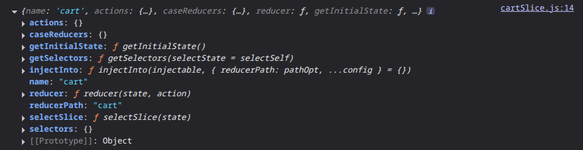
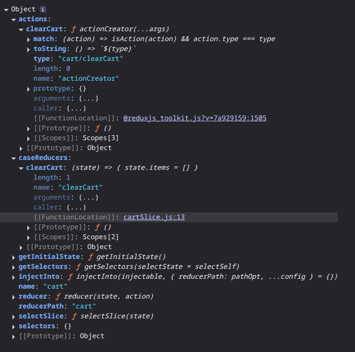
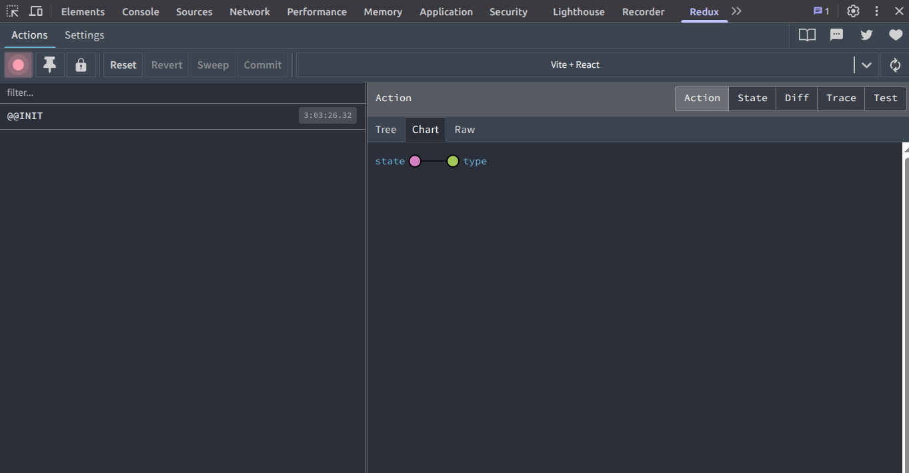

# REDUX!!!!!

FINALLYYYYYY!!! I"VE REACHED THE END THIS CRUEL WORLD OF REACTJS. I CAN FINALLY MOVE ON AFTER I FINISH THIS.

So, with that said, I'm `Md. Rishat Talukder` and let's get started.

- [LinkedIn](https://www.linkedin.com/in/pro-programmer/)
- [YouTube](http://www.youtube.com/@itvaya)
- [gtihub](https://github.com/RishatTalukder/learning_react)
- [Gmail](talukderrishat2@gmail.com)
- [discord](https://discord.gg/ZB495XggcF)

# Overview

`Redux` is a predictable state container for JavaScript apps, often used with libraries like React for building user interfaces. It helps manage the state of an application in a centralized way, Bluh Bluh Bluh.

Sortly it's a complex version of `useReducer` hook.

Does exactly what `useReducer` does but on a larger scale.

Although, `useReducer` is can be used for complex state management in larger applications, `Redux` provides a more `structured` and `scalable` approach to state management.

_With More Features, Comes More Boilerplate_

So, in this article/project, I'll try to go in-depth of the `Redux` library and how to use it effectively in a React application.

I made a simple `Cart` application to demonstrate the usage of `useReducer` hook. I'll do the same thing with `Redux` now.

Same application, but with `Redux`.

You know the drill, Make a new React app and clean it up.

I made a new React app with `Vite` and named it `Cart_Redux`.

Open your app in your code editor.

And we are ready to go.

# Setup and Installation

First of all, even though this is a `alternative` to `useReducer`, and internal theory is similar, it still can be like magic and overwhelming at first.

So, try to go step by step and try to understand the similarities and differences between `useReducer` and `Redux`.

First of all, we need to install some packages.

```bash
npm install @reduxjs/toolkit react-redux
```

`@reduxjs/toolkit` is the official, opinionated, batteries-included toolset for efficient Redux development. It includes utilities to simplify common use cases like store setup, creating reducers, immutable update logic, and many many other things.

`react-redux` is the official React bindings for Redux. It allows React components to read data from a Redux store, and dispatch actions to the store to update the state.

Now, let's create a folder named `redux` inside the `src` folder.

Inside the `redux` folder, create another folder named `slices`.

Inside the `redux` folder, create a file named `store.js`.

Now, inside the `slices` folder, create a file named `cartSlice.js`.

> Reminder: To understand the concepts of `Redux`, you should have a basic understanding of `useReducer` hook. If you don't, please check out my previous article on `REACT ADVANCED CONCEPTS`

Let's now recollect what was the main parts of `useReducer` hook.

- We make a `global context` to provide the state and dispatch function to the whole app.

- We make a `reducer` function and an `initial state`.

- We use the `useReducer` hook to bind the `reducer` and `initial state` and it returns the `state` and `dispatch` function.

- The dispatch function is used to send `actions` to the `reducer` function to update the state.

This was the basic idea of `useReducer` hook, right?

`Redux` does the same things but in a more `structured` and `scalable` way.

First we make a `global context` to provide the state and dispatch function to the whole app.

How do we do that?

Let's open the `store.js` file.

```js {.line-numbers}
// src/redux/store.js
import { configureStore } from "@reduxjs/toolkit"; // redux toolkit gives us this function to configure the store

const store = configureStore({
  reducer: {
    // we will add our reducers here
  },
});

export default store;
```

> Here, we are using the `configureStore` function from `@reduxjs/toolkit` to create a store. The `configureStore` function takes an object as an argument, where we can pass our `reducers`.

Now, you might think, We are passing a `reducer` object, where we will store our `reducer` functions? Why is that? In the use of `useReducer`, we only had one `reducer` function and that was it.

Patience, young duckling.

In `Redux`, we can have multiple `reducer` functions, each managing a specific part of the state. We can have multiple `features` in our app and those features can have their own `reducer` functions.

So, in this `store`, we will combine all the `reducer` functions and pass them to the `configureStore` function. which will create a single store for our app.

This store will be the `global context` for our app.

Now, we need to provide this store to our whole app.

Open the `main.jsx` file.

```js {.line-numbers}
import { StrictMode } from 'react'
import { createRoot } from 'react-dom/client'
import App from './App.jsx'
import { Provider } from 'react-redux' // we need to import the Provider component from react-redux
import store from './redux/store' // we need to import the store we just created

createRoot(document.getElementById('root')).render(
  <StrictMode>
    <Provider store={store}> {/* we need to wrap our app with the Provider component and pass the store as a prop */}
      <App />
    </Provider>
  </StrictMode>,
)
```

> Here, we are using the `Provider` component from `react-redux` to provide the store to our whole app. We need to wrap our `App` component with the `Provider` component and pass the store as a prop.

And here is another question that might pop up in your head.

When we were using `useReducer`, we used the `context` API to provide the state and dispatch function to our whole app directly. but this time we are using the `Provider` component from `react-redux`. and inside that we are directly using the `store`?

The `store` has the `reducers` right? So, how does the `Provider` component know which part of the state to provide to which component?

Hush, little one. Let daddy explain.

The `Provider` component from `react-redux` is a special component that is designed to work with `Redux` stores. It uses the `React Context` API under the hood to provide the store to all the components in the app.

Now, if you remember, to get a specific state or dispatch function from the `useReducer` hook, we used the `useContext` hook to get the context value and then destructured the state and dispatch function from it.

`Redux` has it's own hooks to get what we need from the store.

So, in short, when we are adding a reducer to the store, we are basically telling the `Provider` component that whatever is connected to this reducer(states, actions, dispatch functions) will be accessible to the whole app.

> While doing this you might get an error or warning. It's because there is no reducer added to the store yet. 

That's what we are going to do next.

Let's open the `cartSlice.js` file.

```js {.line-numbers}
import { createSlice } from "@reduxjs/toolkit"; // we need to import the createSlice function from redux toolkit

const initialState = {
  items: [],
  totalQuantity: 0,
  totalAmount: 0,
};

const cartSlice = createSlice({
  name: "cart", // name of the slice
  initialState, // initial state of the slice
  reducers: {
    // we will add our reducer functions here
  },
});

console.log(cartSlice);

export default cartSlice
```

> Here, in this file I made a `slice`. This is a wierd naming convention but as we can recall we needed a initial state and a way to handle actions.

A slice will do that for us. Think of a slice as a partition for different features and state.

`createSlice` is like a more advanced version of the `useReducer` Hook. The hook gives use a state variable and a dispatch function where we pass the reducer and the reducer function. This slice will do all that for us automatically.

As you can see that I passed a object and inside that object. I can pass various types of properties but for now I passed the name(just to name the slice, we will come back to this later), the initial state which will be handled by the redux, and an empty reducer property where we will add our action handling logic.

For more information about this createSlice() function I've logged it to the console.

than exported it.

Now, we can invoke/call/import this file to see what is shown in the console of the browser.

I'll import this in the `store.js` file because we will connect the slice with the store soon.

```js {.line-numbers}
// src/redux/store.js
import { configureStore } from "@reduxjs/toolkit"; // redux toolkit gives us this function
import './slices/cartSlice' // we need to import the cartSlice we just created

... // rest of the code stays the same
```

Now, if you open the browser console, you will see something like this.



As you can see this slice provides us a lot of functions built in like `actions`, `caseReducers`, `getInitialState`, `name`, `reducer`, `selectors` etc.

And for now your eyes should be on the `reducer` property of the slice.

Remember I told you that we will add reducers to the store?

This is the reducer that we will add to the store.

This is not a special function, this is exactly what we wrote ourselves for `useReducer` hook. Now it is automatically created for us. If you look closer it also has those same `parameters` (state, action) that we used in the `useReducer` hook.

So, what do we do now?

Instead of exporting the whole slice, we will export the `reducer` property of the slice.

```js {.line-numbers}
// src/redux/slices/cartSlice.js
... // rest of the code stays the same
export default cartSlice.reducer; // we will export the reducer property of the slice
```

Now, we can import this reducer in the `store.js` file and add it to the store.

```js {.line-numbers}
// src/redux/store.js
import { configureStore } from "@reduxjs/toolkit"; 
import cartReducer from './slices/cartSlice' // we need to import the cartReducer we just created

const store = configureStore({
  reducer: {
    cart: cartReducer, // we will add our cartReducer here
  },
});

export default store;
```
And boom! We have added our first reducer to the store.

And now, if you open the browser console, you will see that the warning/error is gone.

And now we have the basic setup ready.

I know I know you have this question in your head, "How do I handle actions and update the state?"

Well, you're a curious little fella, aitcha?!

I'll get to that asap.

But first we need to lay the structure of the app.

First, getting the data.

Now, we know that the data needs to be a state variable so that we can update it.

So, let's get the data.

```js {.line-numbers}
// src/data/cartData.js
export const cartData = [
  {
    id: 1,
    name: "Product 1",
    image: "https://img.freepik.com/free-photo/single-banana-isolated-white-background_839833-17794.jpg?semt=ais_hybrid&w=740&q=80",
    price: 100,
    quantity: 1,
  },
  {
    id: 2,
    name: "Product 2",
    image: "https://img.freepik.com/free-photo/single-banana-isolated-white-background_839833-17794.jpg?semt=ais_hybrid&w=740&q=80",
    price: 200,
    quantity: 1,
  },
  {
    id: 3,
    name: "Product 3",
    image: "https://img.freepik.com/free-photo/single-banana-isolated-white-background_839833-17794.jpg?semt=ais_hybrid&w=740&q=80",
    price: 300,
    quantity: 1,
  },
  {
    id: 4,
    name: "Product 4",
    image: "https://img.freepik.com/free-photo/single-banana-isolated-white-background_839833-17794.jpg?semt=ais_hybrid&w=740&q=80",
    price: 400,
    quantity: 1,
  },
];
```

> Heres some dummy data for the cart items. This is exactly the data we used in our previous `cart` project(REACT-ADVANCED (PROJECT 12)). I saved this dummy data inside a new file `data/cartData.js`.

Now, we load the data. So, we update the initial state and the data should be available everywhere on the app.

```js {.line-numbers}
// src/redux/slices/cartSlice.js
import { cartData } from "../../data/cartData";

const initialState = {
  items: cartData,
  totalQuantity: 0,
  totalAmount: 0,
};

// rest of the code stays the same

export default cartSlice.reducer;
```

Now, we can use the initial state in our app.

So, now let's see how we can use this state variable in our app.

Let's make the structure of the app first.

# UseSelector

From the title I think I spoiled it a bit.

But let's make a copy of the previous `Cart` project.

```js {.line-numbers}
// src/components/CartContainer.jsx
import React from "react";
import CartItem from "./CartItem";
import { FaCartPlus } from "react-icons/fa";
import Navbar from "./Navbar";
import {cartData as data} from '../data/cartData'

const CartContainer = () => {

  return (
    <div
      className="container py-4"
      style={{ maxWidth: "600px", margin: "auto" }}
    >
      {/* Navbar */}
      <Navbar />

      <ul className="list-group mb-4">
        {data.map((item) => (
          <CartItem key={item.id} item={item} />
        ))}
      </ul>

      <hr className="my-4" style={{ borderTop: "2px solid #312121ff" }} />
      {/* Total */}
      <div className="d-flex justify-content-between align-items-center mb-3">
        <h5 className="mb-0">Total</h5>
        <h5 className="mb-0 text-primary">0.00</h5>
      </div>

      {/* Clear cart */}
      <div className="text-end">
        <button className="btn btn-outline-danger btn-sm">Clear Cart</button>
      </div>
    </div>
  );
};

export default CartContainer;
```

```js {.line-numbers}
// src/components/CartItem.jsx
import React from "react";
import {
  FaArrowAltCircleUp,
  FaArrowCircleDown,
  FaArrowUp,
  FaUps,
} from "react-icons/fa";

const CartItem = ({ item }) => {
  return (
    <li className="list-group-item d-flex justify-content-between align-items-center">
      {/* Left side: Image + Info */}
      <div className="d-flex align-items-center">
        
        <div>
          <h6 className="mb-1">{item.name}</h6>
          <small className="text-muted">${item.price}</small>
        </div>
      </div>

      {/* Right side: Quantity + Amount */}
      <div className="d-flex justify-content-between align-items-center">
        <div className="d-flex flex-column align-items-center">
          <button className="text-success btn">
            <FaArrowAltCircleUp />
            {/* <FaArrowUp /> */}
          </button>
          <span>{item.quantity}</span>
          <button className="text-danger btn">
            <FaArrowCircleDown />
          </button>
        </div>

        {/* Item total price */}
        <div className="ms-3 fw-bold">${item.price * item.quantity}</div>
      </div>
    </li>
  );
};

export default CartItem;
```

```js {.line-numbers}
// src/components/Navbar.jsx
import { FaCartPlus } from "react-icons/fa";
const Navbar = () => {
  return (
    <div className="d-flex justify-content-between align-items-center mb-4">
      {/* Left side: Title */}
      <h3 className="mb-0 text-primary">Shopping Cart</h3>

      {/* Right side: Cart Icon with badge */}
      <div className="position-relative">
        <FaCartPlus size={28} className="text-primary" />
        <span
          className="position-absolute top-0 start-100 translate-middle badge bg-primary rounded-circle"
          style={{
            fontSize: "0.7rem",
            width: "1.5rem",
            height: "1.5rem",
            display: "flex",
            alignItems: "center",
            justifyContent: "center",
            border: "2px solid white",
          }}
        >
          5
        </span>
      </div>
    </div>
  );
};

export default Navbar;
```

I use bootstrap for styling. You can use any css framework or write your own css.

You can install bootstrap, bootswatch themes and react-icons by running this command.

```bash
npm install bootstrap bootswatch react-icons
```

Then import the bootstrap and bootswatch css in the `main.jsx` file.

```js {.line-numbers}
//main.jsx
import { StrictMode } from 'react'
import { createRoot } from 'react-dom/client'
import App from './App.jsx'
import { Provider } from 'react-redux'
import store from './redux/store.js'
import 'bootswatch/dist/minty/bootstrap.min.css'
import 'bootstrap/dist/js/bootstrap.bundle.min.js'

createRoot(document.getElementById('root')).render(
  <StrictMode>
    <Provider store={store}>
    <App />
    </Provider>
  </StrictMode>,
)
```

> This is exactly the same code as the previous `Cart` project. The only difference is that I imported the data directly from the `data/cartData.js` file instead of using the context.

Because now we are going to use the `Redux` store to get the data.

How, do we do that?

We passed the store to the whole app using the `Provider` component from `react-redux`.

Now, to get the state from the store, we use the `useSelector` hook from `react-redux`.

```js {.line-numbers}
// src/components/CartContainer.jsx
import { useSelector } from "react-redux"; // we need to import the useSelector hook
import React from "react";
import CartItem from "./CartItem";
import { FaCartPlus } from "react-icons/fa";
import Navbar from "./Navbar";

const CartContainer = () => {
  const { items:data } = useSelector((state) => state.cart); // we need to use the useSelector hook to get the state from the store

  return (
    <div
      className="container py-4"
      style={{ maxWidth: "600px", margin: "auto" }}
    >
      {/* Navbar */}
      <Navbar />

      <ul className="list-group mb-4">
        {data.map((item) => (
          <CartItem key={item.id} item={item} />
        ))}
      </ul>

      <hr className="my-4" style={{ borderTop: "2px solid #312121ff" }} />
      {/* Total */}
      <div className="d-flex justify-content-between align-items-center mb-3">
        <h5 className="mb-0">Total</h5>
        <h5 className="mb-0 text-primary">0.00</h5>
      </div>

      {/* Clear cart */}
      <div className="text-end">
        <button className="btn btn-outline-danger btn-sm">Clear Cart</button>
      </div>
    </div>
  );
};
export default CartContainer;
```
> Here, we are using the `useSelector` hook which will take a function as an argument. This function will receive the whole state of the store as an argument. And we can return whatever part of the state we want from this function.

So, in our case, we want the `items` array from the `cart` slice of the state. So, we as we are returning `state.cart` we can destructure all the state properties of the `cart` slice.

That's why we passed set the `name` property of the slice to `cart` in the `cartSlice.js` file. Which will automatically set the property name of the slice in the store.

Works like magic right?

So, now instead of context API, we are using the `useSelector` hook to get the state from the store.

Also this opens up interesting functionality because we have to pass a function to the `useSelector` hook, we can do some calculations and return the value we want.

Now, Let's see how we can change the state.

# UseDispatch

We know in the `useReducer` hook, we used the `dispatch` function to send actions to the reducer function to update the state.

Then we check what kind of action it is and update the state accordingly.

We can also pass a payload with the action to update the state.

All these things are also possible with `Redux`. But the way we do it is a bit different.

First, we need to make the actions and the logic to handle those actions.

Let's make the actions logic to handle the `clear cart` action.

```js {.line-numbers}
// src/redux/slices/cartSlice.js
import { createSlice } from "@reduxjs/toolkit";
import { cartData } from "../../data/cartData";

const initialState = {
  items: cartData,
  totalQuantity: 0,
  totalAmount: 0,
};

const cartSlice = createSlice({
  name: "cart",
  initialState,
  reducers: {
    clearCart: (state) => {
      state.items = []; // we can directly mutate the state here because redux toolkit uses immer library under the hood which allows us to write mutable code but it actually creates a new immutable state
    },
  },
});

console.log(cartSlice);

export const { clearCart } = cartSlice.actions; // we need to export the actions we just created
export default cartSlice.reducer;
```

> Here inside the `reducers` property of the slice, we can add our action handling logic. The action will be the key of the object and the value will be a function that will receive the current state as an argument. 

Now, this new property inside the `reducers` object will automatically create an `action creator` function for us with the same name as the key.

Now you might ask what is a `action creator` function?

An action creator is a function that creates and returns an action object. In `Redux`, an action is a plain JavaScript object that has a `type` property and optionally a `payload` property. The `type` property is a string that describes the type of action being performed, and the `payload` property is any additional data that is needed to perform the action.

Well some very fancy words but in short, an action creator is a function that will internally create an action object for us.

For example, the name of the action will automematically be the set to `cart/clearCart` because the name of the slice is `cart` and the name of the action is `clearCart`.

And this action creator function will be available in the `actions` property of the slice.

You can verify this by checking the console log of the slice that we did before.



SO, the whole process of creating an action and checking the type of action in the reducer function is done for us automatically and iternally by the `createSlice` function.

All thanks to the small library called `immer` which is used by the `redux toolkit` under the hood.

So, by just adding a new property to the `reducers` object, we can create a new action and the logic to handle that action.

Now, how do we use this action in our app?

we never made a `dispatch` function like we did in the `useReducer` hook.

We use the `useDispatch` hook from `react-redux` to get the `dispatch` function from the store.

```js {.line-numbers}
// src/components/CartContainer.jsx
import React from "react";
import CartItem from "./CartItem";
import { FaCartPlus } from "react-icons/fa";
import Navbar from "./Navbar";
import { useDispatch, useSelector } from "react-redux"; // we need to import the useDispatch hook
import { clearCart } from "../redux/slices/cartSlice"; // we need to import the clearCart action we just created

const CartContainer = () => {

  const { items:data } = useSelector((state) => state.cart);
  const dispatch = useDispatch();

  return (
    <div
      className="container py-4"
      style={{ maxWidth: "600px", margin: "auto" }}
    >
      {/* Navbar */}
      <Navbar />

      <ul className="list-group mb-4">
        {data.map((item) => (
          <CartItem key={item.id} item={item} />
        ))}
      </ul>

      <hr className="my-4" style={{ borderTop: "2px solid #312121ff" }} />
      {/* Total */}
      <div className="d-flex justify-content-between align-items-center mb-3">
        <h5 className="mb-0">Total</h5>
        <h5 className="mb-0 text-primary">0.00</h5>
      </div>

      {/* Clear cart */}
      <div className="text-end">
        <button className="btn btn-outline-danger btn-sm"
        onClick={()=> dispatch(clearCart())}
        >Clear Cart</button> {/* we need to use the dispatch function to dispatch the clearCart action when the button is clicked */}
      </div>
    </div>
  );
};

export default CartContainer;
```

> Here, we are using the `useDispatch` hook to get the `dispatch` function from the store. And we are using this `dispatch` function to dispatch the `clearCart` action when the `Clear Cart` button is clicked.

This is why I exported the `clearCart` action from the `cartSlice.js` file. So, that we can import it in the component and use it.

So, now when we click the `Clear Cart` button, the `clearCart` action which is a function will be called and it will make the `cartItems` array empty.

And if we go back to the browser and click the `Clear Cart` button, we can see that the cart is cleared.

Also I want to add some bonus info. We should not return anything from the action handling functions. Just mutate the state directly. Because `immer` will take care of creating a new immutable state for us.

If we return something from the action handling function, it will override the previous state completely. Which will lead unexpected results.

So, we should be careful about returning anything from the action handling functions inside the `reducers` object of the slice.

In theory we can return a new state from the action handling functions. But it's not recommended.

I want to do something extra.

I want to show a modal when the cart is cleared button is clicked for confirmation.

So, as this is going to be a new feature, we will make a new slice for this.

# Modal box for confirmation

```js {.line-numbers}
// src/redux/slices/modalSlice.js
import { createSlice } from "@reduxjs/toolkit"

const initialState = {
    isOpen: false,
}

const modalSlice = createSlice({
    name: "modal",
    initialState,
    reducers: {
        openModal: (state) => {
            state.isOpen = true
        },
        closeModal: (state) => {
            state.isOpen = false
        },
    }
})

export const { openModal, closeModal } = modalSlice.actions // exporting the actions

export default modalSlice.reducer
```

> Here I made a new slice for the modal box. This slice will handle the state of the modal box. Whether it is open or closed. So, I made two actions, one for opening the modal and one for closing the modal.

As we are going to use these actions in the component, I exported them.

Now, we add this reducer to the store.

```js {.line-numbers}
// src/redux/store.js
import { configureStore } from "@reduxjs/toolkit";
import cartReducer from "./slices/cartSlice";
import modalReducer from "./slices/modalSlice";

const store = configureStore({
    reducer: {
        cart: cartReducer,
        modal: modalReducer // shorthand property name
    }
})

export default store
```

Now, we can use this modal slice in our app.

So, let's make a new component for the modal box.

```js {.line-numbers}
// src/components/Modal.jsx
import React from "react";
import { useSelector, useDispatch } from "react-redux";
import { closeModal } from "../redux/slices/modalSlice";
import { clearCart } from "../redux/slices/cartSlice";

const Modal = () => {
  const isOpen = useSelector((state) => state.modal.isOpen); // getting the isOpen state from the modal slice
  const dispatch = useDispatch(); // getting the dispatch function

  const handleCancel = () => {
    dispatch(closeModal()); // dispatching the closeModal action
  };

  const handleConfirm = () => {
    dispatch(clearCart());
    dispatch(closeModal()); // dispatching the clearCart action
  };

  return (
    <div
      className={`modal fade ${isOpen ? "show" : ""}`}
      style={{ display: isOpen ? "block" : "none" }}
      tabIndex="-1"
      aria-labelledby="confirmModalLabel"
      aria-hidden={!isOpen}
    >
      <div className="modal-dialog">
        <div className="modal-content">
          <div className="modal-body text-center py-4">
            <h5 className="mb-4">Do you want to clear all the items?</h5>
            <div className="d-flex justify-content-center gap-3">
              <button
                type="button"
                className="btn btn-secondary"
                onClick={handleCancel}
              >
                Cancel
              </button>
              <button
                type="button"
                className="btn btn-danger"
                onClick={handleConfirm}
              >
                Confirm
              </button>
            </div>
          </div>
        </div>
      </div>
    </div>
  );
};

export default Modal;
```

> Here, I made a new component for the modal box. This component will use the `isOpen` state from the `modal` slice to determine whether the modal is open or closed. And it will use the `closeModal` action to close the modal when the cancel button is clicked. And it will use the `clearCart` action to clear the cart and close the modal when the confirm button is clicked.

SO, we can make some changes to the `CartContainer` component to open the modal when the `Clear Cart` button is clicked.

```js {.line-numbers}
// src/components/CartContainer.jsx
import React from "react";
import CartItem from "./CartItem";
import { FaCartPlus } from "react-icons/fa";
import Navbar from "./Navbar";
// import {cartData as data} from '../data/cartData'
import { useDispatch, useSelector } from "react-redux";
import { clearCart } from "../redux/slices/cartSlice";
import { openModal } from "../redux/slices/modalSlice"; // importing the openModal action

const CartContainer = () => {

  const { items:data } = useSelector((state) => state.cart);
  const dispatch = useDispatch();

  return (
    <div
      className="container py-4"
      style={{ maxWidth: "600px", margin: "auto" }}
    >
      {/* Navbar */}
      <Navbar />

      <ul className="list-group mb-4">
        {data.map((item) => (
          <CartItem key={item.id} item={item} />
        ))}
      </ul>

      <hr className="my-4" style={{ borderTop: "2px solid #312121ff" }} />
      {/* Total */}
      <div className="d-flex justify-content-between align-items-center mb-3">
        <h5 className="mb-0">Total</h5>
        <h5 className="mb-0 text-primary">0.00</h5>
      </div>

      {/* Clear cart */}
      <div className="text-end">
        <button className="btn btn-outline-danger btn-sm"
        onClick={()=> dispatch(openModal())} // dispatching the openModal action when the button is clicked
        >Clear Cart</button>
      </div>
    </div>
  );
};

export default CartContainer;
```

> Here, I imported the `openModal` action from the `modalSlice.js` file and used it to open the modal when the `Clear Cart` button is clicked.

Now, we need to use the `Modal` component in our app.

```js {.line-numbers}
// src/App.jsx
import CartContainer from "./components/CartContainer"
import Modal from "./components/Modal"

function App() {

  return (
    <>
    <CartContainer />
    <Modal />
    </>
  )
}

export default App
```

> Here, I imported the `Modal` component and used it in the `App` component. So that it is available in the whole app.

Now, if we go back to the browser and click the `Clear Cart` button, we can see that the modal is opened.

And if we click the `Cancel` button, the modal is closed.

And if we click the `Confirm` button, the cart is cleared and the modal is closed.

Now, you might want to see the state changes in the browser.

But the issue is that the `React Developer Tools` extension does not support `Redux Toolkit` out of the box.

So, we need to install another extension called `Redux DevTools` to see the state changes in the browser.

It's an amazing extension for redux based applications.

And if you install it, you can see a new section in the browser devtools called `Redux`.

Click on it and you should see something like this.


Can be confusing in the beginning but the most useful part is the `State` section.

This monitors all the state changes in the app and also records the actions in a clean animated way.

Play with it and you will get the hang of it.

Now, let's implement the other functionalities of the cart.

# Implementing other functionalities

First, let's implement the `total quantity` and `total amount` functionalities.


```js {.line-numbers}
// src/redux/slices/cartSlice.js
import { createSlice } from "@reduxjs/toolkit";
import { cartData } from "../../data/cartData";

const initialState = {
  items: cartData,
  totalQuantity: 0,
  totalAmount: 0,
};

const cartSlice = createSlice({
  name: "cart",
  initialState,
  reducers: {
    clearCart: (state) => {
      state.items = [];
    },
    calculateTotals: (state) => {
      let totalQuantity = 0;
      let totalAmount = 0;
      state.items.forEach((item) => {
        totalQuantity += item.quantity;
        totalAmount += item.price * item.quantity;
      });
      state.totalQuantity = totalQuantity;
      state.totalAmount = totalAmount;
    },
  },
});

console.log(cartSlice);

export const { clearCart, calculateTotals } = cartSlice.actions;

export default cartSlice.reducer;
```

> Here, I added a new action called `calculateTotals` which will calculate the total quantity and total amount of the items in the cart. It will iterate through the `items` array and calculate the total quantity and total amount and update the state accordingly.

Now, we need to dispatch this action whenever the `items` array is updated.

```js {.line-numbers}
// src/components/CartContainer.jsx
import React, { useEffect } from "react";
import CartItem from "./CartItem";
import { FaCartPlus } from "react-icons/fa";
import Navbar from "./Navbar";
// import {cartData as data} from '../data/cartData'
import { useDispatch, useSelector } from "react-redux";
import { calculateTotal, clearCart } from "../redux/slices/cartSlice";
import { openModal } from "../redux/slices/modalSlice";

const CartContainer = () => {
  const {
    items: data,
    totalAmount,
    totalQuantity,
  } = useSelector((state) => state.cart);
  const dispatch = useDispatch();

  useEffect(() => {
    dispatch(calculateTotal());
  }, [data]);

  return (
    <div
      className="container py-4"
      style={{ maxWidth: "600px", margin: "auto" }}
    >
      {/* Navbar */}
      <Navbar />

      <ul className="list-group mb-4">
        {data.map((item) => (
          <CartItem key={item.id} item={item} />
        ))}
      </ul>

      {/* Clear cart */}
      {totalQuantity > 0 ? (
        <>
          <hr className="my-4" style={{ borderTop: "2px solid #312121ff" }} />
          {/* Total */}
          <div className="d-flex justify-content-between align-items-center mb-3">
            <h5 className="mb-0">Total</h5>
            <h5 className="mb-0 text-primary">${totalAmount.toFixed(2)}</h5>
          </div>
          <div className="text-end">
            <button
              className="btn btn-outline-danger btn-sm"
              onClick={() => dispatch(openModal())}
            >
              Clear Cart
            </button>
          </div>
        </>
      ) : (
        <div className="text-center text-muted">No items in the cart</div>
      )}
    </div>
  );
};

export default CartContainer;

```
> Here, I used the `useEffect` hook to dispatch the `calculateTotals` action whenever the `data` array is updated. This will ensure that the total quantity and total amount are always up to date.

Now, if we go back to the browser, we can see that the total quantity and total amount are displayed correctly.

Also, let's update the `Navbar` component to display the total quantity of items in the cart.

```js {.line-numbers}
// src/components/Navbar.jsx
import { FaCartPlus } from "react-icons/fa";
import { useSelector } from "react-redux";

const Navbar = () => {
  const {
    items: data,
    totalAmount,
    totalQuantity,
  } = useSelector((state) => state.cart);
  return (
    <div className="d-flex justify-content-between align-items-center mb-4">
      {/* Left side: Title */}
      <h3 className="mb-0 text-primary">Shopping Cart</h3>

      {/* Right side: Cart Icon with badge */}
      <div className="position-relative">
        <FaCartPlus size={28} className="text-primary" />
        <span
          className="position-absolute top-0 start-100 translate-middle badge bg-primary rounded-circle"
          style={{
            fontSize: "0.7rem",
            width: "1.5rem",
            height: "1.5rem",
            display: "flex",
            alignItems: "center",
            justifyContent: "center",
            border: "2px solid white",
          }}
        >
          {totalQuantity}
        </span>
      </div>
    </div>
  );
};

export default Navbar;
```

> Here, I used the `useSelector` hook to get the `totalQuantity` from the `cart` slice and displayed it in the badge of the cart icon.

Now, if we go back to the browser, we can see that the total quantity is displayed correctly in the badge of the cart icon.

Now, let's implement the `increase` and `decrease` and `remove item` functionalities.

```js {.line-numbers}
// src/redux/slices/cartSlice.js
import { createSlice } from "@reduxjs/toolkit";
import { cartData } from "../../data/cartData";

const initialState = {
  items: cartData,
  totalQuantity: 0,
  totalAmount: 0,
};

const cartSlice = createSlice({
  name: "cart",
  initialState,
  reducers: {
    clearCart: (state) => {
      state.items = [];
    },
    calculateTotal: (state) => {
      let totalQuantity = 0;
      let totalAmount = 0;
      state.items.forEach((item) => {
        totalQuantity += item.quantity;
        totalAmount += item.price * item.quantity;
      });
      state.totalQuantity = totalQuantity;
      state.totalAmount = totalAmount;
    },
    increase: (state, action) => {
      const itemId = action.payload;
      const item = state.items.find((item) => item.id === itemId);
      if (item) {
        item.quantity += 1;
      }
    },
    decrease: (state, action) => {
      const itemId = action.payload;
      const item = state.items.find((item) => item.id === itemId);
      if (item && item.quantity > 1) {
        item.quantity -= 1;
      } else if (item && item.quantity === 1) {
        state.items = state.items.filter((item) => item.id !== itemId);
      }
    },
    removeItem: (state, action) => {
      const itemId = action.payload;
      state.items = state.items.filter((item) => item.id !== itemId);
    },
  },
});
console.log(cartSlice);

export const { clearCart, calculateTotal, increase, decrease, removeItem } = cartSlice.actions;

export default cartSlice.reducer;
```

Well, here we can see that I added three new actions, `increase`, `decrease` and `removeItem`.

The `increase` action will increase the quantity of the item by 1. The `decrease` action will decrease the quantity of the item by 1. If the quantity is 1, it will remove the item from the cart. The `removeItem` action will remove the item from the cart.

Now, we need to use these actions in the `CartItem` component.

```js {.line-numbers}
// src/components/CartItem.jsx
import React from "react";
import {
  FaArrowAltCircleUp,
  FaArrowCircleDown,
  FaArrowUp,
  FaTrash,
} from "react-icons/fa";
import { useDispatch } from "react-redux";
import { increase, decrease, removeItem } from "../redux/slices/cartSlice";

const CartItem = ({ item }) => {
  const dispatch = useDispatch();
  return (
    <li className="list-group-item d-flex justify-content-between align-items-center">
      {/* Left side: Image + Info */}
      <div className="d-flex align-items-center">
        
        <div>
          <h6 className="mb-1">{item.name}</h6>
          <small className="text-muted">${item.price}</small>
        </div>
      </div>

      {/* Right side: Quantity + Amount */}
      <div className="d-flex justify-content-between align-items-center">
        <div className="d-flex flex-column align-items-center">
          <button
            className="text-success btn"
            onClick={() => dispatch(increase(item.id))}
          >
            <FaArrowAltCircleUp />
            {/* <FaArrowUp /> */}
          </button>
          <span>{item.quantity}</span>
          <button
            className="text-danger btn"
            onClick={() => dispatch(decrease(item.id))}
          >
            <FaArrowCircleDown />
          </button>
        </div>

        {/* Item total price */}
        <div className="ms-3 fw-bold d-flex align-items-center">
          ${item.price * item.quantity}
          <button
            className="btn text-danger ms-3"
            onClick={() => dispatch(removeItem(item.id))}
          >
            <FaTrash />
          </button>
        </div>
      </div>
    </li>
  );
};
export default CartItem;
```

Same old story here.

Export, import, useSelector, useDispatch, dispatch.

Here, I imported the `increase`, `decrease` and `removeItem` actions from the `cartSlice.js` file and used them to increase, decrease and bla bla bla...

And boom! We have implemented all the functionalities of the cart.

Nice and clean right?

That why we use `Redux Toolkit`.

Now, if you compare this code with the previous `Cart` project, you might think that this code is more verbose and longer.

Buuuuut! As the app gets bigger and more complex, The code will be more organized and easier to manage.

Because everything is organised in a modular way and somehow it works like magic even thoguh it seens like nothing is connected.

Reduc toolkit needs some time to get used to but once you get the hang of it, you will love it and you might never go back to the old way of managing state.

Before I end this, I want to show you one more thing.

# Async Thunks

In our previous sections and articles. we saw that we have many ways to manage state in a React app.

But in one case there was no alternatives. 

That is when we need to fetch data from an API.

We always made a new function to fetch the data and then used the `useEffect` hook to call that function when the component is mounted. Than set the data to a state variable.

And we also handled the loading and error states manually in vanilla way.

Redux toolkit has it's own way to handle async operations.

Again the name is funky. It's called `createAsyncThunk`.

Doen't mean anything special. Just a fancy name.

The main purpose of this function is to `create an async action that can be dispatched to the store`.

Now, as confusing as redux toolkit is, this is can be a bit more confusing.

So, listen/read carefully.

The structure of creating a async thunk is like this.

```js {.line-numbers}
import { createAsyncThunk } from "@reduxjs/toolkit";

export const fetchData = createAsyncThunk(
  "sliceName/fetchData", // this is the name of the action
  async (arg, thunkAPI) => {
    // this is the payload creator function
    // we can make our async calls here
    // and return the data
  }
);
``` 

Now, what is happening here?

First we are importing the `createAsyncThunk` function from the `@reduxjs/toolkit` package.

Now we will use this function to create an async action.

Now, how will this `thunk` know where to put the data?

That's why we need to pass the name of the slice as the first argument.

Now, you might ask, how will YOU know the name of the slice because we are making the slice in the same file as functions, using them as functions to mutate the state. In traditional `reducer` function, we used to make our own action types and check for them in the reducer function. But in `redux toolkit` we don't need to do that, almost everything is done internally by the `createSlice` function. So, how do we know the name of the slice we are making?

OW OW OW OW hold on there little buttercup.

Remember at the very beginning of this article, when we made the `cartSlice`? and we logged the slice to the console?

So, go to the console and if you still have the log there, click on the object and then click on the `actions` property.

You should see all the actions that are created by the `createSlice` function with all the extra details.

And in one of those properties, you should see the `type` property.

So, whenever you make a new slice, you can check the `type` property of any action to know the name of the slice.

But the issue is when we are making an async thunk, we don't have the reducer functions yet. So, we don't have any actions to check the type property.

What do we do then?

If you look at the `type` property, of the various actions, you can see that the type property is always in the format of `sliceName/actionName`.

So, we can just make the name of the slice whatever we want. As long as we are consistent with it. So, we are trying to make a async operation to fetch cart items. So, we can set the name of the slice to `cart/fetchItems`. 

This way the data fetched from the API will be stored in the `cart` slice of the state and specifically look for the `fetchItems` action.

I hope you understood that.

The second argument is a function that will be called when the action is dispatched. This function will receive two arguments. The first argument is the argument that is passed to the action when it is dispatched. The second argument is an object that contains various properties and methods that can be used to interact with the store.

We will ralk more about these two arguments later.

But let's fetch some data from a `dummy` API i'll setup using `json-server`.

So, let's install `json-server` and axios for making API calls.

```bash
npm install json-server axios
```

Now, let's make a new file called `db.json` in the root of the project.

```json {.line-numbers}
{
  "cartData": [
    {
      "id": 1,
      "name": "Product 1",
      "image": "https://img.freepik.com/free-photo/single-banana-isolated-white-background_839833-17794.jpg?semt=ais_hybrid&w=740&q=80",
      "price": 100,
      "quantity": 1
    },
    {
      "id": 2,
      "name": "Product 2",
      "image": "https://img.freepik.com/free-photo/single-banana-isolated-white-background_839833-17794.jpg?semt=ais_hybrid&w=740&q=80",
      "price": 200,
      "quantity": 1
    },
    {
      "id": 3,
      "name": "Product 3",
      "image": "https://img.freepik.com/free-photo/single-banana-isolated-white-background_839833-17794.jpg?semt=ais_hybrid&w=740&q=80",
      "price": 300,
      "quantity": 1
    },
    {
      "id": 4,
      "name": "Product 4",
      "image": "https://img.freepik.com/free-photo/single-banana-isolated-white-background_839833-17794.jpg?semt=ais_hybrid&w=740&q=80",
      "price": 400,
      "quantity": 1
    }
  ]
}
```

We can start the json server by running this command.

```bash
npx json-server --watch db.json
```

After running this command, you should see something like this in the terminal.

```bash
--watch/-w can be omitted, JSON Server 1+ watches for file changes by default
JSON Server started on PORT :3000
Press CTRL-C to stop
Watching db.json...

♡( ◡‿◡ )

Index:
http://localhost:3000/

Static files:
Serving ./public directory if it exists

Endpoints:
http://localhost:3000/cartData
```

Click on the `http://localhost:3000/cartData` link to see the data.

Now, let's make the async thunk to fetch this data.

```js {.line-numbers}
// src/redux/slices/cartSlice.js
import { createSlice, createAsyncThunk } from "@reduxjs/toolkit";
import axios from "axios";
import { cartData } from "../../data/cartData";

export const fetchCartItems = createAsyncThunk(
  "cart/fetchItems",
  async (arg, thunkAPI) => {
    try {
      const response = await axios.get("http://localhost:3000/cartData");
      return response.data;
    } catch (error) {
      return thunkAPI.rejectWithValue("Something went wrong");
    }
  }
); // this is the async thunk to fetch cart items

const initialState = {
  items: [],
  totalQuantity: 0,
  totalAmount: 0,
  isLoading: false, // to track the loading state
  error: null, // to track the error state
};

const cartSlice = createSlice({
  name: "cart",
  initialState,
  reducers: {
    clearCart: (state) => {
      state.items = [];
    },
    calculateTotal: (state) => {
      let totalQuantity = 0;
      let totalAmount = 0;
      state.items.forEach((item) => {
        totalQuantity += item.quantity;
        totalAmount += item.price * item.quantity;
      });
      state.totalQuantity = totalQuantity;
      state.totalAmount = totalAmount;
    },
    increase: (state, action) => {
      const itemId = action.payload;
      const item = state.items.find((item) => item.id === itemId);
      if (item) {
        item.quantity += 1;
      }
    },
    decrease: (state, action) => {
      const itemId = action.payload;
      const item = state.items.find((item) => item.id === itemId);
      if (item && item.quantity > 1) {
        item.quantity -= 1;
      } else if (item && item.quantity === 1) {
        state.items = state.items.filter((item) => item.id !== itemId);
      }
    },
    removeItem: (state, action) => {
      const itemId = action.payload;
      state.items = state.items.filter((item) => item.id !== itemId);
    },
  },
  extraReducers: (builder) => {
    builder
      .addCase(fetchCartItems.pending, (state) => {
        state.isLoading = true;
        state.error = null;
      }) // handling the pending state
      .addCase(fetchCartItems.fulfilled, (state, action) => {
        state.isLoading = false;
        state.items = action.payload;
      }) // handling the fulfilled state
      .addCase(fetchCartItems.rejected, (state, action) => {
        state.isLoading = false;
        state.error = action.payload;
      }); // handling the rejected state
  },
});
console.log(cartSlice);

export const { clearCart, calculateTotal, increase, decrease, removeItem } = cartSlice.actions;

export default cartSlice.reducer;
```
Now, I know there is lot of things going on here.

But let's break it down.

First let's talk about the async thunk.

```js {.line-numbers}
export const fetchCartItems = createAsyncThunk(
  "cart/fetchItems",
  async (arg, thunkAPI) => {
    try {
      const response = await axios.get("http://localhost:3000/cartData");
      return response.data;
    } catch (error) {
      return thunkAPI.rejectWithValue("Something went wrong");
    }
  }
); // this is the async thunk to fetch cart items
```

> Here, I created an async thunk called `fetchCartItems` using the `createAsyncThunk` function. The first argument is the name of the slice and the action. The second argument is an async function that will make the API call to fetch the cart items. If the API call is successful, it will return the data. If there is an error, it will return a rejected value using the `rejectWithValue` method of the `thunkAPI` object.

> We must return something from the async function. Either the data or a rejected value.

> ALso, the thunk API object we get as the second argument has many many useful methods and properties. One of them is the `rejectWithValue` method which we used to return a rejected value in case of an error. I'll recommend you to check value the `thunkAPI` object in the console to see all the methods and properties it has.

This `rejectWithValue` method is useful because it allows us to return a custom error message instead of the default error message.

Now, from earlier we saw that the `createAsyncThunk` function will look for the action type in the format of `sliceName/actionName`.

We passed the name of the slice as `cart` and the action name as `fetchItems`.

But there is a catch.

When we are fetching data from an API, there are three possible states.

1. `Pending` - when the API call is in progress
2. `Fulfilled` - when the API call is successful
3. `Rejected` - when the API call fails

So, when we are giving the name of the action, we need to keep in mind that the `createAsyncThunk` function will automatically append the above three states to the action name.

So, if we directly make a new property in the `reducers` object of the slice to handle these three states, it will not work.

We need a special property called `extraReducers` to handle these three states.

That's why we have this `extraReducers` property in the slice.

```js {.line-numbers}
  extraReducers: (builder) => {
    builder
      .addCase(fetchCartItems.pending, (state) => {
        state.isLoading = true;
        state.error = null;
      }) // handling the pending state
      .addCase(fetchCartItems.fulfilled, (state, action) => {
        state.isLoading = false;
        state.items = action.payload;
      }) // handling the fulfilled state
      .addCase(fetchCartItems.rejected, (state, action) => {
        state.isLoading = false;
        state.error = action.payload;
      }); // handling the rejected state
  },
```
> In this `extraReducers` property, we are using a builder callback function to add cases for the three states of the async thunk. We are using the `addCase` method of the builder object to add cases for the `pending`, `fulfilled` and `rejected` states of the `fetchCartItems` async thunk.

In hindsight, this is a bit confusing. because all the three states are not actual different actions. They are just different states of the same action.

And we can add much more cases to this `extraReducers` property if we have more async thunks.

So, the builder has a method called `addCase` which we can use to add cases for different actions.

This add case method takes two arguments. The first argument is the action type and the second argument is a function that will be called when the action is dispatched.

So, here, we have to think about the action types. First we get the pending state when the API call is in progress. So, we can use the `fetchCartItems.pending` as the action type and we can just use the `.` notation to access the `pending` property of the `fetchCartItems` async thunk which is automatically created by the `createAsyncThunk` function.

And we can add a callback function as the second argument which will be called when the action is dispatched and we will get the current state as the first argument.

In this function, we can set the `isLoading` property to `true` and the `error` property to `null` to indicate that the API call is in progress.

Now, if the API call is successful, we will get the `fulfilled` state. So, we add another case for the `fulfilled` just by adding another `addCase` method to the builder object.

And so on...

This is called `chaining` in JavaScript.

Although it looks like the addcases are separate, they are actually chained together. 

And internally processed in a single go.

It needs a little bit of practice to get used to it.

Now, we need to dispatch this async thunk when the `CartContainer` component is mounted.

```js {.line-numbers}
// src/components/CartContainer.jsx
import React, { useEffect } from "react";
import CartItem from "./CartItem";
import { FaCartPlus } from "react-icons/fa";
import Navbar from "./Navbar";
// import {cartData as data} from '../data/cartData'
import { useDispatch, useSelector } from "react-redux";
import { calculateTotal, clearCart, fetchCartItems } from "../redux/slices/cartSlice";
import { openModal } from "../redux/slices/modalSlice";

const CartContainer = () => {
  const {
    items: data,
    totalAmount,
    totalQuantity,
    isLoading,
    error,
  } = useSelector((state) => state.cart);
  const dispatch = useDispatch();

  useEffect(() => {
    dispatch(fetchCartItems()); // dispatching the fetchCartItems async thunk when the component is mounted
  }, []);

  useEffect(() => {
    dispatch(calculateTotal());
  }, [data]);

  if (isLoading) {
    return (
      <div className="d-flex justify-content-center align-items-center vh-100">
        <div className="spinner-border text-primary" role="status">
          <span className="visually-hidden">Loading...</span>
        </div>
      </div>
    );
  }
  if (error) {
    return (
      <div className="d-flex justify-content-center align-items-center vh-100">
        <div className="alert alert-danger" role="alert">
          {error}
        </div>
      </div>
    );
  }

  return (
    <div
      className="container py-4"
      style={{ maxWidth: "600px", margin: "auto" }}
    >
      {/* Navbar */}
      <Navbar />

      <ul className="list-group mb-4">
        {data.map((item) => (
          <CartItem key={item.id} item={item} />
        ))}
      </ul>

      {/* Clear cart */}
      {totalQuantity > 0 ? (
        <>
          <hr className="my-4" style={{ borderTop: "2px solid #312121ff" }} />
          {/* Total */}
          <div className="d-flex justify-content-between align-items-center mb-3">
            <h5 className="mb-0">Total</h5>
            <h5 className="mb-0 text-primary">${totalAmount.toFixed(2)}</h5>
          </div>
          <div className="text-end">
            <button
              className="btn btn-outline-danger btn-sm"
              onClick={() => dispatch(openModal())}
            >
              Clear Cart
            </button>
          </div>
        </>
      ) : (
        <div className="text-center text-muted">No items in the cart</div>
      )}
    </div>
  );
};
export default CartContainer;
``` 

> Here, I imported the `fetchCartItems` async thunk from the `cartSlice.js` file and used it to fetch the cart items when the component is mounted using the `useEffect` hook. I also added two new properties to the state, `isLoading` and `error` to track the loading and error states of the API call. And I added two conditional renderings to show a loading spinner when the API call is in progress and an error message when there is an error.

And we are done.

# Bonus

Thunk API has many many useful methods and properties and it is very powerful.

One of the most useful methods is the `getState` method which we can use to get the current state of the store. Meaning every slice of the state is available to us.

Also we can use the `dispatch` method to dispatch other actions from within the async thunk.

So, this opens up a lot of possibilities and makes our async thunks very powerful and very functional.

```js {.line-numbers}
export const fetchCartItems = createAsyncThunk(
  "cart/fetchItems",
  async (arg, thunkAPI) => {
    try {
      const response = await axios.get("http://localhost:3000/cartData");
      // we can dispatch other actions from here
      thunkAPI.dispatch(someOtherAction());
      // we can also get the current state from here
      const state = thunkAPI.getState();
      console.log(state);
      return response.data;
    } catch (error) {
      return thunkAPI.rejectWithValue("Something went wrong");
    }
  }
);  
// this is the async thunk to fetch cart items
```

And that's it for this article and Finally the end to this `REACT` series.

# LAST WORDS

This was a long one. I'm don't call myself a frontend developer. I'm just a guy who loves to code and loves to learn new things. I never learned `js` properly. I just learned the things I needed to learn to make stuff. So, I'm might be wrong in some places. But I tried my best explaining things in a simple way, the way I understood them.

I'm getting kinda emotional writing this. Because this is the end of a long journey. But start of a new one because the next series is going to be about `django` and `django-rest-framework` and will be connected to this `react` series because there is no way I can make a full stack app without a backend.

SO, I hope you enjoyed this series and learned something new. If you have any questions or suggestions, feel free to reach out to me on twitter or email. I'll be happy to help you.

With that `SIGNING OFF`

Happy coding ya'll!